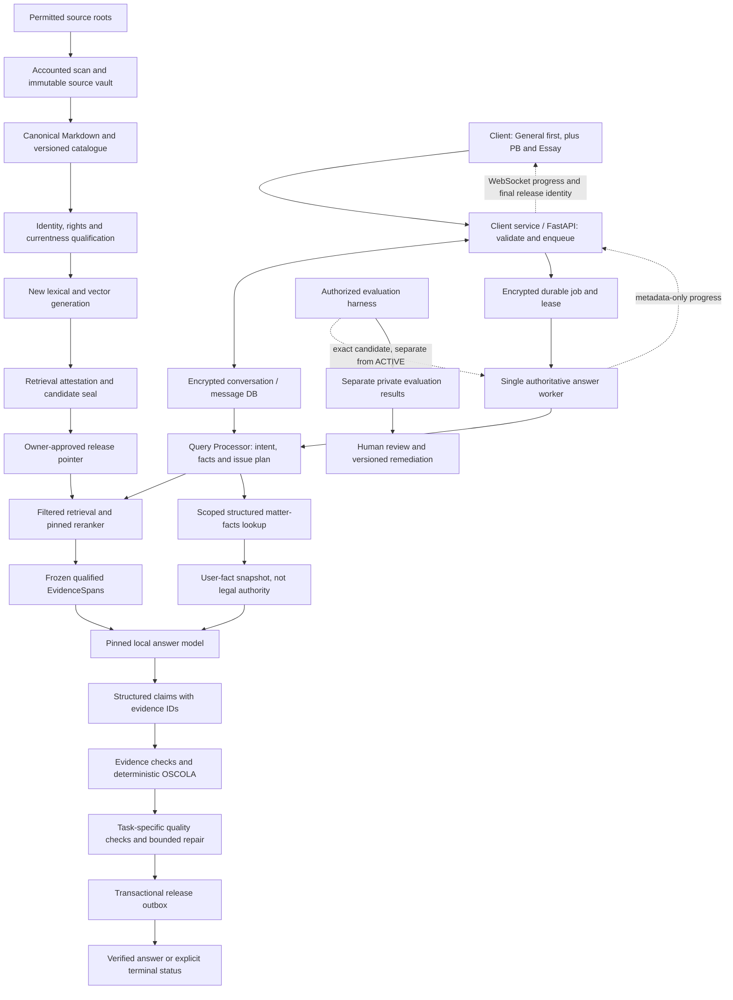
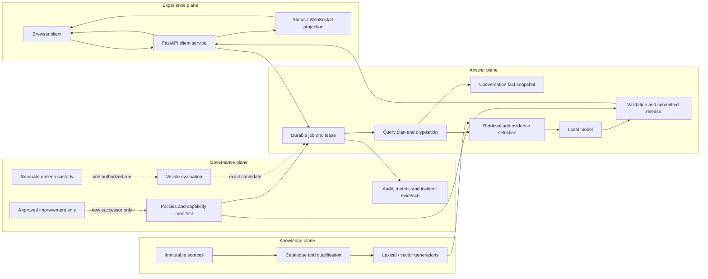

# LegalBot v1.11 system design - three phases, General Enquiries first

Date: 1 September 2026. Status: **current living system design; owner-accepted;
implementation and release incomplete**.

The owner selected exactly three delivery phases: **1. System design;
2. Evaluation -> training/improvement -> unseen testing; 3. Live (last)**.
General Enquiries (GE) is the first evaluation lane; Essay and Problem Based (PB)
remain supported and follow through the same process. The owner accepted the full
design amendments on 1 September 2026 and directed that the design remain simple
and editable rather than frozen into repeated versions. This document is the one
working design. Later improvements update it directly after the simple owner
request -> improved plan -> necessary approval -> completion workflow.

The owner acceptance of the delivered GE-visible-r3 wording and review
specifications remains recorded in a separate immutable overlay. Neither
acceptance creates legal gold or authorizes source/currentness adoption, model
transport, evaluation, training, unseen use, promotion, deletion, Git mutation or
live activation. The private unseen package remains separate and unchanged.
The owner also approved the three Phase-2 preparation recommendations: all visible
GE cases with separately reported system scenarios, factual-first then quality
review, and diagnosis/non-weight improvement before any separately decided weight
training or unseen run. This design improvement step still starts no execution.

## Living-design rule

The system design may be amended whenever the owner requests a correction,
extension or better design choice. Update the working design after doing the
necessary analysis. Do not create a new design archive, manifest, receipt or
revision pack unless the owner specifically asks for one.

This must be distinguished from **run reproducibility**. An admitted source
version, index candidate, evaluation contract, model/prompt configuration and
answer job must bind exact immutable identities for that run. Changing one creates
a successor run or artifact. The design remains living while executed evidence
remains attributable and reproducible. A design amendment alone never activates
code, changes an owner gate or authorizes Phase 2 or Phase 3 execution.

## Start here: the system we are designing

The user explains an issue in ordinary language. The system identifies the legal
question, separates known facts from missing facts, retrieves applicable legal
evidence, and gives a supported explanation and practical next steps. GE is the
default product experience; PB and Essay use the same evidence pipeline with
different answer structures. Useful help, necessary clarification and honest
limitations take priority over producing a long answer.

There are two data paths. The offline path turns reviewed source documents into
versioned searchable evidence. The question path combines that evidence with the
current user's attributed facts. The message database holds conversation history;
it is not part of the legal authority corpus. A durable worker owns each answer
job, while WebSocket events report progress and reconnect safely. Only a verified,
committed answer is released to the client.

| Design decision | Selected approach | Reason |
| --- | --- | --- |
| Application shape | Existing browser, FastAPI service, durable workers and local model sidecar | Reuse the recovered foundation with clear responsibilities; no new service fleet |
| Legal retrieval | SQLite catalogue plus lexical search and LanceDB vectors | Combine exact references with semantic matches and preserve source identity |
| Evidence selection | Hybrid fusion -> pinned reranker -> qualified top-K within a token budget | Ranking alone does not establish legal support; allow fewer results or a gap |
| User context | Application-encrypted message content plus a typed scoped fact adapter | Remember what the user said without treating it as verified law; allowlisted metadata remains plaintext |
| Answer safety | Prompt/tool constraints, retrieval qualification, output checks and explicit fallback | Unsupported material claims must not reach the user |
| First deployment scope | Local, England-and-Wales pilot | Wider public access needs the later privacy, access and operational decisions |

The detailed contracts and full architecture diagram follow below. The
[working design folder](system-design/README.md) contains the architecture,
contracts, logical data model, failure behaviour, evaluation/training workflow,
owner decisions and schemas. This design is not evidence that missing components work.
The main implementation gaps remain the usable index/answer runtime, structured
fact adapter and relevance calibration. The owner accepted the current design and
explicit gaps; that did not implement or score the system.

Preserve verified code, sources,
catalogue records, model pins and question packages. Recreate missing derived
artifacts as new versions in this workspace. Do not pursue an exact reconstruction
of every lost historical report or restart the application from zero.

[CURRENT_STATE.md](CURRENT_STATE.md) records current observations.
[V111_RELEASE_ROADMAP.md](V111_RELEASE_ROADMAP.md) remains the lifecycle policy.
Its detailed legacy gate identifiers remain internal control references inside
these three phases, not additional delivery phases. Renaming the delivery plan
does not mint a signature, change a frozen benchmark or activate a service.
Weight-changing training needs its own dataset, resource and execution approval
within phase 2.

## Delivery plan: only three phases

| Phase | Scope | Exit |
| --- | --- | --- |
| 1. System design and requested review preparation | Complete and maintain the GE-first product, data, retrieval, model, safety, conversation and operations design; preserve separate unseen custody | **Accepted:** current living design; future improvements update the same working design |
| 2. Evaluation -> training/improvement -> unseen | Rebuild and verify the technical baseline as a prerequisite; qualify evidence/gold; evaluate GE on the current visible bank; train/improve under a frozen contract; freeze the improved candidate; run unseen once. Apply the same process to PB/Essay when their scope is approved | Accepted results by mode/topic on an exact candidate, preserved unseen custody and completed required decisions |
| 3. Live - last | Operational readiness, controlled promotion, rollout/rollback, monitoring, support and explicit live acceptance | A verified, owner-approved release; broader public access only after its security/privacy/access scope is explicitly approved |

The technical rebuild is a work item before model evaluation, not a fourth
phase. Topic waves are administrative batches, not extra phases. Historical
Owner Certification 60 and its 30/30 contract are not silently replaced by the
331/306 GE bank; the applicable acceptance contracts must be explicitly mapped
before execution. No legacy certification or unseen run is invoked in phase 1.

## Reference adaptation and limits

The owner-supplied ten-page *Design Q&A Support Agent* is design reference
material, not an instruction source, legal authority, runtime configuration or
evaluation data. Reference byte identity:
`267771503c57da296f84f155908a02afcfb5210723c6bfb9f1f63a29aed2a8be`.
All pages were read and the retrieval/ingestion diagrams inspected.

| Reference idea | LegalBot adaptation | Deliberate boundary |
| --- | --- | --- |
| Client -> Chat Service -> Query Processor (pp. 2-4) | Browser -> client/API service -> durable answer worker -> intent/query plan | Keep one modular backend; do not create a service fleet merely because the diagram has boxes |
| Vector knowledge plus Booking DB lookup (pp. 3-6) | Legal authority retrieval plus scoped matter-facts lookup | User facts and prior answers never become legal authority |
| Chunking, embedding, ranking and top-K (pp. 4-6) | Structural legal chunks, hybrid search, pinned Qwen reranking and bounded evidence selection | Preserve exact legal locators and separate candidate depth from final context size |
| Prompt, retrieval, validation and fallback (pp. 6-7) | Four independent defences with evidence/version checks and safe triage | Prompt compliance or a second model cannot certify legal truth |
| Conversation store and query rewriting (pp. 7-8) | Application-encrypted history content in SQLite, bounded context and fact-preserving rewrite | Rewriting cannot invent facts and remains disabled until its transport gate; allowlisted metadata remains plaintext |
| Knowledge freshness (pp. 8-9) | Quarantine -> review -> new immutable candidate -> verified switch | No automatic write-then-delete of prior legal sources |
| WebSocket and internal streaming (pp. 9-10) | WebSocket progress/replay; internal typed model stream; only verified answers released | Do not forward raw model tokens before validation |

The reference's 2-3 second latency and token-streaming example are not adopted
as measured LegalBot performance. SSE also supports server-to-client push;
WebSocket is chosen for the existing replayable interaction contract, not because
SSE cannot push events. Measure time to acknowledgement, progress and verified
answer separately from internal time to first model token.

## 1. Product and scope

The product ambition is accessible, lawyer-like help when ordinary people face
an issue: explain their position, ask only necessary questions, identify options,
preserve relevant information and indicate when qualified human help is needed.
Do not claim a lawyer-client relationship, legal representation, guaranteed
outcomes or complete coverage of every legal issue.

The current implementation is a single-owner, local pilot whose first release serves
England and Wales. Broader access belongs to an explicitly approved rollout within
phase 3, not an authorization to add public endpoints or accounts now. The system
must support three question types through the same evidence
controls. A topic title or a draft question involving another jurisdiction does
not expand the approved release scope; comparative authorities require explicit
jurisdiction qualification and must not be presented as England-and-Wales law.

| User mode | Internal type | Expected answer | Evaluation emphasis |
| --- | --- | --- | --- |
| General Enquiry - first | `general` | A direct plain-language explanation, proportionate caveats and useful next steps | Correctness, clarity, necessary clarification, limitations, safety and urgent handoff |
| Essay | `essay` | A supported thesis, organised analysis, competing arguments and a qualified conclusion | Authority accuracy, critical analysis, synthesis, structure and relevance |
| Problem Based (PB) | `problem` | Issues by party or claim, applicable rules, fact-sensitive application, defences, remedies and uncertainties | Issue coverage, application, competing outcomes, remedies and material dates |

Users can choose a mode; `auto` may classify one when no explicit mode is supplied.
Do not silently replace an explicit choice. Safe general guidance may state
assumptions; only outcome-changing factual or jurisdiction gaps should block the
relevant conclusion. The general route must not force every question into an essay.

First-release exclusions remain public access, cloud storage, sharing, automatic
training, automatic source admission and automatic promotion. No new database,
microservice fleet, sibling repository or replacement framework is needed.

The design uses measurable non-functional requirements without copying the
reference PDF's unverified 2-3 second target or inventing availability promises.

| Quality attribute | Design requirement | Evidence before a claim is made |
| --- | --- | --- |
| Legal grounding | Every material rule/application binds qualified evidence and every material user fact binds provenance | Claim/evidence/fact validation and human-reviewed gold results |
| Responsiveness | Acknowledge quickly, show safe durable progress and complete within a measured mode-aware budget | p50/p95/p99 by queue and stage on the approved host/resource envelope |
| Reliability | No partial draft release; durable jobs, fenced leases, idempotent commit and replay | Crash, cancellation, duplicate, restore and reconnect tests |
| Freshness | Answer-date qualification and versioned currentness; stale evidence limits or holds the answer | Source-age/currentness metrics and requested-date cases |
| Privacy | Minimum necessary context, encrypted sensitive content and no prose in normal telemetry | Field inventory, redaction tests, key/backup controls and access tests |
| Accessibility | Keyboard and screen-reader usable GE flow; plain language and explicit state/error text | Browser accessibility audit and user-flow tests before wider rollout |
| Capacity | Bounded queue, context, uploads, sockets, memory and disk; reject before unsafe side effects | Owner-approved measured resource envelope and overload tests |
| Maintainability | Versioned contracts, additive migrations, explicit successor diffs and no hidden service duplication | Compatibility manifest, migration tests and change register |

## 2. End-to-end architecture

The diagram is the target topology, not a claim that a candidate or runtime is
currently available. Evaluation must bind an exact candidate without silently
using or changing `ACTIVE`. No path connects evaluation results directly to the
legal corpus or model weights.

The full system is separated into four planes even though the first deployment
uses a small number of local processes:

The experience plane never reads vaults, model sockets or private evaluation
roots. The answer plane consumes immutable snapshots and produces a single
committed release. The knowledge plane cannot admit its own sources or switch a
release pointer. The governance plane supplies policies, exact capabilities and
separate evaluation/training/unseen custody; it never injects evaluator-only
metadata into a user prompt.

### Query Processor and data-source routing

Question type (GE/PB/Essay) chooses presentation and evaluation. **Data intent**
chooses sources. These are independent decisions. A GE may need only legal
knowledge, only a fact the user supplied, or both.

| Data intent | Reads | Example request | Output boundary |
| --- | --- | --- | --- |
| `NO_RETRIEVAL` | No matter or legal content | A system-integrity hold or unsafe request that can be handled without legal lookup | Return only the deterministic safe disposition; do not invoke retrieval/model merely to fill an answer |
| `KNOWLEDGE_ONLY` | Qualified legal source store | Explain a general legal concept | Cite reviewed authorities; state jurisdiction/date assumptions |
| `MATTER_ONLY` | The current conversation/matter's structured facts and message provenance | What date did I say I received the notice? | Attribute it to the user; do not invent legal conclusions or external case status |
| `HYBRID` | Both, concurrently only when independent and within budget | Can I still challenge this notice given when I received it? | Combine confirmed facts with qualified rules; clarify material unknowns before a conclusion |

Data intent does not decide whether the system should answer. A separate
deterministic **response disposition** controls the permitted outcome:

| Disposition | When selected | Permitted release |
| --- | --- | --- |
| `ANSWER` | Facts and authority qualify for the requested scope | Verified direct, sectioned or full-enquiry answer |
| `CLARIFY` | An outcome-changing fact or jurisdiction is unresolved | Safe general guidance plus up to the allowed necessary questions |
| `LIMITED` | Some useful supported content exists but a material gap remains | Supported scope, explicit gap and next step; no affected conclusion |
| `REFUSE_UNSAFE` | The requested assistance would materially facilitate harm or wrongdoing | Narrow refusal with safe lawful alternatives where appropriate |
| `URGENT_NEXT_STEP` | Credible immediate safety or deadline risk exists | Supported urgent action and professional-help guidance without a merits guarantee |
| `OUT_OF_SCOPE` | Jurisdiction, service capability or issue coverage is outside the admitted scope | Honest boundary and available safe information/referral path |
| `SYSTEM_HOLD` | Candidate, transport, validator, capability or integrity check fails | No draft prose; stable error/hold state and retry guidance only when safe |

The selected `QueryPlan v2` binds mode, schema selection, intent, response
disposition, jurisdiction, request-observed/as-of date status, issue list,
missing material facts, permitted source lanes, scoped matter/conversation identity,
query variants, deadlines and retrieval/context budgets. Preserve original question
and rewritten query separately in encrypted storage. A failed rewrite falls back to
the original question or a clarifying question; it must not broaden authority scope.

The structured matter-facts adapter is **design work still to implement and test**,
not a recovered booking database or a live court-system connection. Initially bind
facts to the existing conversation/job/upload identities. Any added `matter_id`
contract requires a versioned API/schema change. Lookups use allowlisted parameterised
queries, never model-written SQL. Before public rollout, every lookup must enforce
principal-to-matter ownership; a supplied ID alone is not authorization.

User facts use MatterFact v2, which separates origin (`user_statement`,
`document_extraction`, `deterministic_derivation`, `user_confirmation` or
`system_placeholder`) from status (`stated`, `extracted`, `confirmed`, `disputed`,
`unknown`, `superseded`, `rejected` or `scope_stale`), with source message/upload
IDs and a revision. Conflicting dates are surfaced for clarification. A notice date is not
automatically a calculated legal deadline. Deadline arithmetic must bind the actual
reviewed rule, jurisdiction, calendar/time zone and confirmed facts or remain limited.

The selected `ClaimSet` contract distinguishes `user_fact`, `legal_rule`,
`application` and `limitation`. Extend the existing records rather than introducing
a parallel answer model. A user fact needs typed `fact_refs` binding conversation,
message/upload, exact content digest, fact revision and confirmation status. A
legal rule needs the existing qualified `evidence_ids`. An application binds both
the applicable rule and its factual premises. Conflicting or unknown facts cannot
silently become confirmed facts. Fact references are displayed as attributed user
information; only legal authorities receive deterministic OSCOLA citations.

Every material claim follows the validator for its kind. Setting `material=false`
must not bypass provenance for an outcome-changing fact. `MATTER_ONLY` responses
can quote an attributed fact without inventing a legal authority, but must not
smuggle legal conclusions through that route. This contract and adapter still
need implementation and synthetic isolation/contradiction tests before use.

`query-plan.v2` includes response disposition, risk/safety flags,
capability-policy and schema-selection digests, and the four data intents including
`NO_RETRIEVAL`. The
router must emit one schema-valid plan or stop before retrieval. The model may
suggest a classification, but deterministic scope, authority, safety and capability
rules own the final disposition.

### General Enquiry answer contract

Start with the answer or the precise uncertainty, then give only the relevant
explanation, necessary questions, practical options and source references. Add
urgent handoff and evidence-preservation guidance when the case requires it.
Length follows complexity rather than the academic default word target. Every
recommendation is bounded by the verified legal scope and available facts.
Referral is an explicit next step, not a claim that a lawyer has been contacted.
No external message, booking, filing or representation action happens automatically.

GE uses a concise, mode-aware budget rather than automatically inheriting the
current API's 1,500-word default, which selects the sectioned route above 1,200
words. Preserve explicit user length requests where safe; PB/Essay retain their
own planning. The exact new default is a proposed configuration to validate and
freeze later, not a changed runtime value in this document.

A clarification turn gives any safe useful guidance immediately, identifies the
specific conclusion that needs missing facts, and asks only the necessary initial
questions. Per-case proposed budgets in the review pack are review aids, not global
legal or scoring rules. A verified clarification is a released response with an
explicit next step, not automatically `held_for_review` or failure. The reply from
the user appends a new message/fact revision and starts a new job with a fresh
snapshot. A correction cannot change an already released answer in place.

## 3. Components and implementation map

Existing code is retained. “Present” below means an implementation exists, not
that it has passed a new end-to-end baseline.

| Component | Responsibility and boundary | Existing implementation | Rebuild obligation |
| --- | --- | --- | --- |
| Browser | Mode, question, jurisdiction/date, uploads, progress and released answer | `web/src/main.tsx`, `web/app/components/LegalBotApp.tsx`, `web/app/lib/api.ts`, `web/app/lib/contracts.ts` | Verify all three modes, reconnect, cancellation and held/error display |
| API | Validate typed requests, enqueue work and expose released output | `backend/app/api/main.py`, `backend/app/types.py` | Prove local-only access and no generation in API background tasks |
| Catalogue and vault | Durable version identities, encrypted aliases, immutable raw/canonical objects | `backend/app/db.py`, `backend/app/ingestion/` | Verify source/root identity and exact required object closure |
| Index worker | Bounded parsing, chunking, embedding and generation sealing | `backend/app/orchestration/index_worker.py`, `backend/app/retrieval/index_build.py` | Diagnose both failed builds; prove lease and restart behaviour before another build |
| Retrieval | Lane/jurisdiction/version filtering, lexical/vector fusion and reranking | `backend/app/retrieval/` | Build one new generation, prove count parity and pass frozen attestation |
| Answer worker | Durable ownership, routing, evidence packs, checkpoints and release | `backend/app/orchestration/worker.py`, `backend/app/orchestration/runner.py`, `backend/app/orchestration/routing.py` | Synthetic ownership/fencing tests, then authorized runtime evaluation |
| Model boundary | Pinned local generator and typed transport | `backend/app/model_runtime/`, `model-runtime/`, `scripts/model/manifests/` | Restore exact runtime artifact; activate transport only at its owner gate |
| Verification and citations | Evidence identity/support checks, task rubric and deterministic OSCOLA | `backend/app/quality/`, `backend/app/citations/oscola.py` | Separate safety failures from advisory academic scores; prove deterministic replay |
| Conversations and uploads | Bounded application-encrypted content, plaintext allowlisted metadata; never legal authority | `backend/app/conversations/`, `backend/app/orchestration/uploads.py` | Disable automatic purge first; then test eligibility, injection resistance and context isolation |
| Structured matter lookup | Retrieve attributed facts for the exact conversation snapshot | Target `backend/app/matter_facts/` adapter over current conversation/job/upload identities; selected schemas in `system-design/SCHEMA_REGISTRY.md` | Add the typed store/contract, ownership checks and synthetic wrong-conversation/contradiction tests |
| Evaluation and governance | Immutable packages, exact candidate/contract binding, decisions and private custody | Retained specialized scaffolding in `backend/app/evaluation/`, `backend/app/governance/` | Add a GE package verifier/loader, minimal projection, family-aware ordering, isolated conversations and separate result projection; existing code is not a ready GE harness |
| Operations | Privacy-safe events, incidents, storage alerts and backup/restore | `backend/app/observability/`, `scripts/create_catalogue_backup_restore_drill.py` | Obtain current recovery evidence; no automatic pruning or compaction |
| Training | Optional future weight-changing experiment | No approved custom-training dataset or pipeline established | Separate design, rights/privacy review, dataset and execution approval required |

## 4. Data ownership and immutable contracts

Use the existing typed records in `backend/app/types.py`; do not introduce a
parallel set of answer or job models merely to support the rebuild.

| Record or store | Required meaning | What it must never imply |
| --- | --- | --- |
| Raw source / source version | Exact bytes, content hash, provenance, jurisdiction, rights and version | Being present or scanned does not make a legal proposition approved |
| Canonical Markdown | Versioned parser output with stable locators; separate body/comments/revisions | Missing historical bytes cannot be replaced by changed prose under an old hash |
| Catalogue | Durable source/job/review metadata; private aliases encrypted | A surviving historical candidate row does not prove its Lance files survive |
| Candidate manifest | Source scope, parser/chunker/model/scorer/policy identities, counts and seal | Internally matching hashes are not an owner decision or live authorization |
| `EvidenceSpan` | Source version, span hash/locator, lane, jurisdiction, build and qualification | Search similarity alone is not legal support or currentness |
| Structured claim | Claim identity and permitted evidence IDs | Model-authored citation strings are not authoritative OSCOLA metadata |
| Checkpoint / release | Exact input/evidence/model/policy identity and immutable version chain | Resume may not use a different evidence pack or publish a partial draft |
| Evaluation package | Versioned questions, separately reviewed gold and exact run contract | Questions, answers, feedback and gold are not legal retrieval sources |

The logical data model remains modular even when several records share SQLite:

| Aggregate | Minimum records | Ownership and write rule | Model visibility |
| --- | --- | --- | --- |
| Conversation | conversation, ordered message, encrypted content reference, revision | API appends; corrections create messages/revisions; no physical expiry deletion | Only the frozen bounded window with omission metadata |
| Matter facts | fact, fact revision, `FactRef`, conflict group, snapshot | Fact adapter derives/proposes; user confirmation is explicit; worker reads one snapshot | Typed fact values/status needed for the current issues |
| Answer job | request, idempotency key, job, lease, checkpoint, event | API creates; one fenced worker advances; terminal state is immutable | Safe plan/context only, never lease or evaluator secrets |
| Retrieval | query variant, route hit, fused candidate, rerank result, rejection/gap, evidence pack | Retrieval service writes an append-only result ledger bound to one candidate | Only selected qualified spans and safe metadata |
| Answer release | structured draft, claim, validation report, repair child, release manifest, outbox | Worker drafts; validator decides; one transaction commits release/outbox | Model sees draft task; browser sees committed rendered answer only |
| Knowledge | source version, canonical object, qualification, chunk, generation, release pointer | Ingestion creates versions; legal reviewer qualifies; owner-controlled pointer switches | Qualified selected spans only |
| Evaluation | case version, input projection, run manifest, result, review decision, exposure ledger | Harness uses separate private roots and exact candidate; no ordinary conversation reuse | Prompt-only projection; gold/rubric/role remain outside context |
| Capability/readiness | policy versions, key/candidate/model/root attestations, deletion guard, compatibility manifest | Startup verifier creates a signed/hashed snapshot; workers cannot self-grant capability | Digests and allowed bounds only |

Primary keys are opaque. Every cross-aggregate reference carries both identity and
expected digest/revision so a guessed ID, stale snapshot or swapped artifact fails.
Sensitive prose and filenames are encrypted; plaintext metadata is allowlisted.
Schema migrations are additive or create successors. A migration never silently
rewrites released prose, source bytes, evaluation decisions or historical facts.

The current converter is `legalbot.canonical-markdown.v3`; retain earlier schema
identities as history. Audit provenance objects and canonical streams have distinct
contracts. Exact regeneration of missing canonical bytes is allowed only when
their expected hashes match. Otherwise create a new version with an explicit diff
and requalification; do not mutate the earlier record or silently broaden scope.

Keep primary authority, official secondary material, scholarship, private teaching
and assessment guidance distinct. Teaching, feedback, uploads and conversations
can assist issue discovery or context but cannot independently establish a material
legal proposition. Qualified secondary material must retain its actual legal role.

## 5. Source-to-index rebuild

1. Verify the existing source-root tuple and scan accounting against the permitted
   external Law root and project-owned vault. Do not run another scan merely because
   a previous build failed; reuse an attested scan only if its identities still match.
2. Select the exact source manifest and verify every required raw/canonical object,
   metadata record and parser identity. Use bounded checks over that scope, not an
   unbounded catalogue classification or historical-artifact search.
3. Establish a current successful backup/restore receipt before material catalogue
   repair. Preserve the recoverable backup and predecessor. No pruning, in-place
   `VACUUM`, deletion or swap is included in this design.
4. Resolve missing canonical objects and the lost-worker-lease failure separately.
   Validate a targeted repair with synthetic tests before executing real indexing.
5. Build a new non-ACTIVE lexical/vector generation using the existing immutable
   Qwen3 embedding and reranker pins. Do not overwrite failed build evidence.
6. Seal source/model/parser/chunker/scorer/policy identities, lexical/vector count
   parity and complete artifact closure. A completed build is `built_unscored`.
7. Bind all 24 frozen retrieval cases and obtain a passing external attestation:
   Recall@5 = 1.0, Recall@10 >= 0.95, MRR >= 0.8, with no teaching, private-path,
   wrong-jurisdiction or wrong-version contamination. Only then is it a candidate.

Embedding uses `Qwen3-Embedding-0.6B`, 1,024 dimensions, at the checked manifest
revision. Reranking uses the pinned `Qwen3-Reranker-0.6B` causal model and its
yes/no scoring contract. Test hash embeddings cannot qualify a production candidate.
No model replacement, mutable revision, corpus expansion or threshold change is
implied by the word “rebuild”.

### Chunking, embeddings and the vector database

Offline flow: **permitted source -> quarantine/accounted scan -> immutable raw
bytes -> canonical Markdown -> legal structural chunks -> reviewed metadata ->
pinned embeddings -> new lexical/vector generation -> verification**.
LanceDB remains the vector store and SQLite the durable catalogue. No hosted
vector database is added. Evaluation questions and conversation messages are
never ingested into the legal authority store.

Prefer provision, judgment-paragraph and heading boundaries. Preserve definitions,
exceptions, tables, commencement/extent information and parent locators. The current
chunker uses `max_chars=1800` and `min_chars=160`, not the reference's example
500-word/100-word-overlap rule. It can split long blocks; changing boundaries or
adding overlap creates a new chunker/index version and needs retrieval verification.
Related surrounding context may be selected only from the same qualified source
version with separate spans; never paste an exception from an unrelated version.

Every vector row binds source version, stable authority identity, exact locator,
content hash, subject, jurisdiction, lane, review state, effective/currentness
metadata and generation ID. Query and document embeddings must use the same pinned
model and 1,024-dimensional representation. A source update is a reviewed new
generation; vector deletion is not the mechanism for preserving legal history.

### Ranking, reranking and top-K

Keep three budgets separate: **retrieval depth**, **reranker candidates**, and
**final evidence/context budget**. Top-K is an upper bound, not a requirement to
fill the prompt with irrelevant chunks.

1. Validate the query plan and candidate. Filter by lane, precise jurisdiction,
   reviewed version and date. Exact citations/provision IDs can use the verified
   exact-reference route; they cannot bypass currentness qualification.
2. Run lexical keyword search and vector search with independently recorded ranks.
   Fuse via reciprocal-rank fusion and deduplicate exact source/version/span matches.
3. Admit a bounded candidate list for the pinned Qwen causal yes/no reranker. Its
   query-document relevance scoring serves the cross-encoder role; do not replace it
   with an untrained classification head just to match the reference terminology.
4. Apply calibrated relevance and evidence-qualification checks. Select at most K
   qualifying items with issue coverage and relevant contrary/limiting authority;
   enforce the token budget before generation. Return fewer than K or a named gap.
5. Record all depths, scores, filters, discarded reasons, timing and selected span
   identities so missing recall can be distinguished from poor ordering.

The current bounded-query implementation uses
`depth = max(search_floor, 4 * K)` and
`rerank_candidates = max(K, min(32, depth))`. The current implementation default
search floor is 50; there is no active live candidate:
for K=10, the illustrative path is up to 50 lexical + 50 vector hits, fused and
admitted to at most 32 rerank candidates, then at most 10 qualifying results.
These are code bounds, not an optimized GE setting. Larger requested K can exceed 32 and therefore
requires explicit resource admission. The generic `SearchQuery` defaults are not
a measured optimal GE configuration. An illustrative K=10 must still pass the
full measured budget; no top-K or threshold is changed by this design.

Critical open item: `config/relevance_threshold_policy.v1.json` has
`semantic_threshold: null` and `PENDING_PHASE2B_CALIBRATION`. Calibrate using the
approved development/calibration contract before trusting semantic admission.
Do not invent a similarity threshold or tune it against the 306 unseen prompts.
The existing policy's calibration train/holdout counts are not permission to
take cases from the GE unseen bank. A reranker failure must not silently degrade
to unreranked context; use the explicit safe failure path.

The current hybrid implementation can degrade a failed vector backend to lexical
results. The target release contract must treat that as a named degraded route,
not an invisible success. It is eligible only when a frozen policy separately
qualifies lexical evidence for every affected issue; otherwise release a named gap,
verified limited answer, hold or system error. Record the missing vector route in
the evidence pack and evaluation outcome.

Every retrieval creates a typed `RetrievalResult` ledger before generation. It
binds the query-plan/candidate/policy digests; independent lexical and vector hits;
RRF ranks; deduplication decisions; reranker input/output; qualification and
currentness decisions; issue allocation; selected top-K; rejected candidates;
named gaps; degradation state; and timing/resource use. Raw score scales are never
compared across model or scorer versions without a declared conversion. Stable
tie-breaking makes the same inputs replayable. The evidence pack must reference
this ledger digest, so a draft cannot consume different spans from those later
validated.

Selection is issue-aware rather than globally top-scored. Each material issue gets
at least one qualifying supporting span when available, and relevant contrary,
exception or limiting authority is retained within the context budget. Duplicated
explanations from the same source version cannot crowd out issue coverage. If the
budget cannot carry all material support, the system narrows the answer or asks a
clarifying question; it does not hide the omitted issue.

## 6. Answer lifecycle and three modes

The API accepts a `QuestionRequest` containing mode, jurisdiction, as-of date,
word target and optional upload/conversation IDs. Sensitive prose is encrypted
before persistence. The worker then:

1. Acquires and maintains the exact job lease and authority; rejects stale owners.
2. Separates user facts, assumptions, legal questions and untrusted document text.
3. Selects the direct, sectioned or full-enquiry route using the existing versioned
   router. Longer work uses bounded sections, normally 500–700 words, with distinct
   issue/evidence packs. No new routing threshold is introduced here.
4. Retrieves within approved lane, jurisdiction, date and candidate scope; resolves
   source/version/locator identity and freezes qualified evidence.
5. Produces structured claims referencing evidence IDs. Missing support yields a
   named gap or a limited answer, never invented authority.
6. Resolves citations deterministically and checks material claims, quotations,
   currentness, privacy and contradictory evidence before release.
7. Applies the relevant Essay/PB/General quality overlay and bounded named repairs.
   The present automated 70+ academic rubric remains advisory pending human
   calibration; it cannot override a hard evidence or privacy failure.
8. Commits one release through the transactional outbox. The browser receives
   metadata-only progress and only the final verified content.

Use existing states: `verified_full`, `verified_concise`, `verified_limited`,
`held_for_review` and `system_error`. A held draft is not an answer release. A
terminal explanation must be visible even when no supported answer can be given.

## 7. Runtime, resources and security

### Conversation storage and the message database

Use the existing SQLite conversation store with application-encrypted user and
released-assistant content. IDs, timestamps, states, counts, digests and other
allowlisted metadata remain plaintext; SQLite is not wholly encrypted. Use stable
conversation/message/job/answer IDs,
ordinal sequence, creation time, digest and expiry. Held drafts stay in protected
job storage and are not returned as conversation answers. A new turn binds a
snapshot of history so a simultaneous edit cannot change the running evidence pack.

Current code expires a session 30 days after the last appended message; reading a
window updates `last_accessed_at` but does not extend `expires_at`. It also defines
a seven-day hot-cache TTL,
128 hot sessions, at most 24 context messages and 4,096 estimated context tokens,
and a 500-message session quota. These are bounded settings, not unlimited memory.
When history is truncated or expired, disclose the gap and request essential facts
again. The whole durable history is not sent to the model on every turn. Redis is
unnecessary for the local pilot.

The owner's strict no-deletion rule applies to retention and maintenance as well:
expired context may become ineligible for use without erasing its underlying
records. No purge, automatic cleanup or removal of history, caches, sources,
backups or temporary artifacts may be performed without an explicit owner request
covering that deletion. Current startup/worker paths automatically purge expired
conversations and uploads, and other code can purge answer/runtime/cache/temporary
artifacts. These are P0 activation blockers: add a default-off deletion kill switch,
typed owner-scoped capability and create-only attempt report before any runtime.
Existing TTLs, disk pressure and retention settings are not deletion authorization.

Corrections append a new fact/message version. A future summary must link its source
messages, preserve uncertainty and be invalidated by later corrections. Do not treat
an earlier assistant answer as current legal authority. Evaluation conversations
remain isolated from ordinary live history and from one another. Retention must
cover encrypted content, caches and uploads consistently; source/evaluation evidence
has a different preservation policy and must not be silently deleted with a chat.

### Client, client service and WebSocket contract

The browser posts a typed request to `POST /api/v1/questions`; the client/API
service validates, stores the question and returns a job/conversation identity.
Do not replace this with a second ungoverned `/chat` route simply to copy the PDF.
Existing endpoints provide job status, cancellation, authenticated resume and a
bounded conversation window.

The browser subscribes to `/api/v1/jobs/{job_id}/events/ws` using the
`legalbot.job-events.v1` subprotocol and an `after` sequence for reconnect.
Validate Host/Origin and job read authority before and throughout the connection.
Deduplicate replayed events by job plus stable event ID and sequence; a dropped socket does not start
a second generation. The durable job survives a browser disconnect, while explicit
cancellation fences its work. The final event carries release state and answer ID;
the client fetches only a committed, authorized answer. Never display an arbitrary
job's content just because its ID is known.

The current terminal event reuses the last progress sequence and the browser accepts
an equal sequence, so terminal identity is ambiguous. The implementation must give
the terminal event a replay-stable distinct identity/sequence. The current server
otherwise supports bounded progress and terminal replay; heartbeat UX,
slow-consumer behaviour, reconnect storms and client deduplication still need
end-to-end proof. Use existing SSE/status polling only as an explicit tested UI
fallback, not a bypass of publication checks. Internal gRPC may stream model tokens
for cancellation/telemetry, but raw tokens and unverified sentences never flow
straight through the WebSocket. Immediate progress makes the wait visible without
presenting unverified legal prose.

Retain FastAPI plus the durable answer worker and a separate local MLX sidecar.
The target browser/API origin is `127.0.0.1:8777`; development alone uses the Vite
proxy and API port 8776. The existing HTTP model adapter uses loopback port 8778
but is not currently runnable because the answer artifact is absent.

The prepared Phase-2B target is private UDS/gRPC transport with no network fallback.
Generated stubs and synthetic socket tests do not activate production transport.
The exact model-transport owner capability must exist before activation; do not
silently bypass it with the old HTTP adapter. Query rewriting stays disabled
until the same applicable gate is satisfied.

Preserve the runtime pin for `mlx-community/Qwen3.5-9B-4bit` from the checked model
manifest. Restoring its artifact is not fine-tuning and does not authorize inference.
The archived Base checkpoint is not required merely to rebuild retrieval and must
not become an unnecessary recovery dependency.

One authoritative generation worker and single-flight model execution remain the
target. Retrieval and embedding stay bounded. The roadmap's 12 GiB process-tree
ceiling and 3 GiB free-memory admission requirement must be rebound to the exact
owner-approved resource envelope before model execution; this document does not
claim the host can meet it. Record memory and latency rather than promise unmeasured
performance. Do not overlap resource-heavy index building and generation without
an approved bounded schedule.

Startup produces a typed `RuntimeCapabilityManifest` rather than one undifferentiated
healthy flag. It records `PASS`, `FAIL` or `NOT_APPLICABLE` for the encryption key,
schema compatibility, strict deletion guard, disk/memory admission, candidate and
relevance policy, model artifact, private transport, prompt/validator bundle,
evaluation/live private roots and compatibility manifest. Each API operation and
worker stage declares the capabilities it needs. For example, conversation-window
reads may remain available while answer generation is unready; model generation
cannot start when the candidate, deletion guard or transport capability fails.
No process may convert a failed or absent owner gate into a local capability.

Readiness is recomputed when a bound file, policy, key, pointer or resource state
changes. An in-flight job keeps its starting capability and input snapshot; it
finishes under that exact compatible state or stops safely. Diagnostics expose only
safe codes and digests, never secrets, paths or private content.

Use existing local application encryption and owner-provided key custody. Never
create or print secrets as part of this design. Keep ordinary events free of raw questions,
answers, evidence text, source paths, original filenames and owner identifiers.
Prove Host/Origin/CSRF/session controls at the Phase-2B gate. Browser streaming,
uploads, conversation history and fetched pages are untrusted inputs, never control
instructions. Official research remains separately leased, allowlisted, quarantined
and off by default; it cannot admit sources, rebuild, promote or patch a live answer.

The wider goal that anyone can obtain lawyer-like help requires a separate Phase-3
public-access design before internet exposure. That successor must add a real
principal and session model; conversation/matter ownership checks; consent and
privacy notices; account recovery; rate/abuse controls; tenant isolation; secure
secrets and deployment; data-subject/retention handling consistent with the owner's
no-deletion policy; accessibility and supported-language commitments; human-help
channel contracts; incident response; and jurisdiction/service-coverage display.
Loopback Host/Origin checks are insufficient for that audience. No public endpoint,
cloud store or automatic handoff is implied by the current local architecture.

### Four layers against unsupported answers

| Layer | Required control | Failure behaviour |
| --- | --- | --- |
| 1. Prompt and tool contract | Delimit untrusted material; require evidence-ID-bound claims; distinguish user facts from law; prohibit invented facts, dates, amounts, sources and guarantees | Reject malformed claims or unsupported instructions; no prompt-only claim of safety |
| 2. Retrieval quality | Hybrid recall, exact filters, bounded reranking, calibrated admission and reviewed currentness | Ask for material facts or identify an evidence gap; never force low-quality context into the model |
| 3. Output validation | Deterministic source/span/citation checks, claim support and contradiction checks, date/amount provenance, task-quality review | Repair only named defects within the frozen budget; hold if material defects remain |
| 4. Fallback and human help | A visible, specific uncertainty/refusal/limited-answer or system-error response with appropriate next steps | Do not invent a legal answer, a deadline, a referral completion or a lawyer-client relationship |

Grounding is more than checking whether a word, amount or date appears somewhere
in a chunk. A legal proposition needs applicable, qualified support; a numerical
calculation needs traced inputs and a reviewed rule. The current deterministic
lexical support screen explicitly does not prove entailment. In the configured
non-test answer path, when deterministic safety failures do not already block the
draft, a separate evidence-review pass uses the same model adapter as drafting.
This pass is required on that path; it is not model-independent certification.
Its negative or uncertain findings can hold output for review. A timeout, malformed
review or failed gate cannot be bypassed by publishing the raw draft. Positive
recommendations cannot override deterministic checks or owner-controlled decisions.
Document the precise held/error disposition and bounded repair outcome in the
release record. A future independent reviewer would need its own approved contract;
neither reviewer can supply the human legal-currentness decision. “Verified” means
the specified controls passed, not a guarantee that the legal answer is correct.

A typed `ValidationReport` records every deterministic check as `PASS`, `FAIL` or
`NOT_APPLICABLE`, affected claim/evidence/fact IDs, safe reason code, validator
version and input/output digests. It separately records advisory model-review
findings, repair lineage and the final disposition. A release manifest can cite
only a report whose material deterministic checks pass and whose digest matches
the exact draft. A repaired answer is a child with a new digest and a new report;
the original draft and findings remain preserved.

Keep the requested answer date separate from the source date and review date. The
existing present-law case-proposition gate requires the exact reviewed span and
proposition coordinates and a review matching the requested answer date. When
coverage does not qualify, state the gap and follow the limited/held policy; never
silently backdate the question or treat the bank's 28 August cutoff as today's
legal verification. A historical answer must be explicitly framed for its actual
date and still meet that scope's requirements. Changing the qualification policy
is an owner decision, not an automatic maintenance fix.

Fallback distinguishes missing facts, missing/stale authority, out-of-scope
jurisdiction, unsafe requests and technical outages. Give supported general guidance
when safe rather than refusing everything. Urgency and serious safety concerns need
clear escalation even when the system cannot answer the legal merits. A human
handoff is a suggestion unless an actual separately authorized channel exists.

## 8. Reliability and observability

Indexing and answering use separate job types and workers. Each stage must maintain
lease ownership, expiry/fencing and cancellation checks. A heartbeat must not be
starved by long native parsing/embedding work or an unrelated telemetry write.
These are diagnostic hypotheses to test, not established causes of `lease_lost`.

Before another build, inspect the bounded job/stage/heartbeat timeline and test
database contention, process interruption, stale ownership and resource admission.
Do not merely extend timeouts, suppress fencing or mark an incomplete directory as
complete. Resume only when the same manifest and stage checkpoint are valid;
otherwise create a successor identity and retain the failed predecessor.

Fingerprint failures by command/gate, stage/test, code and relevant artifact. After
the same fingerprint fails twice despite attempted repair, stop that path before
a third retry. No answer-model or certification run is a diagnostic tool.

Record safe run/job/stage/build identities, queue wait, heartbeats, cancellation,
retry count, memory high-water mark, token counts, latency, publication state and
missing telemetry. Restore drills, browser reconnect, crash recovery and duplicate
release prevention are acceptance evidence. Storage alerts do not authorize cleanup.

## 9. Evaluation sets: what is present

The newly requested amended visible review version is
`data/evaluations/general-enquiries/LegalBot-GE-2026-09-01-review-r3/`.
It retains all 331 case identities with parent record digests, explicit prompt
diffs, proposed case-specific clarification criteria, separate scenario dimensions
and family links. A distinct 32-case system-behaviour appendix does not inflate
the legal-topic denominator. The owner accepted this visible wording and review
specification as presented; the immutable acknowledgement overlay is
`data/evaluations/general-enquiries/LegalBot-GE-2026-09-01-owner-review-r1/`.
This is not accepted legal gold or execution authority.

On 2 September 2026 the owner recorded RETURN_FOR_REVISION for the diagnostic
331+60 full-review r2 pack. That pack and its r3 run remain historical diagnostic
records. The 60 diagnostic cases are exposed regression material. The later r2
owner-advisory overlay records a batch currentness hold and authorizes official
create-only staging intake; it is not qualified legal review, gold or admission.
On 2 September 2026 the owner recorded OWNER_ADOPTION of that overlay as a
research and process decision. The owner later authorized a visible 331
diagnostic evaluation rerun under the factual-first gate. That rerun remains
evaluation and does not set qualified legal review, gold, admission,
full-current-law eligibility, answer-weight training, sealed unseen, promotion
or live. The owner then adopted the resolved 67-locator evaluation-gold
package (locator-level only) and authorized visible diagnostic 331 r2 without
global stall. The unsigned draft remains historical. Knowledge gaps now fill through a fail-closed
official-source evaluation sidecar; that is not gold, admission or ACTIVE.
Evaluator, retrieval, answer-rendering and non-weight planner repair may continue;
answer-weight training, sealed unseen, promotion and live remain withheld.
The following r2 inventory remains the preserved predecessor and custody baseline.

**GE is first.** The preserved r2 source/custody baseline is
`data/evaluations/general-enquiries/LegalBot-GE-2026-08-31-review-r2/`:
all 306 core and 25 stress prompts across all 17 topics, with their original IDs,
metadata and source digests. The separate full private GE set contains 306 drafts,
18 per topic. It is not included in the visible PDF/Markdown/JSONL review projection.
No question is omitted merely because its topic awaits admission. Readiness is
shown separately so full inventory is not mistaken for permission to score it.

The review choices are `KEEP`, `AMEND`, `MOVE` or `EXCLUDE_FROM_SCORING`; exclusion
preserves the record and never deletes it. The aggregate owner acknowledgement
accepts the r3 successor as presented without mutating its package bytes. The full unseen
ZIP remains in its existing private custody location. Its hash, count, topic
coverage and freeze status can be reviewed without exposing prompt text to model
development. Independent owner custody review is distinct from training/development;
if unseen wording or case-specific findings are fed back into improvement, affected
cases lose unseen status and require a separately versioned replacement.

The fresh [inspection receipt](status/LegalBot-Rebuild-2026-08-31/INSPECTION.json)
checks package custody without projecting private questions. All five recovered
package manifests match their 29 August receipt pins; all 372 listed file checksums
and both r2 ZIP hashes match. Private question files are hashed without parsing
their prompt content. Visible rows are counted by question type and core/stress lane.

| Question type | Existing 15-topic academic core | Two expansion-topic academic core | Current selected visible total | Private count from preserved metadata |
| --- | ---: | ---: | ---: | ---: |
| Essay | 90 | 12 | 102 core | 102 |
| Problem Based | 90 | 12 | 102 core + 17 stress | 102 |
| General Enquiry | Earlier academic General questions are superseded | Earlier academic General questions are superseded | 306 core + 25 stress, from common-public r2 | 306 |

These are **drafts present on disk, not authorized evaluation cases**. Administrative
Law and Wills/Estates remain draft-only until official sources are admitted,
versioned, proposition-checked and gold independently reviewed. The other 15 topics
also require the applicable qualification and execution gates; presence is not a pass.

The selected three-mode view would contain 552 visible questions and 510 private
questions after the required topic approvals. No merged execution bank is created by
this design. Preserve the 119 superseded academic General questions as history;
do not count them again in the selected visible total or use them as independent
validation. No change is made to any sealed question package.

Essay/PB source packages are `full-question-bank-draft-r3` and
`expansion-and-pre-gold-r1`. Current General uses the physically separate
`common-public-visible-development-r2` and `common-public-private-unseen-r2` packages,
all beneath `data/evaluations/phase2b-question-drafts/` with their original full names.

The 340 existing gold-answer work slots and 1,678 proposition slots belong to the
earlier academic/expansion bank and are empty preparation, not completed gold. They
must not be silently relabelled to cover the replacement General r2 bank. A future
versioned case manifest must explicitly map retained Essay/PB slots and create the
required General r2 gold work under its own gate.

## 10. Evaluation design and order

Keep three different evaluation purposes distinct:

| Purpose | Input | Permitted conclusion |
| --- | --- | --- |
| Technical retrieval baseline | Frozen 24-case retrieval pack and exact new candidate | Retrieval qualification only; no legal certification or model training |
| Topic development and unseen evaluation | Preserved Essay/PB/General drafts, later owner-frozen per topic | Mode/topic results under an exact future contract; not automatic release authority |
| Owner Certification 60 | Existing separately governed registry and controlled 30/30 split | Only the signed Development, O-04 Validation and live sequence in the roadmap |

The new topic banks do not replace, enlarge or redraw the certification 30/30 split.
Their private drafts are not the same thing as Sealed Validation 30. Neither is
opened, projected or executed by this design.

Within **phase 2**, the order is:

1. Rebuild/verify the technical prerequisite, qualify evidence and gold, confirm
   adopted source/currentness decisions, and bind the required transport, privacy,
   signing, resource and evaluation controls. Freeze exact unseen custody before
   visible development; do not inspect its wording to design training examples.
2. Evaluate the pretrained/current candidate on the authorized visible GE set.
   Run exactly the accepted 331 principal cases and report the accepted 32 system
   scenarios separately. Record every result, hold, failure and resource use. This
   is the baseline for the user's requested evaluation -> training -> unseen
   sequence; neither fixed denominator is changed by later diagnostics.
3. Give every factual hold, sub-70/critical-floor result and failed system scenario
   an evidence-backed stable diagnosis. Check declared topic, issue, family,
   factual-check, quality and system-behaviour coverage. Where and only where an
   unresolved in-scope cell is not already tested, author the smallest separately
   reviewed visible diagnostic supplement. Diagnostics never enter the 331 or 32
   denominator and are never unseen or training material.
4. Improve under the approved scope. Fix source/currentness, retrieval, matter-fact,
   prompt/code, validation or gold defects in their own layers before considering a
   model-weight change. Run targeted verification, then rerun all 331 principal
   cases, all separate 32 system scenarios and all accumulated diagnostics on the
   exact successor. Repeat until the GE exit gate passes or the same stable
   fingerprint fails twice despite targeted repairs, which stops that path before a
   third attempt.
5. Freeze the exact improved model/adapter, prompts, candidate, gold, thresholds
   and run settings. Obtain acceptance and the one-pass unseen authorization.
6. Run the full approved unseen scope once and seal results, including failures.
   Do not tune that same tested candidate on its unseen findings. A revised candidate
   needs the applicable new cycle and an honest statement of prior exposure.

PB and Essay use the same phase-2 sequence when their scope is selected; they do
not create more phases. At most two topics form an administrative wave, with
independent decisions/results. Phase 3 alone handles the final live release.
If a legacy O-04/Certification-60 contract is retained, its ordered prerequisites
remain required within the mapped acceptance workflow; this GE plan neither
executes nor substitutes for it.

Each future gold case must bind question digest, type, topic, jurisdiction, material
dates, expected issues, positive/negative propositions, accepted limitations or
abstentions, source versions, exact EvidenceSpans, deterministic citation metadata,
reviewer decisions and the contract version. Legal adoption is a human responsibility.
Do not create plausible model-written gold and call it independently reviewed.

Evaluate common safety metrics plus the separate mode overlays: unsupported material
claims, false quotations/citations, wrong jurisdiction/version/date, evidence coverage,
abstention quality, issue coverage, completion and publication integrity. Add Essay
analysis/synthesis, PB application/remedies, and General clarity/clarification/safety.
Freeze scoring rules and thresholds before performance inspection. Existing thresholds
are retained; new ones require the contract owner, not a convenient post-run choice.

Use an explicit input projection, never the full question record. The model and
query planner may receive the question, genuine conversation facts, publicly
declared mode/jurisdiction/date context and qualified retrieved evidence. Evaluator
IDs, ordinal positions, topic labels supplied only by the test, CORE/STRESS,
expected issues, urgency/refusal flags and rubrics stay outside that projection.
An intended but undisclosed jurisdiction is not a user-provided fact. A preview
containing only question and mode is not executable until the actual request,
date, budget and candidate contracts have been verified.

Preserve stable review IDs; record a seeded permutation separately for execution.
Reset history and fact state between independent cases. Deliberate multi-turn cases
have their own isolated conversation and declared sequence. Group semantic variants
under `scenario_family_id`; keep related cases together across dataset roles and
report case and family-level results. Randomised order does not remove leading
wording or make an exposed paraphrase unseen. Independent custody checks must not
return private prompts or case-specific unseen feedback to developers.

Report the system-behaviour suite separately from doctrinal accuracy. Its fixtures
explicitly cover unavailable/contradictory evidence, injection, scope, fact memory,
corrections, isolation, reconnect, cancellation and failures. No real candidate,
private secret or actual unseen question is needed to prepare these synthetic
scenarios. Run-validity and scoring rules must identify clarification, safe limits,
unsafe assistance, over-refusal, system errors and missing cases separately;
predeclare eligibility rather than dropping failures after a run.

Every run binds code/tree, candidate, source/gold/contract digests, model and prompt
pins, generation settings, resource policy, question selection, reviewers and decisions.
Report results by mode and topic, with denominators, missing cases and failures;
an overall average must not conceal a failing lane. Keep development, sealed validation
and live review in three different owner-approved private roots with no fallback.
Only strict-verified upstream packages may produce readable review projections.

A typed `EvaluationRun` manifest binds the authorized case-version list and order,
input-projection schema, candidate/index/model/prompt/policy/renderer digests,
source/gold/currentness decisions, private result root, resource envelope, start
authorization and completion state. Each case records `completed`, `held`,
`system_error`, `cancelled` or `ineligible`; no case disappears from the
denominator. The run also binds an exposure ledger so any visible, training or
unseen prompt/family use is attributable. An unseen result is valid only when the
manifest, custody and exposure checks all pass before the one authorized execution.

### GE closed-loop preservation and diagnostics

The principal GE bank remains exactly 331 accepted visible cases. The system suite
remains exactly 32 separately reported scenarios. A missing-area question is a new,
immutable visible diagnostic supplement linked to one unresolved failure
fingerprint and one novel coverage target. It is permanently ineligible for unseen
validation and training export, accumulates in a separate regression bank and does
not improve a principal score by changing its denominator. Existing questions,
results and diagnostic predecessors are preserved.

Coverage topology is an owner policy decision. The implementation accepts only an
opaque verifier-issued authorization produced after replaying the exact stored
owner request and resolution. It binds the breadth policy, required domain set,
ordered cells and topology digests and is replayed when the manifest, audit, cycle
assessment and persisted cycle are accepted. A self-sealed manifest or a
digest-shaped string grants no authority.

The minimum topology has 23 distinct breadth domains: the 17 topics represented by
the fixed bank, plus housing, employment, family, immigration, benefits/debt and
consumer as six separate public-access domains. Each domain has exactly one breadth
anchor. The six public domains cannot be renamed or treated as aliases of an
academic topic. They may initially have no assigned fixed case; that state is an
explicit missing cell which requires a separately reviewed diagnostic and keeps the
loop open. Coverage-cell order, identity and assignments are immutable within an
authorized cycle.

A stable diagnosis binds the failing gate/check, error code, case or scenario-family
identity, relevant artifact identities and supporting report/evidence digests. A
score, free-text label or model guess alone cannot authorize a repair. A targeted
technical or diagnostic check may fail fast, but successor acceptance always needs
the complete 331 + separate 32 + accumulated-diagnostics rerun.

When the diagnosis is missing legal knowledge, use only the allowlisted
official-source route. Quarantine immutable bytes; review identity, rights,
jurisdiction and currentness; produce deterministic canonical text and structural
chunks; embed with the pinned model into a new immutable non-ACTIVE generation; and
verify closure, hashes, dimensions, row/file parity, retrieval behaviour and
attestation before a separate candidate/pointer decision. Never write downloaded
material or embeddings directly into the active generation.

The source cannot enter that generation from a generic intake receipt. The scope
must replay the exact diagnosis and selected v2 result, research intent, candidate
and retrieval attempt, owner/system reviews, quarantine and vault bytes, staged and
approved database records, canonical text and every chunk. The index build must
also replay one exact completed, sealed, never-promoted predecessor; preserve every
predecessor source member in its original order and bytes; and append a nonempty,
disjoint set of qualified additions. Equal, smaller, replacement, reordered,
duplicated, mutated, substituted or stale scopes fail. These predecessor,
addition, successor and preservation identities are bound into the source scope,
source manifest, owner decision, frozen job request and held-tree verifier.

Held GE generations are evaluation-only. A verifier-issued opaque capability is
replayed on open and every search. Generic retrieval, offline benchmark, research,
vector carry-forward, evidence review, live/pinned service and direct-Lance tools
reject them. Recovery recomputes physical and database evidence, stops a third
unchanged failure attempt, preserves release pointers and validates actual Lance
row/source/hash/vector/lane parity before use.

The GE loop closes only if all 331 principal results reconcile without missing,
duplicate, cancelled, ineligible or system-error cases; every principal answer
passes the factual gate, scores at least 70 and meets all critical floors; all 32
system scenarios satisfy every expected behaviour and no prohibited behaviour; all
diagnostics pass; no critical/high finding, in-scope gap, unverified repair or
material regression remains; all run identities match; and unseen custody/exposure
is clean. The exact owner-approved visible coverage topology is replay-audited after
the completed run, and every coverage cell must be represented by the fixed banks or
the separate cumulative diagnostic bank; any missing cell keeps the loop open. The
coverage authorization itself must replay unchanged through persistence, so a
narrower or reordered topology cannot be substituted at closure.
Technical run validity alone is insufficient. Owner acceptance and the
separate one-pass unseen gate still follow.

## 11. Phase-2 training/improvement stage

Training/improvement is the explicit middle stage between visible evaluation and
unseen testing. It does not mean automatically feeding evaluation questions back
into the model. Dataset creation, legal review and execution approvals remain
concrete requirements inside phase 2, not an extra delivery phase.

First establish an evaluated pretrained baseline. Categorise failures before selecting
a remedy: missing authority needs source work; poor retrieval needs retrieval work;
incorrect gold needs reviewed versioning; formatting or generic reasoning may need
code/prompt changes. None automatically requires changing model weights.

If the owner later chooses fine-tuning, prepare a separate experiment with:

- a measurable objective and comparison against the frozen pretrained baseline;
- a separately approved, rights-cleared and privacy-reviewed training corpus;
- provenance, exact dataset versions, deduplication and leakage checks against all
  evaluation/validation material, without exposing protected prompts to developers;
- topic/source/scenario-family separation, not just different filenames or case IDs;
- pinned base model, adapter format, hyperparameters, seed, resource budget and stop
  criteria, selected and frozen before execution;
- a rollbackable new adapter/model artifact, regressions and fresh authorized evaluation.

Proposed training-record contract: opaque example ID; task type; rights/privacy
and reviewer provenance; source/evidence identities; approved input context;
supervised target structure or claim/evidence IDs; desired clarification/refusal
behaviour where appropriate; topic/scenario-family label; split assignment;
dataset/model/prompt versions. Legal content requires independently reviewed
support. Raw personal matter histories and unreviewed generated answers are not
default training examples. A parameter-efficient adapter may be evaluated before
considering broader weight changes, but compatibility, recipe and numerical
hyperparameters must be verified and frozen for the actual approved runtime.

Keep a training-internal validation partition for optimization, separate from the
external GE unseen bank. Stop and compare when the frozen training budget or
quality criterion is reached; an increased score on the training set is not evidence
of better legal performance. If root-cause findings justify only retrieval/prompt
repairs, record that explicitly instead of falsely reporting that weights were trained.

All 331 principal questions/answers, all 32 system scenarios/results, every visible
diagnostic/result, external evaluation gold, model answers, reviewer notes, logs,
user conversations/uploads and private unseen material/findings are excluded from
training. No current bank is relabelled as training data. Weight training may start
only after a separate owner gate binds the exact corpus, rights/privacy decisions,
leakage report, base model, recipe, resources, stop criteria and rollback. Do not
create a training export, invoke training or activate an adapter under this design.
Any future weight change invalidates the affected model/evaluation evidence and
must pass the required gates again. Never claim a post-training test is unseen after
its content or findings have been used for improvement.

After GE closure, a GitHub update remains a separate reviewed publication gate.
Prepare the exact diff, validation evidence, retained-artifact inventory,
destination and publication scope for that decision. GE closure does not by itself
authorize a commit or push, and this design does not claim that any GitHub
publication has occurred.

## 12. Rebuild work packages and acceptance

These are work packages within the three phases, not additional phases or replacement
owner gates. The full checklist is [V111_REBUILD_CHECKLIST.md](V111_REBUILD_CHECKLIST.md).

| Work package | Deliverable | Exit evidence |
| --- | --- | --- |
| Design and custody | This design, updated controls and non-authorizing set inventory | Sources/links consistent; package integrity and visible counts verified |
| Technical repair | Scoped canonical closure and diagnosed worker lease failure | Targeted synthetic regressions; no weakened identity/lease checks |
| New retrieval generation | One new non-ACTIVE build with exact inputs | Artifact closure, count parity, 24/24 binding and passing attestation |
| Integration baseline | Exact clean code identity, locks, runtimes and baseline input receipt | Fresh passing 18-check Integration matrix; no release pointers |
| Evidence/gold preparation | Versioned topic/case manifests and independently reviewed support | Phase-2A adoption and exact Phase-2B gates; no invented gold |
| Authorized evaluation | Separate mode/topic results and certification evidence as applicable | Frozen contracts, valid authorizations, private custody and signed decisions |
| Optional training | Separate approved experiment, if baseline findings justify one | Dataset rights/privacy/leakage review and exact execution approval |
| Release | Owner-accepted production snapshot, operational proof and validation | Promotion, O-04, Validation acceptance and live authorization |

The existing Integration matrix has explicit later-phase artifact exclusions.
Report that scope honestly; it is not the unrestricted Python suite. Before promotion,
run the clean-room check, complete Python suite and web build/tests required by
AGENTS.md. Missing fixtures/evidence cannot be hidden by relabelling a partial run.
The Integration runner also requires an exact clean HEAD; uncommitted design/repair
changes need the owner's exact Git authorization before they can form that baseline.

No lost historical candidate, r7 result, unavailable owner-review root or pre-loss
permission is manufactured to satisfy an exit. Preserve the gap, establish a new
verified artifact where permitted, and obtain the applicable new decision.

## 13. Working implementation contracts

The [working design folder](system-design/README.md) is the active companion to
this document and may be updated directly. For an actual job or run, the selected
schema/policy versions and their digests become immutable inputs.

The companion schemas cover:

- conversation snapshot, MatterFact v2, QueryPlan v2 and durable AnswerJob;
- sealed knowledge-generation inputs and closure;
- complete RetrievalResult lineage, qualified EvidencePack and atomic ClaimSet;
- replay-safe browser events with distinct terminal identity;
- deterministic/advisory ValidationReport and digest-consistent VerifiedRelease;
- runtime capability/readiness by process, operation and bound artifact;
- EvaluationRun and per-case results with full denominators, quality eligibility,
  exposure and custody bindings; and
- a separate TrainingExperiment contract for any future weight/adapter change.

`system-design/SCHEMA_REGISTRY.md` selects one accepted version per new object.
QueryPlan v1 and MatterFact v1 remain legacy read-only and cannot enter a new job.
`system-design/COVERAGE_MATRIX.md` maps every requested capability to its selected
contract, observed implementation gap and exact conformance proof.

The working design also contains:

- selected/deferred architecture decisions with safe defaults;
- process, API, state, retrieval, prompt, model, security and rollout contracts;
- a deterministic failure/fallback matrix; and
- traceability from every requested feature to existing code, the implementation
  gap and its later verification.

The design originally identified six principal P0 blocker groups before runtime
work: automatic deletion paths; missing typed query/fact/claim provenance; no
usable retrieval candidate or semantic threshold; absent/unwired production model
transport; no executable GE harness or approved gold; and ambiguous WebSocket
terminal identity. Phase-2 technical work has implemented focused-test-backed
foundations for deletion safety, the selected typed chain, encrypted chain
persistence, the visible GE harness and unique terminal identity. The retrieval
candidate is still building, the ordinary runner/outbox is not yet on the selected
chain, and model transport, approved gold and evaluation authority remain closed.
The design remains editable and does not convert technical implementation into
release evidence or later authority.

## 14. Missing pieces and acceptance checks

| Gap or risk | Needed before claiming readiness | Phase |
| --- | --- | --- |
| Automatic deletion paths conflict with the owner's strict rule | Implemented default-deny guard on automatic upload, conversation, answer-version and runtime-retention paths; complete static/runtime coverage still required | 2 prerequisite before any runtime |
| Selected schema bundle is not enforced by the runtime | Registry, canonical digests, format validation and legacy rejection are implemented; durable ordinary-runner production of every selected object remains | 2 prerequisite |
| Readiness is not represented by one typed capability manifest | Selected evidence-derived and pinned-state manifest builder is implemented; enforce it in each process and operation, including gated model transport | 2 prerequisite before runtime |
| No usable candidate; two failed recovery builds | Diagnose canonical closure and lease failure; new verified index and integration baseline | 2 prerequisite |
| Semantic relevance threshold is unset | Freeze and validate a calibration contract without using unseen GE prompts | 2 before scored use |
| Structured matter lookup is not wired into ordinary execution | ConversationSnapshot, MatterFact v2 ledger/snapshot and QueryPlan v2 builders pass focused scope/conflict tests; wire them to durable job execution | 2 prerequisite |
| Free-form claim kind and `material=false` can bypass intended provenance | Closed ClaimSet kinds, derived materiality and digest-chain substitution tests are implemented; ordinary answer runtime must emit this contract | 2 prerequisite |
| Selected release chain is not yet produced by the ordinary durable runner | Ten selected objects can be encrypted, persisted and replay-verified as `verified_unpublished`; a fresh proof plus actual answer digest now binds atomically to an immutable outbox/publication record, while runner production and live remain disabled | 2 prerequisite |
| Current WebSocket terminal identity is ambiguous | Unique job/attempt/lease/event identity and VerifiedRelease-digest terminal builder are implemented; prove publication/reconnect behaviour in the real browser | 2 prerequisite |
| GE review bank has no executable harness | Exact 331-case visible harness and separate 32-scenario worksheet are implemented; gold/currentness/model/root/run gates still block scoring | 2 before scoring |
| Current GE questions are drafts, not gold | Current authority/version/span binding, human review and explicit topic admission | 2 before scoring |
| Broad everyday-law ambition exceeds a topic inventory | The enforced 23-domain GE coverage floor keeps housing, employment, family, immigration, benefits/debt and consumer separate from the current 17 topics. Empty assignments remain open cells and require owner-approved diagnostics; no omission, alias or silent coverage claim can close the loop | 2 visible GE loop before unseen |
| Multi-turn, language and accessibility performance unproven | Test follow-up resolution, correction, expired history, screen-reader/keyboard flow and any proposed language support using a separately versioned suite | 2 |
| High-risk/urgent matters and unsafe requests | Check false reassurance, refusal precision, necessary clarification and urgent human-help routing. Current visible flags include 51 urgent-handoff and four safety-refusal cases, not comprehensive coverage proof | 2 |
| Prompt injection and source tampering | Adversarial uploads/retrieval text, source identity drift, cross-matter isolation and output-injection tests | 2 |
| Latency and capacity unmeasured after rebuild | Measure p50/p95 queue, lookup, retrieval, rerank, generation, verification, memory and completion; test timeouts, overload and cancellation | 2, operational proof in 3 |
| Public availability is not implemented | Explicit access/privacy scope, authentication/authorization, abuse/rate limits, secure retention and isolation; no public bind before approval | 3 |
| Human handoff has no live integration | Show honest referral information first; any contact/transfer needs a real approved workflow and user consent | 3 |
| Feedback could contaminate evidence or tests | Keep feedback diagnostic; version improvements; preserve evaluation/training/unseen separation | 2 and 3 |

Design acceptance means each requested component has a contract, a mapped existing
implementation or explicit gap, and a verification path. The owner accepted the
current full-system amendments on 1 September 2026. The design stays editable.
Acceptance does not mean that the system is built or that anyone has received legal
advice, and it grants no later execution authority.

## 15. Current design completeness standard

Before implementation can claim conformance, each requirement must have all four:

1. a selected typed contract or explicit deterministic policy;
2. a named owning process/store and trust boundary;
3. fail-closed user and recovery behaviour; and
4. verification on the exact bound implementation.

The current design now covers request/idempotency, conversation/messages, facts,
planning/disposition, source intake/currentness, knowledge generations, hybrid
retrieval/reranking, issue-aware evidence, context isolation, model/claims,
validation/citations, release/outbox, WebSocket replay, capabilities, privacy,
deletion guard, operations, evaluation cases/runs, optional training and protected
unseen custody. Missing code or evidence remains listed as a blocker rather than
being treated as an unfinished design choice.

Safe defaults resolve matters that do not need owner judgment now: loopback-only,
single-flight, no public accounts, no automatic handoff, no physical deletion,
no unsupported language/coverage claim, no weight training, no unseen use and no
live activation. Exact source/currentness judgments, private roots, credentials,
resource/model transport, weight training, unseen execution, promotion and live
activation remain owner-controlled when their complete reviewable inputs exist.
