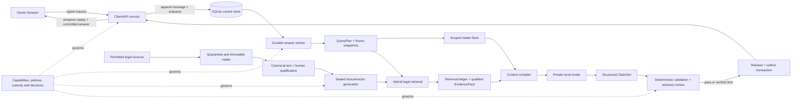

# LegalBot full-system architecture

## Purpose and first scope

LegalBot provides plain-language legal information, issue spotting, fact-sensitive
analysis and practical next steps. General Enquiry (GE) is the first product and
evaluation lane. Problem Based (PB) and Essay use the same evidence pipeline with
different answer contracts. The first release is a local, single-owner England and
Wales pilot.

The system does not claim a lawyer-client relationship, legal representation,
filing, guaranteed outcomes, complete jurisdictional coverage or a completed human
handoff. Wider public access remains a later rollout decision.

## Non-negotiable invariants

1. User messages, uploads and prior answers are untrusted matter context, never
   legal authority or system instructions.
2. Every material legal proposition binds qualified evidence for the requested
   jurisdiction and date.
3. Every material factual premise binds an attributed fact revision from the exact
   conversation snapshot.
4. Search rank is not legal qualification. Identity, lane, jurisdiction,
   currentness, commencement, extent and relevance all pass separately.
5. The model produces structured claims. It never invents or renders source
   identities or OSCOLA citations.
6. Deterministic material failures cannot be overridden by a model reviewer.
7. The browser receives progress metadata and committed verified answers only.
8. A job binds one request, conversation revision, fact snapshot, candidate,
   policy, model and schema selection. Changed inputs require a successor job.
9. Exact runtime/evaluation inputs are immutable for reproducibility; the design
   itself remains one editable working set.
10. No deletion, promotion, unseen disclosure/run or live activation occurs without
    the applicable owner authority.

## Four planes

1. **Experience plane:** browser, typed API, committed-answer fetch and replayable
   WebSocket/status projection. It has no direct database, vault, index, model or
   private-evaluation access.
2. **Answer plane:** durable job, immutable QueryPlan, conversation and fact
   snapshots, retrieval ledger, context compiler, local model, structured claim
   set, validation report and transactional release/outbox.
3. **Knowledge plane:** permitted source intake, immutable bytes, canonical text,
   human qualification/currentness, structural chunks, lexical/vector generations
   and a separately controlled release pointer.
4. **Governance plane:** selected schemas and policies, runtime capabilities,
   evaluation/training/unseen custody, decisions, privacy-safe observability,
   incidents and backup/restore evidence.

## Online answer flow

1. Validate the typed request, ownership/read capability, idempotency key,
   conversation revision, mode, jurisdiction/date status and admission limits.
2. Append the encrypted user message and create one durable job. A conflicting
   replay or conversation revision returns a conflict without duplicate work.
3. Freeze `ConversationSnapshot`, `MatterFactSnapshot v2` and `QueryPlan v2`.
   `data_intent` chooses `NO_RETRIEVAL`, `KNOWLEDGE_ONLY`, `MATTER_ONLY` or
   `HYBRID`; an independent deterministic `response_disposition` controls whether
   the system answers, clarifies, limits, refuses, escalates, reports scope or holds.
4. Retrieve exact scoped matter facts and/or qualified legal sources. Hybrid legal
   retrieval performs exact-reference parsing, lexical search, vector search,
   stable fusion, candidate-bound reranking, legal qualification, deduplication and
   issue-aware evidence allocation.
5. Record every attempted route, hit, rank, rerank, qualification, rejection,
   selection, degradation, resource use and issue gap in `RetrievalResult`.
6. Compile only the required fact revisions and EvidenceSpans, separated by trust
   role and bounded by per-issue and whole-context budgets.
7. Generate a typed `ClaimSet`. Each legal rule, application and limitation binds
   its exact EvidenceSpan and/or FactRef prerequisites.
8. Validate identity, facts, evidence, jurisdiction/date/currentness, quotation,
   citation metadata, dates/amounts/calculations, contradiction, privacy, safety,
   disposition and output shape. Advisory review can add a hold but cannot override
   a deterministic material failure.
9. At most one named repair child may correct specified defects. It receives a new
   digest and a complete new validation report.
10. Commit one verified full/concise/limited release and outbox row atomically.
    `done` has a distinct event ID and sequence and binds the committed release.

## Conversation and matter flow

A conversation is append-only and versioned. A message correction appends a new
message/fact revision; it never edits an earlier answer into a new truth. The
snapshot records exactly which messages were included, omitted or unavailable.

Matter facts separate:

- **origin:** user statement, document extraction, deterministic derivation or
  explicit user confirmation;
- **status:** stated, extracted, confirmed, disputed, unknown, superseded, rejected
  or scope-stale; and
- **scope:** exact conversation, source message/upload, jurisdiction relevance and
  any affected issue IDs.

Conflicting facts stay in a conflict group. The system never resolves them from
model confidence. It clarifies only facts that can change a material conclusion.

## Offline knowledge flow

Permitted source → quarantine/accounting → immutable raw bytes → deterministic
canonical text → identity/rights/jurisdiction/currentness review → legal structural
chunks → pinned lexical and embedding builds → generation closure → retrieval
attestation → separately authorized pointer switch.

A `KnowledgeGenerationManifest` binds source versions, parser/OCR/chunker,
embedding/tokenizer, lexical configuration, vector schema, reranker, counts, file
hashes, qualification policy and verification results. A candidate is unusable if
closure, parity or attestation fails. Updates create new versions and generations;
they do not mutate or automatically delete predecessors.

## Retrieval and evidence allocation

Candidate depth and final top-K are distinct. Lexical and vector searches maximize
recall; reranking improves order; legal qualification determines admissibility;
issue allocation determines which qualified spans enter the prompt.

Selection reserves support for each material issue and, where relevant, the main
rule, exceptions, contrary authority and remedy/procedure. Duplicate high-scoring
chunks cannot consume the whole context. The selector may return fewer than K,
name a gap, request a fact, give a verified limited response or hold. It never
fills the prompt with unqualified context merely to reach K.

## Release truth and user-visible states

Only three prose releases exist: `verified_full`, `verified_concise` and
`verified_limited`. `held`, `system_error` and `cancelled` are terminal job outcomes
with a safe explanation, not answer releases. “Verified” means the specified
checks passed for the bound inputs; it is not a guarantee of legal correctness.

The user sees a direct answer when supported, necessary clarification when a fact
can change the result, precise limitations when evidence is incomplete, and honest
urgent or professional-help information. The system never claims that a referral,
contact, filing or protective action occurred unless a separately approved service
actually completed it.

## Evaluation and improvement flow

The approved sequence is factual check → quality check → owner review → repair the
responsible layer → visible re-evaluation → owner approval → protected unseen once.
GE uses all 331 visible cases plus 32 separately reported system scenarios. PB and
Essay use the same sequence when selected. Evaluation cases, user histories,
reviewer notes and unseen content do not become training data.

Every run binds case order, prompt-only input projection, candidate, model, prompt,
policies, renderer, validators, gold/currentness decision, private root and exposure
ledger. Every case has a result. Missing, held, error, cancelled and ineligible
cases remain in the denominator.

## Security and public boundary

The local pilot still validates Host/Origin, request scope, object ownership and
capabilities. Loopback is exposure reduction, not proof of authorization. Sensitive
prose is application-encrypted and excluded from ordinary logs/events. Retrieved
text and uploads are data under strict delimiters; they cannot issue tool or system
instructions.

Public access requires a later design for real principals, sessions, consent,
privacy notices, ownership, tenant isolation, abuse/rate controls, supported
languages, accessibility, deployment/secrets, incident response, data handling and
a truthful human-help channel. No public bind, accounts, cloud storage, sharing or
automatic handoff is authorized by this architecture.
