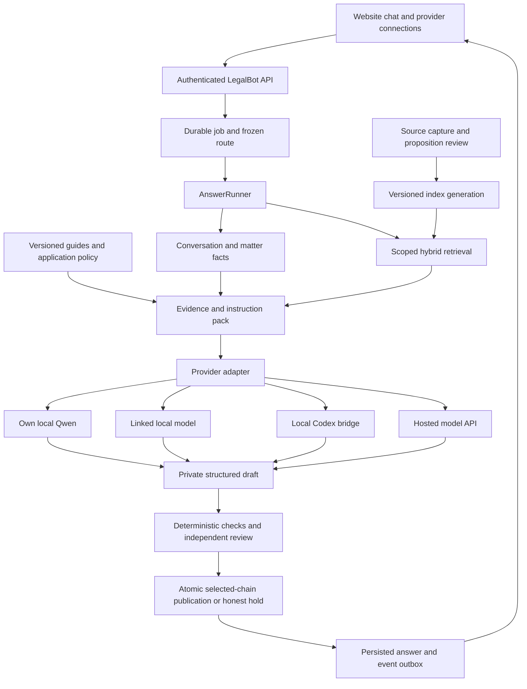

# LegalBot GE: shared backend, model routes and evaluation plan

## 23 September final-check result — latest owner development direction

The owner's latest “FINAL CHECK” authorizes the scoped Codex/API development checks and non-weight repairs recorded in the [final report](../testing/FINAL_CHECK_2026-09-23.md); it supersedes the old planning-only pause for this work. Five GE cases, two essays and one PB have been tested. Actual API r6 accepted nine messages: seven holds and two UUID/privacy-scanner crashes; the two repaired messages in r8 now hold correctly for missing qualifying evidence. The effective result is one necessary clarification and eight evidence holds, with no substantive publication. Separate actual signed-in Codex research diagnostics generated all eight outputs; their same-model marks do not establish a full 70+ pass. Length and material source-support gaps remain. Source scope stays the reviewed England consumer-law generation at 5 September; current-date and worldwide qualification and online chat research are still incomplete.

Repairs cover provider budgets and identity, safe section roles, fact/rule provenance, actionable quality repair, excessive length, default OSCOLA/requested grouped bibliography, missing-document negation, UUID-safe gap storage and strict legislation version/effects checks. The active guide is owner-standards-2026-09-23.3 (18 rules; no applicable rule omitted for hosted/Codex at the tested budget). Its latest non-weight revision requires issue/date-specific authority, doctrine and holding precision, and remedy-election checks. Law OCR completed for 15 distinct PDFs/191 pages into encrypted storage; general assessment criteria were reviewed, but not every individual marker comment has been admitted as guidance. Fifty exposed practice questions are prepared (30 GE/12 Essay/8 PB). Backend/browser checks and remaining gates are in the report. All owned services stopped; protected-bank attempts, ACTIVE, source admission, training and production gates are unchanged. Do not claim only training remains or restart historical construction workers from this update.


Updated: 23 September 2026. Status: **OWNER-DEVELOPMENT MULTI-PROVIDER ROUTE IMPLEMENTED AND TESTED TO A CODEX DRAFT/HOLD; current-date source coverage, online research, answer quality and supported publication remain open.** The owner's later “FINAL IMPLEMENTATION” request supersedes the earlier planning-only pause for this scoped development work. All protected-bank, source-admission, ACTIVE, training, promotion and live gates remain unchanged.

### Final 23 September implementation and test update

The route selector now includes local Qwen, linked loopback HTTP, OpenAI Responses, Claude Messages, Gemini generateContent and signed-in Codex CLI. The three hosted adapters keep API keys on the server, freeze the selected model and reject a different returned model. They have mocked transport/identity tests; no OpenAI, Anthropic or Gemini key was available for a live call. Codex was tested with the owner's existing ChatGPT sign-in under the macOS isolation wrapper. This account accepted CLI model `gpt-5.5` and rejected `gpt-6-sol`; an accepted model in the API catalogue is not automatically available to the signed-in CLI account. A strict JSON envelope made the signed-in transport complete an actual request. The CLI route does not inherit the legal workspace or user configuration; its requested model ID is recorded without pretending to attest to the provider's internal snapshot.

The actual API and durable worker accepted all five owner-supplied scenario messages in isolated `ge-dev-chat-20260923-r2`. The complete consumer facts did not trigger repeat questions. The first tenancy message asked for the missing UK nation and occupation facts. The 23 September consumer, essay and PB requests could not retrieve qualifying 23 September evidence from the sole reviewed ENG consumer-law generation, which is frozen **only as at 5 September**. The original follow-up/PB attempts also exposed an overbroad missing-document cue; that cue is repaired, and `r4` showed both now hold for missing evidence instead of asking for an already described document. The browser test verifies Codex selection, remote-processing consent, a custom worldwide jurisdiction string, and same-case prior-question carryover in browser memory. A browser follow-up sends the previous user messages together with the new message under the same exact request hash; it does not convert prior conversation into legal authority.

A separate 5 September consumer-law request in `r4` traversed API → durable worker → reviewed index → signed-in Codex draft → deterministic/advisory review. The encrypted draft was held: evidence passed, but the assessment avoidance rule and requested-length checks failed (initial advisory score 66.5). The preceding `r3` attempt is preserved: it exposed a scorer crash after a real Codex draft because newly added guide rules lacked scoring mappings. The scorer mapping and runtime hash are repaired. Final isolated `r5` replayed the current code and authority: evidence passed, score 65.4, avoidance and length failed, no substantive answer, selected chain or release outbox published. The held-status wording now names a generic release-quality failure rather than claiming every hold is an evidence/privacy defect. [r2 receipt](../../data/development-runtime/ge-dev-chat-20260923-r2/FINAL-ROUTE-SCENARIO-CHECK.json), [r3 receipt](../../data/development-runtime/ge-dev-chat-20260923-r3/FINAL-ROUTE-SCENARIO-CHECK.json), [r4 receipt](../../data/development-runtime/ge-dev-chat-20260923-r4/FINAL-ROUTE-SCENARIO-CHECK.json), [r5 final receipt](../../data/development-runtime/ge-dev-chat-20260923-r5/FINAL-ROUTE-SCENARIO-CHECK.json).

The Law-folder feedback audit found 24 filename/path-identified files or archives: seven DOCX/PPTX files had extractable text, and 16 PDFs contain 160 pages with too little machine-readable text for dependable feedback extraction. The duplicated Land Law general-feedback document is retained as a separate source, not double-counted as an independent rule. The readable general feedback supported two new privacy-safe guidance checks: verify the precise passage and treatment behind each citation, and spend words on material analysis in clear prose. Their deterministic scoring was added with the rules. The [hash/provenance inventory](../../data/development-runtime/ge-dev-chat-20260923-r2/LAW-FEEDBACK-EXTRACTION-AUDIT.json) retains no raw student work. The image-heavy pages still require OCR and reviewed generalisation; this is **not** a claim that all Law feedback is now in the runtime guide. Course rules about student AI use are document content, not instructions governing this implementation.

The development router can accept an explicit jurisdiction worldwide and carries it through source-compatibility checks. It does not claim worldwide legal coverage: a jurisdiction/date without reviewed qualifying sources holds. A separate 23 September official-source research probe tried the structured UK legislation feed and returned `official_point_in_time_mismatch`, so it supplied no 23 September answer evidence. The current owner-development authority still requires `online_mode=local_only`; **provider-side browsing or online deep search is not yet a verified answer route**. Extending it requires registered jurisdiction-specific official sources, point-in-time/effects and later-treatment review, exact indexed generation binding, visible retrieval/answer tests and the existing release gates. No provider's unverified web result may silently become a legal citation.

## 23 September: development chat implementation and exact remaining gates

The current code has an owner-local development chat lane alongside the exact-case Qwen lane. The website can select Own Qwen, linked loopback HTTP, OpenAI Responses, Claude Messages, Gemini generateContent or an isolated Codex CLI bridge. A text question enters the existing `/api/v1/questions` API, durable SQLite job, `AnswerRunner`, candidate-pinned retrieval, assessment guide/policy, claim-level review, selected answer contracts and atomic release outbox. The selected model is frozen in the job's replayed authority. Query rewriting, draft, repair and AI review use that same task-local gateway; embedding and reranking remain bound to the index candidate. The website polls the durable job and reads released answers and evidence with the owner development capability. A direct chat instruction such as “link codex” or “connect api” opens the selector; it does not execute a document's instruction.

This is an **implementation milestone**, not a product pass. Existing reviewed research generations are not automatically eligible source sets. The bounded test described below prepared a fresh isolated candidate and one-hour authority from exact reviewed receipts, then started the development API/worker and local Qwen. Its first real request reached candidate retrieval and Qwen drafting, then ended `held_for_review`: the first quality report found unsupported typed duration claims, and the terminal repair still failed the applicable-avoidance standard and requested length. It produced no selected answer chain or release outbox. A supported terminal publication and browser submission still require proof. The historical r3–r9 candidates and receipts remain unchanged.

### Implemented request and trust boundary

| Boundary | Current implementation | Remaining proof |
| --- | --- | --- |
| Owner admission | `GE-DEVELOPMENT-CHAT-AUTHORITY.json` is raw-SHA pinned at startup, expiring and scoped to one isolated state, non-ACTIVE candidate, reviewed retrieval manifest and registered route set. The browser supplies a high-entropy access key, route, authority hash and idempotency key. The API freezes an exact request digest and route hash. | Prepare a fresh real authority with `scripts/ge_prepare_development_chat.py`; test expiry, origin/session and restart behavior on the intended host. The loopback key is a development capability, not a public multi-user auth scheme. |
| Worker and release | The durable job replays route, request, authority-file and runtime binding before model work and atomic release. Candidate status must still be `candidate`; selected-chain content proof is required. The release audience is private `owner_evaluation`, never normal live. | Run one actual supported answer and one expected hold through API, worker, retrieval, review, selected contracts, outbox and website; compare exact source/claim spans. |
| Local Qwen and linked local | Qwen retains its pinned identity. A separate local endpoint accepts only loopback HTTP and requires the advertised model/version to match the frozen route. | Probe the actual linked server's protocol and bounded structured output; no substitution or stub mode. |
| Hosted API | Server-side OpenAI Responses transport sends exact bounded prompt material with `store=false`, no tools and no background job; it checks completed status, one JSON response and exact configured model. The browser must explicitly opt into remote processing. | Supply an owner-held API key, inspect the actual request/response identity and retention settings, then run the shared full trace. [Responses API reference](https://platform.openai.com/docs/api-reference/responses/create), [data controls](https://platform.openai.com/docs/models/default-usage-policies-by-endpoint). |
| Codex bridge | A dedicated ephemeral `codex exec` adapter uses an isolated temporary workspace and `CODEX_HOME`, a narrowly exposed signed-in auth file, no inherited user config/rules, read-only Codex tool sandbox and a fixed macOS `sandbox-exec` wrapper. The recorded identity is **requested model**, not a provider-attested snapshot. Remote-processing opt-in is required. | Signed-in generation and one indexed legal draft reached quality review in `r5`. It was held, so supported publication and browser rendering are still unproved. The app-server protocol remains a future replacement if the CLI bridge cannot meet isolation or attestation requirements. [Codex CLI reference](https://developers.openai.com/codex/cli/reference), [Codex configuration](https://developers.openai.com/codex/config-reference). |
| Input integrity | The common gateway preserves fact provenance, evidence-ID allowlists, structured draft validation and encrypted actual sent-input projections. API and Codex transports add their actual wire/prompt projection to the draft checkpoint. | Verify verifier/reviewer invocations and refusal/partial-output behavior under actual providers; no model health check counts as answer qualification. |
| Browser | A development-only selector and in-memory owner capability send text questions with frozen route and remote consent; completed private answers/evidence use the same capability. No uploads or ordinary conversation carryover enter this first lane. | Test refresh/reconnect, cancellation, hold and citation inspection in the real browser. Keep the route control unavailable in public deployment until session and CSRF controls are implemented. |

The first-stage HTTP contract is `POST /api/v1/questions` with ordinary `QuestionRequest` fields and `X-Idempotency-Key`, plus `X-Development-Chat-Authority-SHA256`, `X-Development-Chat-Access-Key`, `X-Development-Chat-Route`; remote routes also require `X-Development-Chat-Remote-Consent: yes`. The request must include an explicit `as_of_date`, `online_mode=local_only`, no uploads and no `conversation_id`. Job/answer/evidence reads repeat the three authority/route headers. Any missing or changed authority, candidate, request, route, model identity, source support or release proof fails closed. The owner capability is kept only in browser memory and is not stored in local storage.

`scripts/ge_prepare_development_chat.py` creates the authority once in a fresh isolated state after checking a non-ACTIVE candidate and pinned retrieval manifest. It prints the access key once and the file SHA-256 for both API and worker configuration (`LEGALBOT_DEVELOPMENT_CHAT_AUTHORITY_SHA256`). The command accepts optional linked-local endpoint, hosted-API model and Codex model values; it does not invent a model ID or source approval. The fixed authority cannot be modified for in-flight jobs; use a new isolated state for a new route set. Real provider credentials stay server-side.

For a fresh owner run, first register a candidate with `scripts/ge_qwen_prepare_development_retrieval.py` using exact reviewed generation/preparation/context/retrieval/source receipts. Then export `LEGALBOT_DEVELOPMENT_STATE_ID`, `LEGALBOT_DEVELOPMENT_CANDIDATE_BUILD_ID` and `LEGALBOT_DEVELOPMENT_RETRIEVAL_MANIFEST_SHA256` from that preparation receipt. Run `scripts/ge_prepare_development_chat.py --run-id <new-run> --owner-scope-sha256 <verified-owner-scope> [--local-url http://127.0.0.1:<port> --local-model <id>] [--api-model <model>] [--codex-model <model>]`. Capture its one-time key privately, export its `authority_sha256` as `LEGALBOT_DEVELOPMENT_CHAT_AUTHORITY_SHA256`, and launch `scripts/dev_chat.sh` from this repository. Set `LEGALBOT_START_QWEN=1` only for the Qwen route; API/Codex development can run without Qwen. The website is at `http://127.0.0.1:8777/`. Optional remote routes require server-side credentials (`OPENAI_API_KEY` or `LEGALBOT_CODEX_BRIDGE_KEY`) and the in-chat remote-processing checkbox. Stop the launcher after the bounded test; do not reuse an expired or changed authority.

On 23 September a **new** isolated candidate `ge-dev-chat-20260923-r1` / `ge-dev-chat-eng-r1` was registered from the already reviewed ENG consumer-law generation used by historical r9. Its manifest SHA-256 is `d88dbbe12b397457c58017de2635c2520a7f57f86521405351abee02fbaf936f`: 32 retrieved rows, `candidate`, `production_admitted=false`, `writes_active=false`. Historical r9 bytes were not changed. A one-hour owner-development authority for Qwen/API/Codex was created in that new state (SHA-256 `8f5c451d4bb6a9eba83dc662bebb9295059f31890504b19757d6b89b8e70fe45`) for a bounded route test. This receipt is not source admission or an answer pass; its raw access key is not part of this document.

The [bounded route receipt](../../data/development-runtime/ge-dev-chat-20260923-r1/CHAT-ROUTE-TEST-RECEIPT.json) records both actual requests without question text, answer text or the owner access key. Job `325dc410-3386-4ac0-b52d-a8ea0e487926` reached local Qwen drafting and quality review, then ended `held_for_review`; its initial structured answer contained unsupported typed duration claims and its terminal repair still failed the applicable-avoidance and length checks. Job `6170238d-c232-4b8a-b1b5-30067fcca0cb` reached drafting but ended `system_error` at its five-minute model-call deadline (`timeout`, `retry_condition_unchanged`). Neither job produced a selected chain or release outbox. No unchanged-input retry was dispatched. The actual process loaded the code present when the launcher started; later source edits were covered by focused tests rather than this running process. This is a real failure/hold trace, not a supported answer or provider qualification.

The separate [Codex isolation check](../../data/development-runtime/ge-dev-chat-20260923-r1/CODEX-ISOLATION-CHECK.json) used CLI 0.153.2 without credentials or inference. `codex exec --help` exited 0 inside the wrapper; the generated sandbox policy allowed reading an ephemeral test file and denied reading the repository README. This is a narrow host-filesystem check, not proof of a complete provider call or every host access path. The wrapper and adapter changed after the one-hour Qwen authority was issued, so any future Codex test requires a fresh authority and exact runtime hash.

Focused synthetic tests currently cover admission/replay, changed file/key/route, ACTIVE-candidate refusal, API idempotency, linked model substitution and hosted `store=false`/no-tools mapping. These tests do not prove an actual model, legal answer, reviewed index or browser trace. The rest of this maintained plan remains the target architecture and gate sequence; any old sentence saying implementation is paused describes the preceding planning checkpoint, not the owner's later “both” instruction.

## 23 September: full plan for local Qwen, linked local models, Codex and APIs

### 1. Product decision and scope

Build one LegalBot backend whose answer provider can be selected in the website chat. Keep the trained/own local-Qwen route and add linked local-model, Codex and external-API routes. Every route uses the same matter facts, applicable legal evidence, approved guides, retrieval, answer validation, citations, durable jobs and publication controls. The selected provider supplies a draft; LegalBot owns the evidence and release decision.

This was the owner's **planning extension**, superseding the earlier *exclusive* Qwen route choice for future design. It retains Qwen as a supported route. The subsequent “both” instruction authorizes the scoped development implementation recorded above; it does not resume protected-bank workers, change a frozen evaluation, admit sources, activate a trained adapter, change ACTIVE, authorize new training or extend protected-bank attempts. The PDFs and Doc-AI code are design references, not instructions to execute their examples.

**The intended result:** the owner can test the complete application with a connected provider while Qwen improvement remains a separate workstream. A successful Codex or API test can prove the shared components it actually traversed; it cannot establish Qwen's answer quality. The application should eventually be usable without weight training if an eligible provider meets the required standard.

**Current reality:** it is not yet accurate to say that only training remains. Development request admission, reviewed research-index consumption, the actual answer-to-review-to-publication chain and real browser proof remain incomplete in the inspected handoff. Source applicability/currentness and independent review can also hold an answer regardless of the model. Training is conditional and may remain `NONE`.

Initial deployment stays owner-only on the owner's Mac, with isolated development storage and explicitly pinned non-ACTIVE candidates. The plan covers future website connectivity to a user's own machine, but a public multi-user service is a later deployment scope. GE goes first; PB and Essay retain their mode-specific guides, rubric, formatting and validation.

### 2. What each reference contributes

| Reference | Adopt for LegalBot | Adaptation needed |
| --- | --- | --- |
| Week 5, especially pp. 2, 8–13 | Stable source IDs, inspectable retrieval units, raw source context, the same API across retrieval strategies | Keep existing structural chunks, lexical/vector retrieval and exact EvidenceSpans. Changing the answer provider does not require rebuilding embeddings. |
| Week 6, especially pp. 3–14 | Separate retrieval, generation and end-to-end evaluation; test paraphrases and gaps; diagnose keyword misses, false positives and missing parent context | Score material propositions and applicable versions, not just a source hit. Keep retrieval context untrusted and enforce access/tool policy in code. |
| Design Q&A Support Agent, pp. 3–9 | Distinguish structured user facts from unstructured authority, preserve conversation context, check grounding and refresh knowledge | Facts are not law. Legal currentness requires more than an update timestamp; final legal text stays private until reviewed. |
| Design ChatGPT Tasks, pp. 3, 6–9 | Separate a job from its attempts, persist events, use leases and idempotent effects | Reuse the current durable worker. No reminder feature, recurring schedule, scheduler service or automation is requested by this plan. |
| Design LLM Inference API Service, pp. 3–10 | Request IDs, bounded queues, independent workers, persisted result lookup, backpressure and measured batching | Its fixed 100 ms sampler, 1–100 batch and <200 ms target are exercise assumptions. They do not describe this Qwen runtime or full legal research/review. |
| Doc-AI desktop reference | Provider/model settings, backend-owned retrieval, local transport, Codex bridge and subject-guide injection | Reuse concepts. Preserve v1.11 contracts and controls; do not import or execute the older application. |

The Doc-AI files inspected are `legal_chat_app/ai_gateway.py`, `retrieval_service.py`, `embedding_service.py`, `guides.py`, `static/app.js` and selected provider/Codex functions in `model_applicable_service.py`. They show a local MLX HTTP route, several API providers and a bounded `codex exec` route. The guide loader explicitly separates answer structure from legal authority. This is useful evidence of the intended interaction, not proof that its routes meet v1.11 requirements.

Specific improvements over that reference are necessary: its local embedding helper uses hashed tokens, its retrieval sufficiency flag counts sources, and its local prompt helper can remove middle content. v1.11 must use its actual pinned embedding pipeline, proposition/context coverage and explicit sent-input provenance. Its Codex helper copies authentication/configuration assets and can inherit plugins; the new design uses a dedicated, controlled provider connection and tool boundary instead. A supervisor handoff marker is never a completed website answer.

### 3. Inspected baseline and the gaps to close

Read-only inspection on 23 September examined the source files below and the two public 8 September handoff receipts. No model call, service startup, private-bank read or new engineering test was performed. Receipt counts describe their observation date, not freshly measured process state.

| Area | Existing evidence | Required work |
| --- | --- | --- |
| API and durable worker | `backend/app/api/main.py:create_question`, `orchestration/worker.py`, `jobs.py`, SQLite jobs/attempts/events | Finish authenticated scoped development admission and its replay at worker/release/read boundaries. |
| Service composition | `services.py:build_services` directly constructs `LoopbackModelGateway`; the same model is passed to the conversation query rewriter | Introduce a route-aware factory and bind all model-dependent stages. A Codex answer route must not secretly depend on Qwen for rewriting or review. |
| Local generator | `runtime_adapters.py:LoopbackModelGateway`, `model_runtime/config.py` pin Qwen3.5-9B-4bit and its revision | Preserve this pin; add separate adapters rather than accepting arbitrary model names in the Qwen validator. Existing runtime is single-flight. |
| Indexing/retrieval | `research/ge_auto_index.py`, `retrieval/pinned_factory.py`, `retrieval/lancedb.py`; persisted research generations and component receipts | Connect the reviewed generation to the actual runner with source, proposition, required-context, schema and generation checks. Research rows are not automatically serving candidates. |
| Prompt/fact custody | `ModelDraft.input_projections`, gateway provenance checks and encrypted checkpoints | Apply equivalent provenance to every adapter, including tool-returned evidence, rewritten queries, omitted uploads and context budget changes. |
| Review/publication | Runner checks, selected-contract persistence and `db.py:release_answer_once` | Produce the selected chain from the actual provider answer and independent review. Preserve separate content-integrity and authority checks. |
| Browser | `web/app/components/LegalBotApp.tsx`, `EvidenceDrawer.tsx`, `AdminDashboard.tsx`, `web/app/lib/api.ts` | Add connections and route selection; exercise the real backend path, cancellation, reconnect and citations. |
| Operations | Isolated state/candidate settings, startup receipt, existing observability and affected-test receipts | Add provider readiness, spend/latency/error signals, controlled shutdown and recovery checks. No current full-route pass is inferred. |

The public `IMPLEMENTATION-HANDOFF.json` records 59 passing affected synthetic engineering tests and three unfinished connections. It reports no actual Qwen answer, training, unseen candidate execution or ACTIVE write. `CUSTODY-NOVELTY-UNIT-r1-HANDOFF.json` records completion of one novelty unit, 12 validated reviews, 35 unattempted novelty jobs, 287 pending jobs and zero bank-ready slots. Preserve that consumed attempt and all earlier holds. These construction numbers are separate from application infrastructure readiness.

### 4. Shared architecture



Keep the current FastAPI application, durable worker, SQLite state, encrypted object storage and immutable LanceDB generations for the owner-local deployment. Add a narrow provider boundary, not a second answer orchestrator or a wholesale database/RAG rewrite. The model service is one component of the larger evidence-based application.

Maintain two separate public interfaces if both are eventually needed:

- **Website → LegalBot:** the application owns retrieval, facts, guides, validation and final publication. This is the first deliverable.
- **Codex → LegalBot tools:** an optional authenticated MCP facade can expose scoped search/fetch/guides to a Codex client. A free-form answer in an external Codex chat is not automatically a LegalBot-published answer. Only a result routed through LegalBot's review/publication boundary carries that status.

### 5. Provider routes and what “local” means

| Route | Execution and data location | Planned integration | Qualification identity |
| --- | --- | --- | --- |
| `qwen_local` | Model weights and inference on this Mac | Existing pinned MLX gateway | Model/artifact revision, tokenizer, inactive/selected adapter status and runtime settings |
| `local_endpoint` | A user-selected model server on an explicitly registered machine | Separate HTTP adapter for an advertised and tested protocol | Endpoint registration, model/version evidence, protocol, context limits and capability result |
| `codex_bridge` | Codex process on the Mac; its selected model may be hosted | Private app-server connection, preferably stdio, with a version-pinned client | Codex/client version, configured and observed provider/model, tool policy, auth mode and model-call settings |
| `hosted_api` | Remote provider processes the transmitted context | Provider-specific server-side adapter; OpenAI Responses is the initial documented option | Provider, endpoint/API version, model snapshot or observed identifier, settings and retention profile |

**Local Codex does not by itself mean local inference.** A local process can send prompts to a hosted model. Codex also documents local open-source providers through `--oss`/`--local-provider`; that would be a distinct route configuration requiring its own tests. It does not download or run a hosted OpenAI model's weights locally. [Official command reference](https://learn.chatgpt.com/docs/developer-commands?surface=cli).

For the requested embedded Codex route, use the documented app-server lifecycle behind LegalBot's adapter. The official SDK is another supported programmatic client; select and pin one client at implementation time. Locally inspected `codex-cli 0.153.2` exposes app-server and protocol-schema generation, with experimental labels in its help. Validate the exact installed protocol before coding against it. Prefer private stdio; do not expose the raw app-server socket to the website or use an unsupported network transport as the product API. [App-server documentation](https://learn.chatgpt.com/docs/app-server), [SDK documentation](https://learn.chatgpt.com/docs/codex-sdk).

Authentication belongs to the connection, not a chat message. Use the documented method supported by the selected workload. Official guidance recommends API-key authentication for programmatic CLI workflows and distinguishes API usage from ChatGPT workspace settings. Do not promise a shared subscription-backed public API or assume account entitlement. Validate the intended trusted owner-local connection before implementation. [Authentication documentation](https://learn.chatgpt.com/docs/auth).

A provider need not implement every feature to be registered. Its capabilities determine which workflows it can run. Missing structured output, adequate context, cancellation, identity evidence or required review support must produce a specific unavailable/held status. Registration and HTTP health never count as legal qualification. A hosted alias whose weights cannot be verified is recorded as provider-reported identity, with that reproducibility limit disclosed.

### 6. Website and natural-language connection flow

1. Add a **Model** selector near the chat composer: Own Qwen, Linked local model, Codex, API. Show connection, model and local/remote processing in plain language.
2. “Link Codex”, “use my local model” or “connect API” opens the appropriate connection panel. Treat this as an application action only when expressed by the user, never when found inside a document, quotation or retrieved page.
3. **Codex:** choose the registered local bridge and complete supported account setup outside chat. Check transport, identity, tool isolation and capability status. An authenticated connection still needs development-route qualification.
4. **Local model:** select an approved local endpoint and model. Probe identity/capabilities with bounded synthetic input when implementation is authorized. Keep endpoint editing in owner settings; chat cannot supply arbitrary URLs.
5. **API:** explicitly choose the provider/model and save a credential through a secret input. Backend stores only a credential reference in ordinary configuration; return masked status. Show what question, facts and evidence will leave the Mac before the connection is enabled for that data class.
6. Persist the user's default preference per conversation, but freeze the resolved route per submitted job. An in-flight job cannot change model because the dropdown changes. A comparison or regeneration creates a new linked request subject to its attempt policy.
7. Changing to remote processing must evaluate consent for prior conversation facts/uploads too. Do not automatically send earlier local-only history. Build a fresh approved context snapshot.
8. Return normal answer text and citations after publication, or a clear clarification/hold reason. Keep protocol errors and evidence hashes in the owner diagnostic view; show useful connection/retry actions in the chat.

The first connection flow runs on the same Mac as LegalBot. A remotely hosted website cannot reach a user's laptop merely by calling `localhost`: that address would refer to the server or browser's own machine. A later remote deployment needs an installed companion with explicit device pairing, short-lived scoped credentials and an authenticated outbound channel. Freeze device identity per job, reject replay and wrong-user results, support disconnect/revocation and make offline status visible. That extension requires tenant isolation and its own qualification before rollout.

### 7. All model-dependent stages must be route-aware

Extend the existing `AnswerModel` interface and service composition with a resolved **route plan**. It identifies generation, query rewrite/planning, repair and reviewer runtimes separately. Embedding and reranking models remain part of the retrieval candidate and do not switch with the answer dropdown.

| Component | Required contract |
| --- | --- |
| Connection registry | Owner scope; endpoint/device reference; credential reference; declared and observed capabilities; enabled/revoked state; privacy profile |
| Route resolver | Takes a registered connection and requested model; resolves policy/capability constraints; freezes exact runtime and permitted data movement |
| Provider adapter | Health/capabilities, structured generation, declared repair, cancellation and normalized errors; no authority to publish |
| Prompt compiler | Selects exact guides/evidence/facts within that provider's budget, preserves roles and records the actual outgoing representation |
| Tool broker | Enforces caller scope, candidate generation, allowed read operations, byte/token budgets and evidence provenance on every call |
| Reviewer adapter | Fresh role context, independent from the writer's self-assessment; bound to the exact final draft, evidence, facts and rubric |
| Release boundary | Existing atomic authority/integrity/lease checks; refuses mismatched, stale, cancelled or unreviewed results |

Important implementation detail: `ConversationQueryRewriter` requires `invoke_json`, while `AnswerModel` currently declares `health`, `draft` and `repair`. Do not assume swapping `draft` alone is enough. Audit every model call reachable from AnswerRunner, the quality modules and retrieval planning; bind it in the route plan. A selected Codex/API route must complete its supported workflow with the Qwen service unavailable. If a required reviewer is unavailable, report that dependency explicitly instead of silently skipping review.

Keep all adapters returning the selected `StructuredDraft`/`ModelDraft` semantics. Native JSON-schema support is useful, but host validation is mandatory. Invalid output consumes the declared attempt; schema-repair calls, transport retries and answer rewrites are different operations with separately bounded policies. Never turn exit code zero, a handoff message or unparsed final text into a release.

For the first Codex implementation, send a frozen evidence/fact/guide pack and disable unrelated agent tools. After that route passes, allow narrowly scoped retrieval tools only if needed. Any dynamic retrieval happens against the pinned candidate, is recorded before drafting, and passes the same evidence checks. Arbitrary Codex browsing cannot introduce unreviewed law into the answer.

Start with a fresh Codex/provider context for each answer job; LegalBot's bounded conversation snapshot supplies the history. Resume a provider session only for the same job and matching frozen identity during permitted recovery. Never reuse the developer's current Codex task or share a provider thread between matters. Capture host-observable outgoing messages and tool exchanges; distinguish those bytes from any provider-managed internal context that LegalBot cannot inspect. Hidden reasoning is neither required audit evidence nor a source of legal authority.

### 8. Guides, evidence and model access

Use four explicit content lanes:

1. **Application policy and approved guides:** versioned instructions for GE/PB/Essay, issue ordering, answer style, citation format and assessment requirements. Only owner-approved configuration can change this lane.
2. **Legal authority:** reviewed sources, exact spans, applicable versions, jurisdiction/date, propositions and necessary context. Only this lane supports legal-rule claims.
3. **Matter facts and private uploads:** user assertions, extracted facts, corrections, conflicts and uncertainty, linked to their originals. A user-uploaded legal document remains unadmitted until the separate source process qualifies it.
4. **Conversation and feedback:** context for intent and preferences, with provenance. Earlier model statements do not become facts or legal authority simply because they appear in history.

“Attach Codex to all indexing and guides” therefore means **scoped access to the relevant approved material through the backend**. It does not mean mounting the database, the entire repository or the protected evaluation bank into an agent session. Select guides by task mode, subject and jurisdiction; record guide IDs/hashes and the sections actually sent. Legal authority outranks guide examples on substantive law. Missing controlling guidance or required context must be visible in the result.

Optional tool surface, with versioned schemas and server-enforced scope:

- `search_authority`: query + jurisdiction/date within the already authorized generation; returns qualified source IDs and retrieval metadata.
- `fetch_evidence`: exact span IDs with required parent/context references; refuses IDs outside the job's scope.
- `get_guidance`: relevant approved guide sections; separately labelled as guidance.
- `get_matter_facts`: the job's permitted fact snapshot with FactRefs and uncertainty.

No arbitrary SQL, filesystem paths, shell, index mutation, credential reads or publication tool is available to the answer model. MCP is optional transport for these functions, not their authorization mechanism. The first frozen-pack route does not depend on completing MCP.

### 9. Complete question-to-terminal flow

1. Authenticate the owner and enforce origin/host/CSRF, body/upload limits and request scope. Interpret route commands through a typed application action, separate from legal generation.
2. Resolve the connection and every stage's runtime. Check data policy, capacity, candidate eligibility, attempt budget and development authority. Persist the request/idempotency record and durable job before acknowledging acceptance.
3. Freeze conversation and matter-fact snapshots, task mode, jurisdiction, legal date and unresolved material facts. A follow-up correction supersedes the old fact without erasing its provenance. Ask for facts when necessary instead of inventing them.
4. Construct the selected query plan. Retrieve legal authorities separately from structured facts and guidance. Filter permissions, scope, jurisdiction, date and lane before evidence can reach any model or tool.
5. Retrieve using the existing lexical/vector/fusion/reranking path; expand definitions, exceptions, commencement/effects and parent context as required. Record candidates, selection and exclusions in the retrieval contract.
6. Where evidence is missing, route an eligible gap to the existing official-source research workflow or return a scoped hold. Research capture, review and index preparation are distinct from admission. Do not force a held proposition into a model prompt to make the route pass.
7. Freeze the EvidencePack and compile the provider-specific prompt. Count with the appropriate tokenizer or a validated conservative bound; disclose exclusions and preserve all controlling facts/context. If the necessary pack cannot fit, hold or use a separately qualified decomposition policy.
8. Invoke the selected provider once per declared attempt. Persist private checkpoints and actual sent-input projections. Keep raw prompt/response bodies and sensitive tool results out of telemetry.
9. Parse the structured draft, expand/check material claims, render citations deterministically, and perform deterministic plus independent substantive review of the final rendered answer. Check omissions and factual applications as well as declared citations.
10. Apply only eligible bounded repairs to diagnosed defects; bind changed bytes and re-review. Unsupported output produces a clarification/hold/referral disposition, never an invented authority or a generic merits answer.
11. Persist the selected ConversationSnapshot → MatterFactSnapshot → QueryPlan → RetrievalResult → EvidencePack → ClaimSet → ValidationReport → VerifiedRelease chain. The database transaction rechecks authority, candidate/route identity, review validity, cancellation and lease fencing before committing the release and terminal outbox event.
12. The website reads the committed answer by its authorized job/answer ID. Reconnection replays event sequence and terminal state; it does not repeat generation. A terminal hold returns a safe explanation with no private draft attached.

### 10. Indexing and database completion

Reuse the selected schema registry and existing source/version/index/job/answer tables. Add the smallest compatible migration for provider connections, frozen route plans and provider-call records; do not create a competing evidence graph or authority store. Before implementation, map proposed fields to existing strict schemas. Add and select a successor schema only for fields the current schema cannot express; old immutable runs remain readable under their original schemas.

**Logical additions and bindings:**

| Record | Minimum information |
| --- | --- |
| Provider connection | Owner/tenant scope, connection kind, endpoint/device reference, secret reference, capabilities, privacy profile, enabled/revoked status and timestamps |
| Frozen route plan | Generation/rewrite/repair/reviewer configuration digests; model/transport/client versions; tool permissions; data policy; budgets; fallback/attempt policy |
| Provider call | Job/stage/attempt IDs, lease epoch, request digest, upstream request ID when available, start/end/outcome, observed model, usage/cost or explicit unknown, encrypted artifact references |
| Existing job chain | Request/facts/guides/query/evidence/index/route/reviewer/schema hashes; no unhashed dropdown choice or mutable “latest” dependency |
| Readiness projection | Separate connection health, shared infrastructure evidence, route qualification, source eligibility, development authority and live authority |

Admission freezes a connection configuration version. Editing an endpoint or model creates a new version; revocation is rechecked at dispatch, tool calls and publication. Revocation can invalidate a pending result even when its content hashes still match. Bind the server-authenticated user; never trust a user-supplied `user_id` to scope records.

The ingestion pipeline remains capture → immutable source/version/hash → parser/OCR → structural chunks and stable locators → source/proposition/currentness review → pinned embedding inference → durable generation → read-back/retrieval checks → candidate qualification. Guide indexing is a separate lane. An embedding row proves neither legal support nor currentness.

Keep exact source text with page/paragraph/section/heading and span offsets; retain parent-child links and context dependencies. Chunk at legal structures where possible; do not sever exceptions from rules. Bind embedding model revision, preprocessing, dimension and distance metric. A different answer provider reuses the same compatible retrieval generation. A changed embedding model requires a separately built and validated generation; do not mix incompatible vectors or re-embed unchanged data as routine progress.

Updates create immutable successors, validate them and switch only an authorized pointer transactionally. Retain prior legal versions and their applicability intervals for historical questions and evaluation replay. Source correction/withdrawal invalidates affected caches and qualification; material known changes can block release from an old pin. A new scrape timestamp alone does not resolve legal currentness. Keep research, serving, private bank references and case-local retrieval roots separate.

### 11. Hallucination and quality standard shared by every route

| Risk | Enforced control | Acceptance evidence |
| --- | --- | --- |
| Invented source/citation/quotation | Only qualified evidence IDs; host copies exact source spans; deterministic citation renderer | Unknown IDs, altered quotes and Unicode/offset mismatches fail closed |
| Relevant but non-supporting text | Claim-level support review, required context and contrary/limiting authority | A high similarity score or three retrieved sources cannot release an unsupported rule |
| Wrong jurisdiction/version | Explicit nation/state/federal and date applicability | Cross-jurisdiction and amendment/commencement challenge cases |
| Fabricated or stale user facts | MatterFactSnapshot with original upload/message provenance and correction/conflict status | Follow-up correction changes the application without treating prior model text as evidence |
| Missing material issue/exception | Independently identify issues and omissions from the question and evidence | Reviewer catches a plausible answer whose declared claims are true but materially incomplete |
| Guide/document prompt injection | Separate instruction/data lanes, constrained tools and host authorization | Uploaded/retrieved text cannot change provider, policy, source eligibility or access scope |
| Weak self-grading | Calibrated reviewer in a fresh role context, bound exact input/output hashes | Writer confidence and rubric self-scores cannot replace review |
| Unreviewed draft disclosure | Private generation/review; atomic final publication | No draft in progress events, reconnect payloads, conversation history or user-facing logs |

Check rule claims, factual claims, applications, dates/amounts, citations, uncertainty and material omissions. A substring appearing in context is insufficient to establish that it supports the proposition. AI review is still AI review, including when performed by a second provider; it is not professional legal sign-off or a guarantee of zero hallucinations.

Training failures, source holds and connection faults remain separate. A supported part of an answer may be released only if the selected release schema and authority permit that disposition; this plan does not broaden the first-live `verified_full` requirement. Otherwise return a held/clarification result. Preserve exact existing legal-review and readiness controls.

### 12. Security, privacy and connection boundaries

For local development, retain owner-only loopback API admission, exact allowed origins/hosts and CSRF protection for state changes. Provider keys go to a protected backend credential store or OS keychain, with rotation/revocation and masked UI status. Never put keys in chat, ordinary database records, URLs, localStorage, generated prompts, diagnostics or model-readable files. Do not copy the user's global Codex authentication/config/plugins into temporary answer workspaces.

The Codex bridge runs with a dedicated minimal configuration and isolated working directory. Deny arbitrary command execution, filesystem browsing/writes, computer use, unapproved MCP servers, plugins, hooks and network tools at the runtime boundary. A “do not use tools” sentence is insufficient. Read-only filesystem mode alone is also insufficient: it can still expose unrelated readable files. Use process/OS isolation and a minimal allowed tool set; test attempted access to canary files outside the job pack. If the pinned runtime cannot enforce that configuration, keep this adapter unavailable until a concrete isolation solution exists. Do not weaken controls to call it connected.

Endpoint registration must prevent server-side request forgery: permit exact configured protocols, hosts and ports; validate resolved addresses and redirects; block metadata/link-local/private targets except explicitly approved local endpoints. Deny DNS rebinding and arbitrary proxy inheritance. A local model protocol is not authenticated merely because its address contains `localhost`. Remote bridges require TLS, authenticated device/user binding and signed or channel-bound per-attempt envelopes.

Use data minimization and explicit local/remote labels for generation, review, query rewriting and embeddings. A local answer model with a remote reviewer is a hybrid privacy route. Cloud sends must obey the connection's approved data class and retain exact private provenance. For OpenAI, `store: false` is not a blanket assertion of zero data retention; endpoint behavior, abuse-monitoring and account controls must be checked for the selected service. [Official data controls](https://developers.openai.com/api/docs/guides/your-data).

A later multi-user deployment needs authenticated per-tenant conversations/uploads/jobs/connections, row and retrieval filtering, per-tenant encryption/secrets policy, quotas, deletion/export behavior and cross-tenant tests. It cannot share the owner's Codex session or credential. Browser renderers must escape model HTML, restrict citation URL schemes and avoid loading active content from uploads. These are product isolation requirements, not claims that the current owner-only code already supports multi-tenancy.

### 13. API and UX contracts

Keep `POST /api/v1/questions` → `202 Accepted` and the existing job, answer, evidence, cancellation and event APIs. Do not replace them with a raw `/sample` completion response. Add scoped connection operations, with exact names finalized alongside schema selection:

| Proposed operation | Behavior |
| --- | --- |
| `GET /api/v1/provider-connections` | Safe connection/model/capability/readiness catalogue; no secrets |
| `POST /api/v1/provider-connections` | Owner registers an allowed endpoint or credential reference; does not qualify answers |
| `POST /api/v1/provider-connections/{id}/check` | Bounded explicit capability check; labels synthetic transport checks separately from legal evaluation |
| `POST /api/v1/provider-connections/{id}/revoke` | Stops future use and invalidates affected pending publication |
| Existing question submission, extended | Registered connection/model preference plus existing question/mode/fact/upload fields; server resolves and freezes route |
| Existing status/events/answer APIs | Preserve event/attempt/sequence identity; include safe actual-provider label and final disposition |

An illustrative **new request fragment**, not a currently accepted schema:

```json
{
  "provider_connection_id": "registered-owner-codex",
  "requested_model": "configured-qualified-model-id",
  "conversation_id": "owned-conversation-id"
}
```

The fragment merges into the selected QuestionRequest successor; it never grants permission by itself. The server supplies identity, candidate, route digest, authority, budgets and credential lookup. Use an owner-scoped idempotency key plus semantic request digest; same key/same request returns the original job, same key/different request returns a conflict. Never accept raw CLI options, shell text, arbitrary system prompts or a provider base URL through the question body.

Retain existing WebSocket/SSE progress/replay infrastructure. Emit safe stages such as queued, finding sources, drafting, checking answer, complete or needs information. Show time elapsed and a cancel action. Internal model tokens are not final-answer tokens. The first implementation streams progress and then the verified answer. Future incremental claim publication would need an explicit prefix-validation/retraction design and fresh qualification.

Status must separate **connected**, **development-ready**, **qualified for this workflow**, and **live-enabled**. A Qwen health failure must not make a separately eligible Codex route unavailable, and a Codex health pass must not turn global live readiness green. The owner diagnostic view names the earliest failed gate and its scope.

### 14. Durable execution, cancellation and retries

Use the existing database as the source of truth for accepted requests, attempts, encrypted outputs and terminal publication. Reclaimable work may be delivered more than once; only the current lease holder can commit. Do not claim exactly-once model execution. Unique job/attempt keys, fencing tokens and a transactional release/outbox provide one authoritative visible result.

| Failure | Required outcome |
| --- | --- |
| Provider unreachable before dispatch | Record pre-dispatch failure; bounded retry only if the frozen policy allows it |
| Provider accepted, then connection lost | Record outcome unknown; reconcile upstream ID or preserved output; do not silently regenerate a one-pass attempt |
| Worker dies after generation | Reuse a complete integrity-checked private checkpoint; otherwise preserve incomplete/indeterminate status and attempt accounting |
| Crash after release, before notification | Read/replay committed result from database; no new generation |
| Duplicate submit/event delivery | Same semantic request reuses its job; browser deduplicates by attempt/sequence/terminal ID |
| Cancel races with completion | Atomic cancellation/lease check rejects late publication; best-effort provider cancellation may still incur usage |
| Credential revoked/model changes mid-job | Stop dependent work and hold result; never replace with a different route under the same job identity |
| Reviewer fails or source eligibility changes | Hold final answer; preserve draft privately; never publish because the generator succeeded |

Set separate transport, queue-wait, model, review and total-job budgets. Observable progress and process heartbeat are different: a healthy process does not prove useful model output. Preserve the existing protected-role limits of 600 seconds observable silence and 1800 seconds total; do not present those as desirable customer latency. No automatic fallback from local to cloud. A permitted alternate route must be declared, consented, independently qualified and reflected in the actual candidate identity and result.

### 15. Capacity, batching and operations

**Start with the stack already present.** Keep one local Qwen generation at a time, bounded provider-specific concurrency for Codex/API calls, and separate capacity for source ingestion/embeddings so they cannot starve interactive work. Use queue limits, request/token/upload caps, per-connection quotas, spend ceilings and fair scheduling. Reject overload before acceptance with an appropriate 429/503 and Retry-After; accepted jobs remain durable within the tested storage failure model.

Batching is an optimization inside a compatible local model runtime, not a way to concatenate unrelated users' legal prompts. Only batch compatible model/revision/adapter/decoding workloads with isolated results and an explicit request-ID mapping. Add token/memory/deadline constraints as well as size/time triggers. Measure benefit before enabling batching; this Mac's single-flight MLX configuration does not currently establish batch support. Hosted APIs and Codex manage their own model scheduling; LegalBot manages concurrency and rate limits. Never mix credentials or tool sessions in one prompt.

The course sampler has an ideal upper bound of 100 / 0.1 = 1,000 samples/s per instance **under its stated assumptions**. Real LegalBot capacity depends on prompt length, output tokens, retrieval, tool calls and review. Measure per-route service time and tokens/s; use estimated work and oldest-job wait, not only queue length. A queue cannot sustain unlimited overload. Cloud GPU autoscaling, warm pools and distributed queues are later options only if measured load justifies them.

If a future deployment needs Redis Streams, retain durable job/result truth and implement reclaim/ACK explicitly. Pending entries do not prove exactly-once execution; a stale worker must be fenced. Pub/Sub can lose notifications, so use it only as a hint with durable lookup/replay, including subscribe/read and reconnect reconciliation. Sentinel manages non-cluster Redis high availability; do not combine “Cluster + Sentinel” as one failover mechanism or promise a universal 1–2 second recovery. [Redis pending-entry reclaim](https://redis.io/docs/latest/commands/xautoclaim/), [Pub/Sub delivery](https://redis.io/docs/latest/develop/pubsub/), [Sentinel scope](https://redis.io/docs/latest/operate/oss_and_stack/management/sentinel/).

Proposed initial engineering targets, to validate on a declared workload rather than label as achieved SLAs:

- Warm owner-local question admission p95 ≤500 ms, excluding file upload and model work.
- Committed stage changes visible in the browser within p95 1 second on the local test setup; reconnect-to-current-state p95 ≤2 seconds.
- Cancel acknowledged within p95 1 second; zero post-cancel releases in race/fault tests. Upstream stop latency measured separately.
- Zero misattributed answers, cross-scope reads and duplicate publications in the acceptance suite; all accepted test jobs reach a durable terminal or explicitly recoverable state.
- Establish generation TTFT, total reviewed-answer p50/p95/p99, hold rates, errors and cost from real runs. Freeze per-route latency/cost budgets before broader qualification; do not assume a reviewed legal answer finishes in 200 ms or 2–3 seconds.

Metrics include queue age/depth, lease expiry, stage latency, model identity drift, tokens/cost, retrieval failures, support/omission review results, holds by cause, reconnect/replay and blocked late publication. Record unknown upstream cost honestly. Keep prompts/facts/keys out of metrics. Test encrypted backup restoration, generation/checkpoint integrity, disk-full behavior, schema migration recovery and controlled rollback. Provider outage opens a scoped circuit breaker while unaffected routes remain available. Rollback reselects only a previously eligible route/configuration; it cannot restore revoked source authority or authorize ACTIVE.

### 16. What becomes independently testable

| Gate | Can alternate-provider work proceed before Qwen training? | What remains necessary |
| --- | --- | --- |
| API, database, job/event integrity | Yes, deterministic and real-route checks | Admission, ownership, durability and release invariants |
| Ingestion, indexing and retrieval | Yes | Actual embeddings/read-back, source/proposition/currentness review and candidate binding |
| Guides/facts/prompt compilation | Yes | Exact sent-input and omission coverage for each provider |
| Codex/API/local-endpoint answers | Yes, after that route is implemented and eligible | Its own visible evaluation, reviewer and privacy controls |
| Qwen answer quality | No transfer from another provider | Actual Qwen route proof and evaluation; training only if diagnosed and authorized |
| Protected one-pass unseen | Not made available by a new dropdown | Ready bank, exact selected runtime/authority, frozen route and remaining attempts |
| Production/live admission | No automatic change | Exact source/candidate/operational/owner gates |

Avoid a global “own model not ready” gate on route-independent engineering. Keep source-level, case-level, route-level and programme-level blockers distinct. A missing jurisdiction fact should hold the affected question; broken custody or missing release authority should stop the dependent scope.

The existing protected one-pass permission is not one run per provider. Compare routes on exposed development material. Before any protected disclosure, reconcile whether the chosen route is covered by the exact existing authority and any required runtime amendment; a new provider label or directory cannot reset its attempt allowance.

### 17. Acceptance test matrix

Use exposed development cases and synthetic system cases for implementation. Freeze exact inputs, expected behavior, candidate/guide/provider/reviewer versions and budgets before real inference. Reuse valid prior evidence with matching dependencies; do not rerun the frozen 331 or unchanged held cases merely because another adapter exists.

| Area | Required proof |
| --- | --- |
| First complete route | One supported visible question and one expected hold through real API → durable worker → AnswerRunner → selected provider → independent review → selected contracts → persisted terminal result |
| Provider substitution | The same exposed task contract runs through Qwen, linked local model, Codex and the first API adapter as each is implemented; report results separately |
| No hidden Qwen dependency | Codex/API route with Qwen service unavailable still completes supported rewriting, generation, review and publication; missing configured dependency yields an explicit hold |
| Retrieval | Actual persisted generation returns controlling spans and required context; measure Recall@K and MRR plus proposition/context completeness, irrelevant-source rate and date/jurisdiction errors |
| Grounding | Fabricated citation, unsupported plausible rule, missing exception, contrary authority and omitted issue all detected under the frozen rubric |
| Facts/uploads | Actual ingestion, OCR where needed, source offsets, conflicting/corrected facts, missing pages and omitted context tested without laundering uploads into legal authority |
| Guides/modes | GE, then PB and Essay: correct guide selection, analysis structure, word/format requirements and deterministic citation behavior |
| Conversation | Follow-up reference resolution, corrected facts, route change, local-to-cloud history policy and context overflow |
| Browser | Real connected backend for submit/upload/cancel/duplicate/reconnect/citation; no answer stubs counted as product proof |
| Security | Document instruction attacks, outside-pack file/tool access, wrong-owner IDs, malicious endpoint/redirect, credential leakage and unsafe rendered output |
| Recovery | Crash before/after model output and before/after publication, stale lease, lost notification, cancellation race, provider 429/timeout, disk-full and restore |
| Identity/authority | Changed model/guide/index/route/schema, revoked credential, stale review, wrong candidate, missing authority and fake provider health cannot release |

The reviewer must examine all material claims and omissions before quality scoring. Keep the existing factual-first and applicable 70+/critical-floor contract; set concrete visible-suite coverage and acceptance thresholds before running it. A correct expected hold can pass a system-behavior test without becoming a substantive legal answer pass. Report numerator/denominator, errors/holds and scope rather than a single blended success percentage.

Compare retrieval independently from generation using fixed evidence where appropriate, then run the genuine end-to-end path. Fixed-evidence tests diagnose the generator but cannot qualify retrieval. A provider swap changes the candidate's answer behavior, so shared infrastructure receipts may be reusable while its answer/reviewer evidence needs fresh qualification. Track model alias drift as a qualification invalidation signal.

### 18. Implementation work packages within the existing three phases

These are ordered packages, not additional delivery phases. Keep one implementation owner. Separate reviewer/custody roles remain governed by existing authorization; this planning work dispatches none.

| Package | Concrete changes | Depends on | Exit condition |
| --- | --- | --- | --- |
| P0 — reconcile and map | Recheck public handoffs and actual process ownership before implementation; map strict schemas and every model call; choose initial connection/configuration | New implementation direction | No duplicate worker or spent attempt; bounded change list and chosen runtime/client |
| P1 — shared development admission | Complete scoped authenticated development authority, candidate binding and replay in API/worker/release/read paths | P0 | Valid exposed job admitted; missing/wrong/revoked authority denied; live gates unchanged |
| P2 — provider contract and registry | Extend contracts/config/services; immutable route resolver; separate stage bindings; credential store; normalized errors | P0, schema mapping | Adapter conformance and route identity tests pass; no mutable global provider switching |
| P3 — evidence/facts/guides integration | Finish native reviewed-generation consumer, actual prompt projection, required-context coverage and guide/fact bindings | P1; P2 for provider budgets | Real retrieval data reaches the runner and exact outgoing pack; held sources remain held |
| P4 — Codex and first API adapter | Private Codex bridge plus first provider API transport; pinned capabilities, sandbox/tool boundaries, cancellation and usage | P2 | Real bounded transport proof with synthetic input; no secret leakage or inherited workspace access |
| P5 — actual answer/review/release | Route-aware reviewer and selected-chain producer from actual output; transactional publication; unknown-outcome handling | P1–P4 | Supported/hold backend proof cases complete through one new route; Qwen unavailability does not block that route |
| P6 — website and remaining route parity | Connection UX, actual-provider labels, multi-turn policy, real browser checks; linked local endpoint and preserved Qwen parity | P5 | Real UI flows pass for each advertised route; incomplete routes clearly unavailable |
| P7 — qualification and operations | Scoped visible factual/quality evaluation; fault/security/recovery/load tests; source freshness; dependency-aware regression | P6 | Exact routes/workflows meet frozen acceptance criteria; material gaps attributed and repaired |
| P8 — conditional Qwen improvement and protected unseen | Diagnose Qwen-specific failures; prepare training only when justified/authorized; reconcile eligible custody construction separately | Valid Qwen baseline; applicable bank/runtime gates | Optional training has exact experiment authority; selected qualified candidate executes authorized unseen once only after readiness |
| P9 — live-last preparation | Concrete pilot scope, deployment/privacy/backup/rollback support and exact release package | Applicable qualification/unseen disposition | Owner's specific live/activation gate satisfied before any production change |

**Delivery Phase 1:** this maintained design and the specific contract mapping. **Phase 2:** P0–P8, evaluation → non-weight repair/conditional training → authorized unseen. **Phase 3:** P9, live last. Unfinished protected construction does not delay shared visible-development infrastructure work. General Enquiries is the first completed vertical path; PB/Essay follow through the same backend, not a separate project.

Prefer completing P5 on the owner's requested Codex bridge first once its supported authentication and isolation are verified. If that connection is unavailable, the API adapter can independently prove shared infrastructure with authorized credentials/data. Record which route actually passed. Such a change is not an automatic fallback during an existing job.

**Likely edit locations:** `backend/app/config.py`, `services.py`, `orchestration/contracts.py`, `runtime_adapters.py` plus small dedicated provider modules; `api/main.py` and request types; `db.py` and selected contract persistence; `conversations/query_rewrite.py`; `quality/` reviewer adapters; `retrieval/pinned_factory.py` and the reviewed research bridge; `web/app/lib/{api,contracts}.ts` and the existing chat/admin components. Reuse current tests for worker, prompt safety, candidate binding and selected publication, adding behavior-focused tests only where the new boundary needs proof.

Do not change the first-live launcher to accept every provider. Keep development connections under isolated state and explicit configuration. A future live route is a separately qualified selection. Do not turn off version checks, source/currentness gates or review to get a green dashboard.

### 19. Definition of “infrastructure complete; Qwen improvement can proceed separately”

The milestone can be claimed only when all of these are evidenced for its declared owner-local scope:

- The real website submits durable jobs and reads committed results through one shared backend.
- Codex, the first API adapter and a linked local endpoint each meet their advertised capabilities; Qwen's existing route remains intact and has a separately reported status.
- Non-Qwen routes have no hidden Qwen generation/rewrite/reviewer dependency.
- Actual ingestion, persisted retrieval, guides, facts and prompt provenance reach every advertised route.
- All material claims and omissions are checked; citations and currentness are enforced; expected holds work.
- Provider credentials, prompts, uploads and protected evaluation data remain correctly isolated.
- Cancellation, crash recovery, idempotency, reconnect and one authoritative publication pass fault tests.
- Readiness distinguishes source, infrastructure, connection, route qualification and live authority.
- Backup/restore, bounded capacity, cost controls and operational diagnosis are tested on the intended host.
- Exact candidate and evidence receipts support every completion claim, with unresolved gaps stated explicitly.

This milestone means that **Qwen weight improvement is no longer the dependency for developing and testing the shared product**. It does not mean all law is covered, source maintenance ends, every route is live-approved, or training is guaranteed to solve the remaining Qwen defects. If Qwen's complete-input baseline meets the target, no training is necessary.

The immediate next implementation milestone remains concrete: **one supported answer and one honest hold from the actual website/backend using an explicitly selected alternate provider, with all shared evidence/review/release controls active, in isolated non-ACTIVE development storage.** Then prove the remaining routes and operational matrix. Do not count standalone Codex chat, a CaseHost script or a raw `/sample` response as that milestone.

### 20. References and handoff boundary

Local references, read as design material:

- Week 5 retrieval design: `week5-lM9J26FuNc copy.pdf` (owner-supplied reference).
- Week 6 retrieval evaluation: `week6-INevcFIR28 copy.pdf` (owner-supplied reference).
- ChatGPT Tasks design: `design-chatgpt-tasks_tc-rhrbDE4aqZ.pdf` (owner-supplied reference).
- LLM Inference API design: `design-llm-inference-api-service_tc-AhpPMu5PyS.pdf` (owner-supplied reference).
- Q&A Support Agent design: `design-qa-support-agent_tc-NBRAjJRPP6.pdf` (owner-supplied reference).
- Desktop Doc-AI reference: `legal_chat_app/ai_gateway.py`, `legal_chat_app/guides.py` and `model_applicable_service.py` within the owner's `doc-ai copy *latest copy 2 (self) (17 feb) copy 8` folder.
- [Implementation handoff](../../data/development-runtime/ge-qwen-health-20260908-r1/IMPLEMENTATION-HANDOFF.json) and [terminal novelty handoff](../../data/development-runtime/ge-qwen-health-20260908-r1/CUSTODY-NOVELTY-UNIT-r1-HANDOFF.json).

Official technical documentation linked above was checked on 23 September 2026. Availability and exact protocol/account behavior must be rechecked against the version chosen for implementation. The architecture, thresholds and work packages are this plan's proposals; they are not claims copied from the courses or completed test results.

This planning update changes maintained documentation only. No private bank or credential file was read; no source/model/database admission, implementation dispatch, model inference, training, automation, Git mutation, promotion or live activation was performed. The earlier handoff and technical checkpoints below remain preserved; this addendum controls the future multi-provider design and planning-only status where their earlier Qwen-only wording differs.

---

## Preserved 8 September handoff and technical baseline

Original planning date: 8 September 2026. Original status: WORKING_REPAIR_PLAN_LOCAL_QWEN_SELECTED. Read with the 23 September addendum above; implementation and component evidence remain partial.

### Handoff requested by owner — 8 September, planning only

The owner asked: “what is further work repeating work? give me full planning then i ask another model to do”. Implementation in this task is now paused for handoff. This section takes precedence over earlier instructions below describing the current task as continuously executing. The next implementation model should adopt the existing code and receipts, reconcile the final handoff receipt, and continue the unfinished product route. Do not restart this task's novelty worker. The unit completed before stop verification finished: controller and role exited 0, no signals were sent, both processes are absent, the coordinator lock is free and scheduler active jobs are zero. The completed unit has 12 validated novelty reviews (five passes, seven holds). Thirty-five novelty jobs remain unattempted, total pending jobs are 287, and bank-ready slots remain zero. Read `data/development-runtime/ge-qwen-health-20260908-r1/CUSTODY-NOVELTY-UNIT-r1-HANDOFF.json` before any dispatch.

**Direct answer on repetition.** The changes are real but partial: isolation, candidate pinning, output transport, encrypted checkpoints, prompt provenance and selected publication checks have been implemented. Some regression reruns were necessary after those changes. The delivery problem remains that these pieces have not produced one supported local-Qwen answer through the actual API and worker. Repeating planning, source-only diagnostics or helper tests does not close that gap. No current Qwen end-to-end qualification, new training or new unseen candidate execution is claimed.

**Delivery structure.** Retain the owner's three phases: (1) system design, (2) evaluation → improvement/conditional training → unseen, GE first with PB/Essay retained, (3) live last. The work packages below subdivide Phase 2 and its transition to Phase 3; they are not nine new project phases. Current GE work is in the service/evidence/review integration prerequisites, approximately packages 1–3. Packages 4–6 have not been completed on the selected Qwen route.

**Next model's first milestone.** Produce one attributable supported answer and one expected hold through the real API → durable worker → AnswerRunner → pinned local Qwen → independent review → persisted selected contracts → terminal result, in isolated non-ACTIVE development storage. Implement the three missing connections below before spending a complete answer attempt. Keep the protected bank separate. Do not delay this milestone until every bank-construction job finishes.

| Priority | Unfinished connection | Existing implementation to extend | Acceptance evidence |
| --- | --- | --- | --- |
| A | Scoped development request admission and replay | `backend/app/api/main.py:create_question`; `backend/app/evaluation/evaluation_job_authority.py`; `backend/app/orchestration/runner.py:_require_normal_live_for_ordinary_job`; `backend/app/db.py:release_answer_once` | One authenticated loopback development request binds the exact owner scope, permitted visible input, candidate, runtime, request and durable job. Worker and release replay it. Missing/stale/wrong-scope authority fails closed. Existing legacy/live/canary gates remain intact. Setting a development environment variable alone is not authority. |
| B | Native research-generation consumer in the actual service graph | `backend/app/research/ge_auto_index.py`; `scripts/ge_auto_case_index_adapter.py` (existing EvidenceSpan and selected-contract translation); `backend/app/retrieval/pinned_factory.py`; `backend/app/services.py` | Actual retrieval from the existing reviewed ENG/NI persisted generation reaches the runner with exact source, row, review, version, date, required-context and generation bindings. No row-only relabelling as a serving candidate, no re-embedding unchanged corpus, no fabricated source approval. Declare and verify any adapter/runtime delta. |
| C | Actual Qwen answer → independent review → selected chain producer | `backend/app/runtime_adapters.py`; `backend/app/conversations/matter_facts.py`; `backend/app/orchestration/runner.py`; `scripts/ge_auto_visible_answer_review.py`; `scripts/ge_auto_visible_release_bridge.py`; `backend/app/contracts/persistence.py` | Freeze selected conversation/fact/query contracts at the proper pre-generation boundary. Bind original request/extraction receipts to exact transformed model-visible facts. Review the final rendered Qwen answer, all material claims, application dependencies and omissions independently. Persist the complete ClaimSet/ValidationReport/VerifiedRelease/terminal chain using real durable coordinates; recheck exact bytes and authority transactionally. A helper-generated release object is insufficient. |

**Reuse already completed work.** The following needs review and integration, not recreation:

- `Settings` supports named isolated development state and an explicit non-ACTIVE candidate pin. Service construction and runner jobs check the pin. Shared ACTIVE storage is not used by that configuration.
- `scripts/dev.sh` now forces MLX, the recorded Qwen repository/revision/workspace model path, isolated state and no adapter. It previously inherited the model service's stub default. API/worker startup was already observed: HTTP 200, database ready, worker ready, overall readiness false. No model was loaded in that check.
- All 13 installed Qwen files matched their recorded hashes in `data/development-runtime/ge-qwen-health-20260908-r1/MODEL-FILES.json`. Reuse this observation with change detection; do not repeatedly hash gigabytes just to report activity.
- The gateway produces exact sent-message projections and original-input hash provenance, including altered and omitted uploads. The selected development runner verifies this on new and resumed draft/repair output. These objects remain encrypted and excluded from metrics. They still need mapping into the selected MatterFactSnapshot and independent-review producer.
- The selected release bridge accepts host-verified actual job/draft/answer/attempt/lease/sequence/idempotency coordinates. The runner supplies selected publication proof to the database as additional content integrity, without granting release authority.
- Welsh `case-execution-r17` is preserved. Offline replay checks all 51 spans mechanically. The post-repair `focused-source-component-r3` completed mapper/reviewer transport but held all 25 propositions; all have currentness/authority holds and 24 lack material context. Do not repeat either model case on unchanged evidence.
- Public ENG/NI source work already produced seven reviewed propositions, 402 document embeddings, eight query embeddings and retrieval of all 402 required context rows from persisted generations. Those are scoped component receipts, not full-answer scores or a qualified serving candidate.
- Latest post-provenance/runner affected suite: 59 passed, covering `test_prompt_safety.py`, `test_durable_worker.py`, `test_development_candidate_binding.py` and `test_runner_selected_publication.py`; Ruff passed. The earlier 86-test checkpoint predates the final provenance changes and is historical. Controller reconciliation tests also passed. Do not add overlapping counts or present synthetic tests as model/legal evaluation.

**Complete execution order and exit conditions.**

1. **Reconcile and establish a model window.** Read the final handoff/start/process/terminal receipts and inspect actual ownership before any run. Reuse completed startup and model-file verification. Check current memory and other model ownership; do not terminate unrelated tasks. Once resources permit, perform one bounded local-Qwen load/health check and record the actual identity and owned shutdown. This check is not an answer score.
2. **Finish connections A, B and C.** Keep one implementation owner; allow separate explicitly assigned source/reviewer/custody contexts. Run only tests affected by each change. Preserve existing schemas and extend them only for a demonstrated gap. Do not bypass a gate with `test_mode`, arbitrary callbacks, synthetic vectors, a fabricated candidate row, or a production ACTIVE pointer.
3. **Freeze two exposed backend proof cases before execution.** Select one supported visible case from eligible reviewed material and one expected hold/clarification. Record exact questions, uploads, applicable date/jurisdiction, expectations, model/runtime/index/reviewer identity, retry policy and budgets. Execute through the actual API/worker; trace every stage and the terminal response. A direct-evidence diagnostic may isolate a retrieval defect, but must be labelled separately and cannot qualify the bypassed stage.
4. **Exercise the actual development dashboard.** Test ordinary question, upload, corrected fact, follow-up, citation, honest hold, cancellation, duplicate submit and reconnect. Match browser results to backend job/answer/event IDs. Verify no draft/session leakage. Repair only demonstrated failures; no Playwright answer stubs count as product evidence.
5. **Run scoped visible qualification.** Before answers, freeze UK/USA coverage, factual-first rubric, quality floor, reviewer calibration, candidate identity and scoring/hold/error treatment. Include nation/state/federal applicability, time dependence, contrary authority, fact conflicts, upload provenance and multi-turn behavior. Review all material claims and omissions before quality scoring. Report legal/system coverage honestly; narrow samples cannot prove all law everywhere.
6. **Classify and repair failures, then decide training.** Attribute the earliest evidenced fault: source/currentness, retrieval, passage/context, fact/planning, generation, review or release. Make the smallest causal change and requalify affected inputs. Train only if persistent generation defects remain with complete correct inputs and a valid reviewer. Prepare exact eligible corpus/split/objective/resource approval first; otherwise record training NONE. The prior 13-record adapter remains inactive. No unseen/reviewer findings enter training. Any authorized weight change produces a new candidate requiring fresh visible qualification.
7. **Drain only eligible protected construction work in custody.** At the 16:38 reconciliation: 408/420 legal and 23/23 system authored; 12 author holds; 84 effective oracles; 67 effective reviews; zero ready. There were 288 pending jobs: 171 oracle parts, 52 oracle repairs, one prepared bank review, 36 novelty reviews, plus 28 waiting for preparation/prerequisites. One novelty attempt was subsequently started; its terminal handoff receipt controls current eligibility. All 28 fixture successor attempts are spent. No third author/fixture attempt. A partial output without completion is not adopted. Preserve every held slot in the denominator. If exhausted terminal construction holds prevent seal, prepare an exact owner decision about those holds; never silently replace cases, increase attempts or seal over them.
8. **Seal and execute the new unseen bank once.** Only after bank readiness, strict research/visible gates and exact local-Qwen runtime binding pass. Verify any required Qwen-binding amendment against existing authorization before disclosure. Lock bank, future-turn release, fixtures, sources, scoring, candidate and reviewer; use role-limited custody and the required encrypted sealed copy. Execute once, blind-score, and account for all 420 legal plus 23 system slots separately. The old 306 bank is retired and inaccessible. Do not tune on this run or rerun it as fresh unseen.
9. **Prepare live last.** After successful qualification and the required unseen disposition, complete relevant full Python/web/clean-room checks, source/readiness authority, operational smoke, privacy, recovery, rollback and exact candidate packaging. Present the concrete owner pilot/activation decision only then. No ACTIVE, promotion or live authority is implied by development success.

**Rules that prevent more circular work.** Each attempted unit must name its input/runtime fingerprint, why another run would distinguish a defect, and its existing budget. Reuse a successful result only for unchanged relevant inputs and still-valid evidence; a material change invalidates the affected result. Do not rerun the frozen 331, repeat Welsh held inputs unchanged, restart spent fixture/author/novelty attempts, re-embed the same corpus, reopen locator review, or transfer Codex/synthetic results to Qwen. Preserve both successes and failures. A fresh directory/model/context does not reset attempts. Enforce the 600-second observable-idle and 1800-second total role bounds. The novelty unit used an exact wrapper for those bounds; the generic protected `invoke` path still needs the same enforcement before a broader dispatch. Do not claim the wrapper repaired the generic path.

**Progress reporting.** Report completed acceptance evidence, the current earliest blocker and the next discriminating action. Do not call the GE product done because helpers pass. Keep one maintained plan, one owner and evidence only for reached stages. No new recurring automation is requested. Do not launch another task or worker from this handoff without the new implementation owner's explicit selection and process reconciliation.

### Local Qwen completion plan — latest owner decision, 8 September

The owner selected “Yes, pause it; keep local Qwen.” The task “Plan evidence routing repair” acknowledged the pause and supplied its handoff; its construction controller and related workers were reported stopped. The current task owns integration. This section supersedes the earlier pending route choice and running observations below. Preserve all original receipts, including interrupted runs; this planning update is not an execution receipt.

The deliverable is a working, evaluated local-Qwen General Enquiries dashboard. Its intended route is browser → API → durable answer worker → AnswerRunner → reviewed retrieval/evidence → local Qwen → independent review/validation → committed final answer. Codex can supply authorized development and review work, but success of the separate Codex CaseHost does not qualify Qwen. Record the reviewer runtime separately from the answer runtime; the synthetic Codex reviewer calibration is not evidence that a different runtime reviewer passes calibration.

**Why ACTIVE is absent.** ACTIVE.json selects the immutable evidence build used by normal live service. It is not a model-loading switch and does not complete missing implementation. The read-only first-live check currently stops at its absence. Startup also checks the build manifest/seal, admitted readiness authority and database generation, matching candidate identities, and pinned model artifacts. Only the first failing check has been observed; creating the pointer would not establish the later checks. Production source admission, readiness and activation must be earned by the exact served candidate.

**Development testing has a separate path.** build_evaluation_services already supports an explicitly pinned candidate without following ACTIVE. Reuse that boundary and the existing scoped evaluation admission rather than inventing production approval. Its presence alone does not prove the API/worker/browser is wired to it. Establish an isolated development database/index binding, exact Qwen identity, permitted visible inputs and an authenticated local development route. The same substantive evidence/release checks apply; the result remains development evidence. User selection of Qwen and opening the dashboard do not promote the corpus or freeze a candidate.

8 September continuation checkpoint: `focused-source-component-r3` completed mapper and reviewer output transport. All 25 propositions remain HOLD (currentness and authority; 24 also lack material context); no source or full-case pass is inferred. Named loopback development storage is now available through `LEGALBOT_DEVELOPMENT_STATE_ID`, separating catalogue/index/answers/review state and logs while retaining configured model paths. Real API/worker startup in `data/development-runtime/ge-qwen-service-20260908-r2/STARTUP-RECEIPT.json` returned HTTP 200 with database and worker ready. Overall readiness correctly remained false: no model was started, no ACTIVE index existed and normal-live release certification was missing. The first startup receipt is preserved with its Host-port mismatch; r2 bound the configured port correctly. Both owned service processes were stopped after the bounded check. This is startup evidence only, with no submitted question or model inference.

The development candidate is now configured with `LEGALBOT_DEVELOPMENT_CANDIDATE_BUILD_ID` together with isolated state. API and worker service construction selects that pin directly; conflicting pins, missing/noncandidate rows and ACTIVE rows fail closed. AnswerRunner rechecks the job pin and candidate status before retrieval/model work. Its release path now supplies the existing selected-contract publication verifier, which reopens encrypted contracts and checks exact answer bytes before the database transaction. Evaluation can supply this additional content proof while still requiring its separate opaque evaluation authority; it cannot use normal-live authority. Focused synthetic checks cover missing/stale/mismatched proof, wrong candidate and refusal to publish from content proof alone.

Still incomplete: development API request admission/replay, production of the selected chain from the actual Qwen answer and independent review, and a real supported request-to-terminal trace. The GE visible script's chain builder is still separate from AnswerRunner. The reviewed ENG/NI point-in-time packets are possible scoped development inputs, not an already qualified HybridRetrievalService candidate. The seven-proposition generation uses the GE research index path; do not relabel it as a sealed serving candidate. No new Qwen inference, source approval, ACTIVE write or unseen run occurred in this continuation.


**Execution direction — resumed by the owner, 8 September**

The owner asked to continue the stages with a full plan to run and fix. This is execution direction for the existing authorized work, not another planning-only pause. Evaluation/improvement may continue now. Training is a conditional decision after a valid Qwen baseline; the current generic continuation does not identify or approve a new training corpus. The new unseen run is authorized once under its recorded scope but remains gated by bank readiness and exact Qwen binding. These are separate states, not one global “cannot run” condition.

Use the existing nine steps in order with the following concrete work queue. A local held source/case does not stop independent eligible development work. Do not add another controller or restart the protected coordinator from a start receipt alone.

| Step | Current state and next executable work | Required evidence before advancing |
| --- | --- | --- |
| 1. Services and actual model | API/worker startup is proved. All 13 Qwen artifact files matched recorded hashes. `dev.sh` now explicitly selects MLX, the pinned model/revision/path, no adapter and isolated state; it previously defaulted to the model service's stub. Bounded model-load health remains pending while another task is using MLX memory. | Owned-process model health, configured identity and artifact hashes agree; preserve start/stop receipts and resource checks. A loaded model is not an answer score. |
| 2. Development evidence consumer | Use the exact already independently reviewed ENG/NI source packets and persisted research generations as the first scoped inputs. Verify the native research-generation reader and adapt its reviewed spans to the real API/worker consumer. Do not import a research generation by merely adding a `candidate` database row. Welsh r17/r3 remains a source-currentness/context hold; do not repeat it unchanged. | Exact source/review/generation/context hashes and actual retrieval agree for the declared question and point in time. The scoped candidate remains non-ACTIVE. |
| 3. Admission, facts, review and release | Implement the scoped development admission/replay against the recorded owner scope and exact candidate/request/runtime identities. Preserve first-live, legacy evaluation and professional-review gates. The actual Qwen gateway now returns the exact sent prompt projection and original-input hash bindings, including changed/omitted upload context. Encrypted draft/repair checkpoints preserve them, and the selected development runner replays those bindings before accepting fresh or resumed output. Complete the MatterFactSnapshot and independent-review mapping. The release builder can now accept host-verified real job/answer/lease/event coordinates instead of diagnostic IDs. Finish the Qwen-output → independent-review → selected-chain producer and connect it to runner persistence/publication. | Real request/job IDs, exact prompt visibility, final answer bytes, ClaimSet, material review, ValidationReport, VerifiedRelease and transactional terminal record agree. Omitted facts, stale review and lost lease fail closed. |
| 4. Backend proof | First run one supported exposed visible case on the actual Qwen route, then one expected hold/clarification. Freeze exact inputs and expectations before either execution. Keep supplied-evidence and mocked results separately labelled. | Trace API acceptance, durable lease, retrieval, Qwen call, independent review and terminal publication/hold; account for any output-lost attempt without automatic regeneration. |
| 5. Dashboard proof | Exercise the real development API for questions, uploads, corrections, follow-ups, citations, holds, cancellation, duplicate submit and reconnect. | All declared journeys have results and attributable backend IDs; no answer stubs, draft leakage or session leakage. |
| 6. Visible qualification and repair | Freeze the declared UK/USA coverage, factual-first rubric, quality floor, reviewer and exact candidate. Run, classify the earliest evidenced failure, make a targeted repair, and requalify affected inputs. | Factual/currentness/application and quality gates pass for the declared scope. Test passes and source captures cannot stand in for legal-answer scores. |
| 7. Training decision | If complete correct inputs and a valid reviewer still demonstrate a persistent model defect, prepare the exact eligible corpus/split/resource/approval packet. Otherwise record NONE. No unseen prompts, references or findings enter this packet. | Either justified training NONE, or separately authorized training followed by fresh qualification of the changed candidate. Training is not used to repair missing wiring, law, facts or review. |
| 8. Bank readiness and one-pass run | Custody reconciliation at 16:38 UTC found 431 authored/443 (408 legal +23 system), 12 canonical author holds, 67 effective review records, 84 effective oracles, zero ready and 288 pending jobs. Of these, 260 are prepared and never attempted; 28 await preparation/prerequisites. Both formerly unattempted fixture successors are now spent. Three incomplete invocations have since been acknowledged without adopting output. One original novelty unit completed with 12 validated reviews: five passes and seven holds. There are now 35 unattempted novelty jobs, 287 total pending jobs and zero bank-ready slots; the owned processes exited and the coordinator lock is free. Preserve exhausted author and fixture budgets. Prepare any necessary exact Qwen-binding amendment before disclosure. | Updated custody outcome, fixed 420 legal+23 system denominator, no skipped holds, full seal/readiness and identical qualified candidate. If terminal construction holds still prevent sealing, prepare the exact remaining owner decision; do not silently exceed attempts. Then run once and blind-score independently. |
| 9. Local pilot | After qualification/unseen and required source/readiness checks, prepare full Python/web/clean-room checks, operational smoke, rollback proof and exact owner pilot decision. | Only the separately approved identical candidate may receive ACTIVE and live authority. |

Repair discipline: each model attempt must have a named input/runtime fingerprint and a discriminating reason to run. Preserve failures, stop unchanged reruns, and stop a path after the same failure fingerprint recurs twice despite repair. Role execution retains the 600-second observable-idle and 1800-second total bounds. A new directory or context does not reset an exhausted budget. No elapsed-time estimate substitutes for evidence.

**Observed status, not a completion forecast**

| Area | Evidence available | What remains |
| --- | --- | --- |
| Dashboard/runtime | Isolated real API health returned HTTP 200 with database and worker ready. All 13 Qwen files match provenance; launcher now explicitly selects pinned MLX. | Model-load health and supported Qwen inference remain unproved. Coordinate the model memory window before loading; a listening port is not inference qualification. |
| Evidence/index | Real capture, parsing, embeddings and persisted retrieval have component receipts. The 51-span replay is mechanically valid; preserved propositions still have unresolved currentness. | Review applicable versions, commencement, scope, definitions, exceptions and contrary context; bind the eligible generation to the actual Qwen consumer. |
| Contracts/release | Selected retrieval/evidence adapters and release helpers exist; handoff reports answer-release wiring incomplete. | Bind candidate-visible facts and evidence through material-claim/application review to ClaimSet, ValidationReport and VerifiedRelease; enforce final publication in the actual API worker route. |
| Evaluator | EVALUATOR-CALIBRATION-r2 records 11/11 synthetic labels, zero observed false approvals/rejections, on gpt-6-astra. | Validate the selected actual reviewer and real-case review scope. This is not Qwen answer qualification or professional legal approval. |
| Current visible evaluation | Engineering checks and isolated component results exist. No complete supported current Qwen dashboard trace has been established by this takeover. | Successful and expected-held actual-backend traces, browser development acceptance, then fresh qualification of the locked candidate. |
| Historical evaluation/unseen | Earlier separate Codex work records a 23/23 supplied-source visible result and one retired 306-case unseen run with 157 full passes and 149 holds. | Those results are historical for their exact routes. Do not transfer them to Qwen or reuse the retired bank as fresh unseen. |
| New UK/USA bank | Planned 420 legal plus 23 system slots. The 16:38 custody receipt validates 431 authored, 67 effective reviews, 84 effective oracles, zero ready and 288 pending. The prior successor is reconciled as interrupted with unknown exit/cause; one bounded novelty unit has since completed (five passes, seven holds); total pending jobs are now 287 and no owned process remains. | Finish only eligible unattempted fixture/oracle/review/novelty work and verify seal readiness. All author/fixture successor budgets remain consumed. Authored does not mean reviewed, ready or candidate-tested. |
| Training | No new weight training under the current create/review/run-once permission; the prior adapter remains inactive. | Decide from causal visible evidence whether any weight change is needed. Default disposition is NONE; this is not a missing mandatory gate. |
| Live | ACTIVE absent; current candidate qualification, unseen and release readiness incomplete. | Complete the gates below and prepare the exact local pilot package before any final activation decision. |

**Execution sequence and acceptance criteria**

| Order | Concrete work | Completion condition |
| --- | --- | --- |
| 1. Reconcile and restore services | Adopt both tasks' changes without overwriting evidence. Inspect startup blockage, actual model identity/health and worker state. Resolve the combined-test receipt count discrepancy; rerun affected checks against the now single-owner state. | A reproducible local startup, responsive health with honest scoped holds, verified Qwen identity and a single worker owner. Preserve logs; no speculative model rerun. |
| 2. Prepare reviewed development evidence | Complete source identity/currentness/context review on explicit visible sources. Use the existing persisted index path with a named immutable non-ACTIVE candidate; preserve all raw captures, versions and rejected sources. | Real retrieval returns the independently required eligible spans, including definitions/exceptions, from the declared generation; unresolved material support remains held. |
| 3. Finish actual Qwen review and release | Map existing selected contracts into AnswerRunner and publication. Before accepting fact citations, bind the exact candidate-visible user/document/turn projection; author-only scenario facts must not support an answer. Produce and validate the selected claim/review/release chain. | Exact final text, claims, facts, evidence, currentness scope, reviewer result and candidate identity agree. Missing/stale/mismatched review, undeclared unsupported claims and draft content cannot reach final UI output. An internal VerifiedRelease record alone does not confer live authority. |
| 4. Prove the full backend path | Run eligible visible examples through the real API/worker/Qwen route with a pinned development index and selected reviewer. Reuse existing fixtures; add only demonstrated coverage gaps. | At least one meaningful supported answer and one expected hold/clarification are traced end to end, then all declared integration coverage is accounted for. Supplied-evidence diagnostics remain separate. |
| 5. Test the development dashboard | Use the real API without Playwright answer stubs. Exercise submit, sources/citations, uploads, corrected facts, multi-turn flow, hold/limited answers, cancellation, duplicate submit and reconnect. | Request/job/answer IDs prove the display came from the tested Qwen route; no draft or session leakage; all required journeys have outcomes and remaining defects block their affected gates. No production ACTIVE needed. |
| 6. Evaluate and improve | Freeze coverage, rubric, reviewer and candidate inputs before fresh visible qualification. Diagnose failures at their earliest evidenced layer; fix source/retrieval/transport/review/release before considering weights. | Mandatory factual/currentness/application, quality, coverage and regression gates pass for the declared scope. Material candidate changes invalidate affected evidence and require the prescribed successor qualification. |
| 7. Decide training, then qualify any changed candidate | If persistent model defects remain with complete correct inputs and a valid reviewer, prepare the exact eligible corpus, family split, objective, resource limits and approval packet. Otherwise record training NONE and continue. | No training required when the unchanged Qwen weights meet the gates. If authorized training occurs, compare against baseline and qualify the exact successor before freeze; unseen is never training/selection data. |
| 8. Complete protected bank readiness and run once | Custody work can proceed independently only within its existing scope/attempt limits, with no private material reaching development. Before disclosure, verify bank completion/seal and bind the exact Qwen route, source policy, candidate and evaluator. Existing Codex-named receipts do not automatically authorize a materially different Qwen test: prepare and verify any required exact-binding amendment before dispatch. | Required visible qualification and strict research gate pass; bank and candidate are locked; authorized one-pass execution and independent scoring account for every fixed legal/system slot. No post-score tuning or hopeful retry on this bank. |
| 9. Prepare and activate the local pilot | Use the successful identical candidate, approved live-source generation and actual normal-live readiness/release process. Complete required full Python/web/clean-room checks, applicable source/legal authority, operational smoke and rollback proof. Prepare the concrete owner pilot decision last. | Only after all prerequisites and exact activation authority: controlled ACTIVE selection and readiness generation agree, first-live preflight passes, and a real final smoke reaches the same qualified Qwen route. |

Development backend/browser proof in steps 1–5 does not depend on completing all 443 protected slots. Live readiness does depend on the required qualification and unseen outcome. The permitted protected queue and attempt budgets were reconciled in the public custody receipt; the single separately recorded novelty unit completed and no owned construction process remains. Do not start a duplicate controller, reset exhausted author/fixture budgets or manufacture a completion receipt.

The work previously took a long time because successful helper tests, isolated Codex execution, source capture and protected bank construction did not join into a proven Qwen product route. Recorded transport/mapper failures also stopped progress before substantive answer review. The revised priority is one attributable complete Qwen path, followed by declared coverage. Preserve the existing no-unchanged-retry and bounded runtime rules. Each failed step gets one scoped diagnosis and the smallest discriminating check; starting a new run name does not refresh its attempt budget.

Sources for this checkpoint: [runtime readiness implementation](../../scripts/runtime_readiness.py), [evaluation service binding](../../backend/app/services.py), [takeover receipt](../../data/evaluations/general-enquiries/ge-auto-research-visible-20260905/component-diagnostics-takeover-20260908/TAKEOVER-RESULT.json), [synthetic calibration result](../../data/evaluations/general-enquiries/LegalBot-GE-2026-09-08-pre-browser-enactment-r2/EVALUATOR-CALIBRATION-r2/RESULT.json), [interrupted successor start](../../data/evaluations/general-enquiries/LegalBot-GE-2026-09-05-codex-unseen-r1/CONTINUOUS-RECONCILED-SUCCESSOR-START.json), and the source task's owner-requested handoff. Older snapshots below remain historical; the selected route and paused state above control current planning.

Keep UK/USA development under the recorded owner scope; decide pilot scope separately. General Enquiries is the selected lane. This plan belongs to LegalBot Recovery, not the Pensions Dashboard project.

This maintained plan incorporates the 8 September reviewer-boundary/job-driven requirements and the owner's subsequent request for full evidence-mapping, routing and root-cause planning. That latest request is a planning deliverable. This update inspects code and public records and edits this working design only. It does not replace existing authority receipts, dispatch workers, execute answers, create a bank, run training, open private material, activate a pilot or publish anything. The next execution session must reconcile the actual checkpoint before acting. Existing valid permissions should be reused for their exact scope; preparing this plan does not grant new permissions. The separately preserved accepted-plan bytes bound by PLAN-EXECUTION-AUTHORIZATION.json remain unchanged.

**Current planning checkpoint — 8 September 2026**

The public pre-browser enactment pack, observed at 11:09:08 UTC on 8 September, supersedes the older running descriptions for planning. Its status is ACTIVE_WITH_SCOPED_HOLDS at technical prerequisites, with browser entry held. It records two held visible case traces, zero successful full-answer traces, material answer review not started for those traces, evaluator calibration execution not started, and a normal-API startup hold because the required active index is absent. Previously reported UI/API fixture results do not establish a working model/evidence browser route. These are inspected historical execution records; no tests or model calls were rerun in this planning update.

The same-day public construction reconciliation records 431 authored slots of 443, zero ready slots, 295 pending jobs, and no bank seal, runtime freeze, candidate execution or blind scoring. The 431 is an aggregate authored-slot count, not 431 legal cases or passed cases. Its 64 reviews and other component counts are not a completed-bank count. An authorized custodian must reconcile unique legal/system case versions separately before readiness; this planning inspection does not infer that split. Retain the approved 420 legal plus 23 system denominator and the 12 held author slots. The recorded coordinator is absent, its lock was free, and a bounded successor was prepared but not dispatched. Its termination cause is explicitly unknown. No third author attempt, no third fixture attempt, and no reuse of consumed resume markers follow from this plan.

All 12 artifact-to-file hash bindings in the public enactment manifest matched during this inspection. Selected owner/scope/accepted-plan bindings also matched. Different receipt families use different canonicalization, including a terminating newline in the selected contract scheme; use each producer's declared verifier. Hash agreement is integrity evidence, not authentication, substantive review or current runtime health. A narrow process-command check found no matches carrying this workspace path and the GE worker names; this is not a complete service/lease audit.

Primary checkpoint records: [enactment status](../../data/evaluations/general-enquiries/LegalBot-GE-2026-09-08-pre-browser-enactment-r1/STATUS.json), [visible integration](../../data/evaluations/general-enquiries/LegalBot-GE-2026-09-08-pre-browser-enactment-r1/VISIBLE-INTEGRATION-MANIFEST.json), [blockers](../../data/evaluations/general-enquiries/LegalBot-GE-2026-09-08-pre-browser-enactment-r1/PRIORITISED-BLOCKER-REPORT.json), and [public construction reconciliation](../../data/evaluations/general-enquiries/LegalBot-GE-2026-09-05-codex-unseen-r1/CONTINUOUS-SCHEMA-REPAIR-INTERRUPTION-COMPLETE.json). Revalidate their dependencies before acting. CONSTRUCTION-OUTCOME.json and AUTO-RESEARCH-VISIBLE-VALIDATION.json were absent at the expected current-run paths during inspection; do not manufacture them or equate that observation with a completed audit of every possible successor.

### 8 September execution takeover

The owner paused the previous execution task and moved fixes to the current task. Adopt preserved terminal work before any successor. `r17` completed search, policy selection and six captures, then failed mapper post-output validation. Two quotes encoded SOH where the captured source has NBSP. Offline replay corrected only those uniquely source-provable serialization defects and validated all 51 spans. Both mapped propositions nevertheless remain `UNRESOLVED`; a full rerun solely for the Unicode fix would not establish an answered case.

The execution method now separates three checkpoints:

1. **Mechanical evidence binding.** The mapper returns source identity, part identity and Python Unicode offsets in a dedicated transport schema. The host copies the exact text into the unchanged proposition schema. Protected custody recomputes this mapping from raw model references and the original source payload. Unknown identities, invalid bounds, added model quotation text and changed receipts fail closed. A small source inventory encourages focused reads; full source context remains available. Protocol error codes are retained in host completions.
2. **Substantive source completeness.** Run a bounded mapper/reviewer component diagnostic on an explicit changed public-source packet before another complete case. Preserve raw source, discovery-link and parse provenance. The revised whole Welsh Act yielded 719 blocks, exceeding the existing 512-block capture limit; do not increase the limit or silently truncate it. Officially linked Part 2 and Schedule 1 captured in 179 and 223 blocks respectively, alongside the linked 2022 commencement article. The three-source diagnostic is independent of full-case scoring. Successful capture or exact quote materialization does not approve currentness.
3. **Actual route and answer proof.** A full successor requires evidence that its earliest failure is addressed, an unchanged applicable authorization, and remaining retry budget. Bind the changed runtime before execution. Run the parent mailbox listener in the same orchestration tool invocation as the active case, with prompt request servicing and bounded waits; avoid conversation handoffs between request detection and servicing. Preserve the currently configured shared 300-second host/broker bound. Expired requests cannot be newly published after their HOLD record. Judge completion from durable terminal and operation records: runtime faults remain `EXECUTION_HOLD` even if a final model emits a safe HOLD. A complete answer remains pending independent review.

Use [offline replay evidence](../../data/evaluations/general-enquiries/ge-auto-research-visible-20260905/component-diagnostics-takeover-20260908/FINAL-MAPPER-REPLAY.json) and the explicit `focused-source-component` directory under the same diagnostic root. Do not count the replay or component review as a successful original `r17` execution. No original case bytes are repaired in place.

The three-source mapper diagnostic was stopped after approximately ten minutes without observable progress and without a committed final output. Its final receipt is an inconclusive component hold; no independent reviewer ran and no full case was restarted. Preserve the stop intent, logs and failure. Preliminary mapper commentary identifies missing definitions and transitional dependencies, but cannot be treated as a finalized review. Exact official links to the 2019 commencement instrument and the 2022 commencement instrument affecting the 2021 amendment were captured separately from primary-text annotations. These are source-packet preparation, not automatic legal admission.

The role runtime now separately bounds **observable silence at 600 seconds** and **total execution at 1800 seconds**, with 30-second waits. Changes in protected host logs or the model output file reset only the idle clock. The prompt is sent once across waits. Exceeding either bound stops that owned process group, retains the attempt and records a specific timeout code; no automatic rerun follows. An idle timeout does not establish that the provider made no internal progress. Successful subprocess exit alone still does not establish an eligible source or answer.

**Browser-route correction:** `scripts/start.sh` is the first-live local-Qwen launcher with official research disabled. `scripts/dev.sh` also starts the existing API/worker path; the durable worker calls `services.runner.run`, implemented by `AnswerRunner`. The visible GE work uses a separate Codex `CaseHost`. An ACTIVE index pointer is not an adapter between these routes. Establish and bind the intended isolated development API/worker/GE connection, then test the real request-to-terminal path. The existing mocked Playwright tests and supplied-source component checks remain separately labelled. Do not weaken first-live controls or turn a development source packet into production ACTIVE admission to make startup pass.

**1. Findings that change the starting plan**

The following retains the earlier planning inspection and its limits. Use the dated checkpoint above when it conflicts with an earlier progress description; none of these historical passes qualifies later code automatically.

| Evidence inspected | Finding | Planning consequence |
| --- | --- | --- |
| Filesystem and Git | Correct project root exists; a configured origin is present; branch `main`; HEAD `634a28d4965a76b99cf2bc9ab9f360111a5c5381`. There were 22 modified tracked entries and 185 untracked entries before this plan was added. | HEAD alone cannot identify the candidate. Capture relevant working files, configuration, models and dependencies without disturbing ongoing work. |
| `docs/CURRENT_STATE.md` and `AGENTS.md` | Records dated 5 September describe UK/USA development, a 420-legal-plus-23-system diagnostic bank and unfinished construction/integration work. | The pasted England-and-Wales-only development scope is superseded by the owner's confirmation in this conversation. Recorded running states need fresh reconciliation; they are not proof of a running process today. |
| Latest referenced visible run | `LegalBot-GE-2026-09-04-post-unseen-fresh-audited-route-r1` records 23/23 factual and full-quality passes, 108 reviewed declared material claims and five audit-changed answers. Its manifest identifies a Codex route using `gpt-5.6-sol`, with the local r2 adapter inactive and unused. | Preserve this route result. Establish whether its planning/auditing stages are part of the actual candidate before transferring any conclusion to the local application. A supplied-source route result does not establish upload, automatic research or UI capability. |
| Visible manifest verification | All ten checked manifest-to-file SHA-256 bindings matched, including results, reviews and state. | This verifies selected artifact integrity only. It does not establish legal correctness, freshness, implementation completeness or current qualification. The executable implementation binding was not verified in this check. |
| Public current-bank owner receipt | Creation, review and one diagnostic execution are authorised under the recorded exact contract; no training. Separate Codex roles are authorised, with same-host/same-provider limitations explicitly recorded. Its canonical content hash matched. | Preserve that permission for that specific diagnostic route. Do not manufacture a second permission requirement for an unchanged authorised action, or extend that permission to a different protected qualification bank or release. |
| Public author-repair completion receipt | Records 431 canonical drafts, 12 held canonical slots, five successful parts and one timed-out part; no automatic third author attempt. Its canonical content hash matched. | Verify later terminal receipts before choosing work. Do not start another author attempt merely to complete the denominator, count partial drafts twice, or lower the 443 planned slots. |
| Public historical records | The old 306 bank is recorded as consumed and retired; its prompts and findings are excluded from further repair/training. | Keep it closed. The generic pasted rule allowing released unseen failures to become development data does not apply where this bank's stricter exclusion controls. |
| Working knowledge-gap plan | Actual embeddings, persisted retrieval and reranker component results are recorded; full consumer integration and remaining visible checks are described as pending. | The next evidence needed is a complete question-to-answer execution through the intended consumer. Component counts cannot substitute for it. |

Limit of this inspection: no private question-bank contents were opened. Active processes, current ports, all later receipts, source currentness, adapter files, complete candidate hashes and qualified-review authority have not been fully audited. No current readiness state is asserted.

**2. Preserve one programme with three delivery phases**

Retain the existing sequence: maintain the system design; complete evaluation and justified improvement; consider live use last. The checkpoints below are gates within those phases, not new projects, schedules or parallel release programmes.

There are two different evaluation claims to keep explicit:

- The existing 420+23 programme is a scoped, same-provider experimental diagnostic with its recorded creation/review/one-pass permission. It must satisfy its own frozen readiness and scoring rules.
- A later protected qualification claim must satisfy the applicable custody, fresh-set, reviewer and candidate-freeze requirements. A diagnostic label or AI advisory pass cannot satisfy a stronger gate merely by being renamed.

Pilot geography, topics, features and permitted users are a separate future decision. UK/USA development coverage does not imply UK/USA pilot readiness or comprehensive legal coverage.

**3. Correct the controller contract before implementing another controller**

Reuse the existing coordinator, control-plane states, integrity contracts and job infrastructure where they fit. Inspect their actual ownership and status before adding a thin gate layer. Do not introduce a second authority store, queue or active coordinator simply because the pasted plan uses a new directory name.

| Required correction | Concrete rule |
| --- | --- |
| One owner of transitions | Use an exclusive lock/lease with a fencing token. A stale worker cannot commit a transition after a replacement has acquired ownership. Reconcile job identity and outputs before considering restart. |
| Restart safety | Commit output receipts and state transitions transactionally or through a recoverable journal. Restart checks the last durable gate and adopts valid completed work; it does not regenerate it. A process exit code alone is insufficient. |
| Duplicate prevention | Define a stable work key from semantic inputs: stage, candidate, set, policy, source generation, evaluator and authority. Run ID, timestamp and random nonce cannot make unchanged work eligible again. |
| Bounded recovery | Separate resuming an incomplete job from rerunning a completed evaluation. Predeclare fault/retry limits. If generation may already have happened but output is lost, record an indeterminate attempt; do not silently regenerate in a one-pass run. |
| Scoped holds | Keep claim, case, source, run and programme holds separate. A local missing fact may leave a case held while independent authorised work finishes. A mandatory qualification gate still blocks qualification. Global integrity/custody failures stop dependent work. |
| State consistency | Use one schema for stage, status, blocker scope and required authority. Represent review/approval waits explicitly, including `QUALIFIED_HUMAN_REVIEW_REQUIRED`; reconcile the pasted state's missing/inconsistent terminal entries. |
| Repair limits | Apply the budget to a stable defect fingerprint, not a broad class such as all retrieval failures. Bind the proposed repair and attempt count. A renamed defect or split job cannot reset an exhausted allowance. Preserve existing no-third-attempt restrictions. |
| Authenticated decisions | Distinguish content integrity from authority. A self-hashed JSON object is not an owner signature or qualified-review decision. Bind the accepted authority mechanism, exact scope, expiry/revocation where applicable and covered artifacts. |
| Hash semantics | Document raw-file hashes and canonical-content hashes separately, including excluded self-hash/signature fields and schema version. Validate references using the declared scheme. |
| Minimal artifacts | Prepare only evidence relevant to reached stages. Record unstarted stages as `NOT_STARTED` or `NOT_APPLICABLE` in status; never generate placeholder passes. |

New recurring schedules remain zero. Bounded workers and job-scoped watchers terminate with their jobs. Supervise one controller only if process survival is needed; do not install per-stage timers. Inspect only LegalBot-specific automation metadata when reconciling duplication. Existing unrelated automations remain outside this work.

**4. Define candidate identity and result reuse correctly**

The candidate manifest must identify the actual answer route and every behaviour-changing component: local versus hosted model, adapter status, prompts, planner/auditor stages, tokenizer, rendering, source and index generations, routing, parsing/OCR/chunking, embedding/reranker revisions, grounding, retry/fallback policy, API/worker code, UI build, dependencies and relevant configuration. Bind the dirty working files used by the run. Do not infer identity from a model name or Git HEAD alone.

Maintain a dependency map from changes to invalidated tests. A model, prompt, planner, retrieval-policy or source-generation change can invalidate answer evidence. A UI-only change still requires affected browser checks, without automatically replaying unrelated model cases. Evaluator changes require explicit rescore provenance or new execution according to the contract; retain original scores.

Reusing a pass requires matching relevant inputs **and** still-valid time-dependent evidence. Record evaluation date, legal applicability date, currentness-review expiry and any known source-change signal. Unchanged source bytes do not prove that no later amendment or contrary authority exists.

Create a candidate lock before fresh qualification begins. After all qualification gates pass, create the final freeze receipt for the identical candidate. Do not allow the candidate to drift during qualification and freeze only its final form afterwards.

Replace the blanket phrase “no fallback” with a precise declared-route rule: no undeclared model, evidence store, canned merits answer or reduced gate. Any bounded retry, fail-closed response or fallback that is part of intended behaviour must be declared and tested before freezing.

**5. Complete the knowledge-gap-to-answer path visibly**

The required route is question/facts → jurisdiction/date → issues → applicable authority/version → exact supporting passages → actual model evidence pack → answer claims and application dependencies → factual/quality review → authorized release. Verify it through the intended executable consumer. A schema definition, source URL, inserted vector, or terminal answer file proves only its own stage.

**5.1 Reuse the contracts and identify their actual producers and consumers**

Use [SCHEMA_REGISTRY.md](SCHEMA_REGISTRY.md) and the existing ConversationSnapshot v1, MatterFactSnapshot v2, QueryPlan v2, RetrievalResult v1, EvidencePack v1, ClaimSet v1, ValidationReport v1, VerifiedRelease v1 and job/event contracts. Retain EvidenceSpan and proposition qualification records. Do not introduce a second evidence/claim graph. Reject legacy plan/fact contracts on new work. Where a necessary field truly cannot be represented, document that specific gap and make a compatible, explicitly selected successor before execution; do not bypass strict validation with extra JSON fields.

The code inspection establishes these starting points, not runtime passes:

| Existing implementation | Observed capability or gap | Required proof or bounded repair |
| --- | --- | --- |
| [query_plan.py](../../backend/app/contracts/query_plan.py), [ge_auto_case_contracts.py](../../scripts/ge_auto_case_contracts.py) | A selected plan is built for case research. The caller supplies an issue ID, jurisdiction/date and gap resolution. Some history-only contracts are constructed after the answer terminal. | Trace each live decision to the plan frozen before that decision. Post-terminal history records cannot establish that the original answer obeyed a pre-generation contract. Prove missing/corrected facts and multiple issues survive the route. |
| [ge_auto_case_host.py](../../scripts/ge_auto_case_host.py), [ge_auto_case_driver.py](../../scripts/ge_auto_case_driver.py), [ge_auto_case_protocol.py](../../scripts/ge_auto_case_protocol.py) | The isolated host binds runtime, source review, persisted index retrieval and final evidence. Its native final schema contains answer/status/cited proposition IDs. Its final validator checks citation membership and some evidence presence; it is not claim-by-claim entailment review. | Map native artifacts to the selected contracts without losing provenance; prove actual population and enforcement. Keep the recorded candidate terminal pending blind scoring distinct from a released answer. |
| [claim_set.py](../../backend/app/contracts/claim_set.py) and its selected schema | Rule/fact/application/limitation fields and dependency-cycle checks exist. A search of backend/app and scripts found no calls to build_claim_set beyond its definition. | Confirm whether equivalent construction happens through another path. If absent, wire the existing builder to the exact draft and enforce semantic dependency checks in the actual consumer. Static search alone is not a complete call-graph proof. |
| [retrieval_evidence.py](../../backend/app/contracts/retrieval_evidence.py) | Issue/evidence allocation exists. Status is derived from selected IDs and supplied gaps. reviewed_as_of can fall back to the requested date, and currentness classification defaults to current unless certain historical labels appear. | Never infer substantive coverage from nonempty IDs. Test missing/unknown review dates and statuses; carry actual qualification provenance or an explicit hold. Determine reachability and caller guarantees before describing an exploitable runtime defect. |
| [ge_auto_visible_answer_review.py](../../scripts/ge_auto_visible_answer_review.py) | Whole-answer span inventory, omission review, independent factual checks and quality floors already exist. Its review categories are LEGAL/FACT/ADVICE/OTHER; application dependencies are not the selected ClaimSet graph. | Reuse this review workflow and add the necessary ClaimSet cross-checks. Verify both rule and fact premises for application advice; either kind of supporting span alone is insufficient for a conclusion needing both. |
| [runner.py](../../backend/app/orchestration/runner.py), [integrity_chain.py](../../backend/app/contracts/integrity_chain.py), [persistence.py](../../backend/app/contracts/persistence.py) | The application runner has its own checkpoints and release gates; selected integrity/commit helpers also exist. No call to build_verified_release was found in the searched application/scripts paths beyond its definition. | Trace the actual API/worker/model/release path. Prove selected-chain validation, substantive gate completion and atomic final publication there; preserve legacy authority checks. Do not transfer the isolated-host result to the application by assumption. |

The output of this work is a route map linked to existing artifacts: producing function, consuming function, job/stage, input/output hashes, actual execution observation and enforcing negative test for each boundary. It is an audit view of the existing contracts, not another runtime datastore.

**5.2 Establish the full mapping and fail-closed rules**

| Boundary | Required evidence in existing objects | Acceptance and failure routing |
| --- | --- | --- |
| Question, conversation and uploads → facts | Original question and due-turn hashes; bounded history; actual extraction receipts; fact IDs and text/locator provenance; asserted, disputed, inferred, missing and corrected status. | A later correction supersedes the affected premise without erasing history. OCR success does not prove a document statement true. Conflicts and omitted history remain visible; future turns and other matters stay inaccessible. |
| Facts → jurisdiction and legally relevant dates | Explicit location and applicable legal system per issue; event/transaction/proceeding dates; requested legal date; separate observation/capture/review timestamps. | Do not infer law from host timezone, assume all UK law is interchangeable, or apply US federal law to a state issue without support. Distinguish explicit dates from service defaults; clarify a material date/location gap. Test England/Wales differences, Scotland, Northern Ireland and state/federal interactions. Route unsupported territories and tribal law explicitly. |
| Facts and jurisdiction/date → issues | Stable issue IDs; disputed questions; elements, remedies, deadlines, factual dependencies, missing facts and query variants. | Check complete scenario coverage and cross-issue interactions. Plain-language facts without taxonomy keywords must work. A wrong or missing issue is repaired here before widening retrieval. Teaching material supplies issue hints only. |
| Issue → authority and version | Requested identity and fetched official identity; title/identifier/court or issuing body; authority role/hierarchy; territorial scope; effective/commencement/savings/amendment or later-treatment evidence; source-version and capture hashes. | Distinguish primary rules, judgments, guidance and factual documents. A valid URL or exact quote cannot establish that this authority controls this issue/date. Preserve currentness unknowns and contrary authority; use authorized official research only. |
| Authority → retrieved candidates and passages | Selected source/index generation; lexical, vector and reranker observations; issue-specific candidate/rejection records; exact offsets/locators against canonical text and raw capture lineage. | Distinguish absent source, wrong version, retrieval miss, misranking and bad passage boundaries. Retain definitions, rule conditions, exceptions, provisos, schedules, cross-references and material contrary passages. Version/locator identity controls deduplication. |
| Selected passages → model evidence pack | Exact content received by the model; source/version/span and issue IDs; whole required context; ordering/token budget/truncation decisions; fact snapshot; named gaps and qualification limits. | Inspect the serialized payload at the model boundary, not a pre-serialization object. Reject silent truncation or issue starvation that changes meaning. Recorded token counts must come from the pinned tokenizer or be identified as estimates. Held evidence cannot re-enter via fallback prompts or source-link rendering. |
| Model pack → answer and ClaimSet | Exact raw draft and rendered text hashes; atomic claims linked to answer text, issues, facts and EvidenceSpans; depends_on_claim_ids; gaps/limitations. | Every material rule needs proposition support. Every application conclusion needs the applicable rule premises, fact premises and justified inference. Citation membership, shared vocabulary and topic similarity never count as support. |
| Claims → review → release | Full-answer independent inventory; rule/fact dependency checks; omissions and counterevidence; exact factual/quality decisions; validator identities; committed selected integrity chain and release authority. | No unsupported, contradicted or unresolved material conclusion passes as a full answer. A valid limited/clarification outcome follows the governing expected disposition. An unreviewed draft may be retained for evaluation, but cannot be published as verified legal content. |

For an application claim, follow the complete dependency graph: rule R and its conditions/exceptions, facts F1…Fn with provenance/status, and conclusion A with an explanation of how each required element is or is not satisfied. Check every edge, not just that IDs exist or the graph is acyclic. A disputed fact or uncertain controlling rule makes the corresponding conclusion conditional or held; it does not automatically invalidate unrelated supported advice. Deadlines and financial calculations additionally require identified inputs, start/event rules and checked arithmetic.

Review the entire answer independently of its self-declared claims. Capture undeclared material statements, omitted issues, omitted exceptions and misleading certainty. Compare positive and contrary evidence, explain authority hierarchy and any unresolved conflict, and bind the review to the exact final text. Deterministic checks verify identity, quotations, arithmetic and coverage mechanics; substantive legal support remains the declared AI-advisory or qualified-review decision. Do not relabel an AI finding as professional sign-off.

**5.3 Diagnose the earliest faulty layer**

For each permitted development failure, record the stable fingerprint, exposure eligibility, candidate/input/index/reviewer hashes, expected-versus-observed behavior, earliest supported faulty layer, downstream symptoms, smallest reproducer, repair owner, invalidated checks and remaining attempt budget in the existing control plane. Keep unresolved attribution explicit until a discriminating check is available. Record secondary defects too; a correct diagnosis of the first fault does not certify later stages.

| Earliest layer | Discriminating observation | Repair focus |
| --- | --- | --- |
| Issue interpretation | Needed issue, location, date, fact conflict or rule element is absent/wrong before source lookup. | Fact/issue planner, jurisdiction/date routing or clarification behavior. |
| Source identity/currentness | Requested/fetched authority differs, or the needed applicable version/commencement/later-treatment evidence is absent or unresolved. | Exact source identification, official capture and proposition/currentness review. Preserve and assess affected staged records; a code fix does not repair earlier source evidence. |
| Retrieval | Independently verified needed evidence exists in the eligible selected generation but the actual retriever fails to return it. | Filters, source-generation membership, query construction, hybrid fusion, ranking or per-issue allocation. Measure retrieval on the same frozen eligible corpus. |
| Passage selection | Correct authority is found, but the controlling span, definition, exception or contrary context is excluded. | Parser/chunker boundaries, locator selection and required-context closure. OCR/parser errors retain their own operational cause under this layer. |
| Context assembly | Required evidence was selected but is dropped, altered, mislabelled or displaced before the model receives it. | Serialization, context budgets, ordering, identity propagation and token/truncation handling. |
| Generation | Correct complete evidence and facts actually reached a healthy model, yet the answer invents, omits, misapplies or overstates a material point. | Bounded prompt/planner/generation repair first. Weight changes require the separate evidence and corpus gate in section 10. |
| Grading | The answer and evidence are sound but review misclassifies them, or review approves a known unsupported/missing-dependency answer. | Claim extraction, rubric application, dependency validation and reviewer calibration. Preserve original grades; do not train the candidate to satisfy a faulty grader. |
| Release | Failed, missing, stale or mismatched review is bypassed, draft content leaks, or a valid result is wrongly withheld by defective implementation. | Authority/content checks, digest binding, transactional commit/outbox and UI final-event handling. A correctly closed authority gate is a dependency, not a bug to remove. |

Operational failures are an additional cause dimension: transport, permission, resource, worker, parser or database faults. For the recorded US visible CALLBACK_RUNTIMEERROR, the earliest observed failure is planner callback execution; the inner cause is not yet proved. Inspect its permitted failure/role receipts and reproduce that callback without model inference where possible. Do not classify it as poor legal reasoning or missing model knowledge. The England trace's currentness/authority holds likewise require source-level diagnosis before any training claim.

Repair one evidenced layer and rerun its smallest discriminating check before spending on dependent model work. An unchanged-input failure is not eligible for another hopeful attempt. Preserve the two-failure stop and all stricter stage limits; job renaming, splitting or a new run suffix cannot reset the same fingerprint's budget.

**5.4 Compare normal retrieval with independently supplied evidence**

Use only eligible visible/synthetic development cases with independent scenario, source and evidence review. Reuse existing coverage where possible; add a scenario only for a demonstrated gap. Freeze the comparison design before model execution. A custodian may return opaque overlap eligibility, never protected prompts, expected answers, reference selections or reviewer findings to development.

1. **Normal route:** run the real question → facts/issues → source/retrieval → evidence pack → answer → review path. Record every selection, rejection and gap.
2. **Direct-evidence diagnostic:** use the same candidate, question/fact snapshot, original issue/query plan, model settings, output contract, context budget and review rubric, but supply independently verified passages at the defined retrieval-output/evidence-assembly boundary. Include necessary exceptions and contrary context, not expected answer prose or grader instructions. Record precisely which stages were bypassed; never certify them using this result. If the original issue plan is defective, attribute that first or register a separate issue-plan intervention; do not silently correct it within a retrieval comparison.
3. If normal fails but direct evidence succeeds, examine the first divergence among source, retrieval, passage selection and assembly. If both fail, check facts/issues, complete payload delivery, inference and grading before attributing the failure to model weights. If normal succeeds but direct fails, inspect the direct pack's completeness, formatting and budget comparability. If both succeed, report only the demonstrated cases and scope.
4. Use further one-boundary substitutions only when needed to distinguish competing causes. Preserve all attempts and predeclare any stochastic repeats, budget and aggregation; do not select the best answer. Blind reviewers should not see route labels or each other's initial findings before submission where dual review is required.

Report paired case outcomes, eligible-source retrieval recall, complete-context coverage, issue coverage, material support/contradiction/omission counts, application-dependency validity, false approvals/rejections, uncertainty handling, latency and resource use. Freeze relevance labels and counting units before measuring; do not convert these diagnostics into a new universal score or choose a cutoff after seeing outcomes. Supplied-evidence results remain separate from formal end-to-end qualification totals, and diagnosed cases become development-consumed.

**5.5 Check the previous audit leads against the selected route**

These are bounded audit leads, not permission to rerun the frozen 331 or import protected findings. Use PRESENT, ALREADY_FIXED, NOT_APPLICABLE or UNVERIFIED with a scope and code/receipt reference. PRESENT in a helper means the code behavior was observed; it does not establish that the current candidate invoked it. No legal registry entry was revalidated against official documents in this planning update.

| Lead | Planning inspection | Next acceptance check |
| --- | --- | --- |
| Old September 2 selection | PRESENT in latest_visible_results in [ge_factual_gap_fill.py](../../backend/app/evaluation/ge_factual_gap_fill.py): r2/r1 preference followed by modification-time fallback. | Bind explicit authorized run lineage and exact result artifact. Reject ambiguous/default selection in current jobs; preserve frozen history. Check actual caller reachability. |
| Title-only deduplication | PRESENT in the legacy existing_titles/title checks; selected-generation/version/locator coverage is not represented by that title set. | Same title with different version, locator/date or index membership cannot suppress a needed gap. Exact duplicate content remains a no-op without deletion. |
| Undated/default-date qualification | PRESENT as fallback behavior in official_urls and retrieval_evidence; qualification impact UNVERIFIED. | Undated fetched bytes and requested dates must not masquerade as verified point-in-time law or an actual review date. |
| Malformed input means no gaps | UNVERIFIED as a complete defect. Invalid JSON raises in scan_results; a missing file returns an error, the CLI checks existence, and some missing-shape rows/manifests can be skipped. | Test absent/unreadable/truncated JSON, wrong schemas and incomplete source manifests. Unknown scan completeness must never emit successful no-gap completion. |
| Gap success without completion | UNVERIFIED end to end. CLI reports ingestion counts/exit status, not a verified answer-level gap closure. | Distinguish scan, fetch, parse, review, embedding, persisted read-back and affected-claim success in the existing job state. No close-on-insert transition. |
| Requested/fetched identity and registry mismatches | UNVERIFIED for the active route, including the pensions and commencement entries named in the pasted audit. | Compare exact official fetched identity to requested title/identifier/version, including redirects, before repairing. Assess affected staged versions and dependent runs individually. |
| UK/USA authorized source routes | Scope checks and isolated-host research adapters exist; complete actual coverage remains UNVERIFIED. | Prove applicable UK nation and US federal/state routes on visible material; maintain explicit unsupported routes and source holds. The old UK sidecar is not USA support. |

**5.6 Close gaps and preserve isolation**

Close a legal knowledge gap only after the actual retriever returns the required eligible passages, the consumer receives their complete context, and the affected claim/application passes the applicable independent review. A technical retrieval miss can be marked mechanically repaired earlier, but must not be reported as answer-level resolution. Fetching, embedding, insertion, schema validity and quotation matching remain distinct evidence stages.

Keep shared development sources, private bank references, user/matter evidence and candidate case-local research stores separate at the capability/storage boundary. Test access denial, prompt injection and cross-case isolation. Public web queries must minimize disclosure of facts. No developer receives unseen prompts, expected answers, case-local deltas, private selections or reviewer findings, even as a convenient routing hint.

If the evaluated workflow permits automatic online research, freeze the shared baseline and exact research policy, including adapters, budgets, review rules and allowed case-local operations. Record every actual case-local delta and capture time. Allow only declared within-conversation reuse. No cross-case accumulation or shared-source mutation during the one-pass run. A previously unseen internet response is an observed tool input under the frozen policy, not permission to change the candidate.

**6. Prepare these test assets before the next substantial browser session**

First inventory existing eligible tests and fixtures. The entries below are coverage packs, not instructions to create several new large banks. Give every requirement an existing case or a justified new case. Select counts from actual coverage gaps and risk before observing results.

| Pack | Purpose and required coverage | Timing / classification |
| --- | --- | --- |
| Controller and contract faults | Duplicate dispatch; crash around receipt commit; stale lease; partial output; missing/mismatched hash; timeout; cancellation; corrupted index; exhausted repair budget; wrong-lane/store access. Mostly deterministic synthetic tests. | Before expensive inference. Engineering fixtures are not legal qualification questions. |
| Visible retrieval and answer integration | Applicable law and dates; retained definitions/exceptions; missing versus misranked source; contrary evidence; supported partial answer; justified abstention; source unavailable; no unapproved fallback; complete final-answer trace. Include both successful and held research. | Before browser answer testing. `DEVELOPMENT_VISIBLE`; consume for development when used to select repairs. |
| Document and conversation scenarios | Actual native and scanned files; OCR/table extraction; inconsistent document and user facts; fact correction; withheld later turns; necessary clarification; irrelevant attachments; document-as-instruction attacks; cross-session isolation. | Before browser testing. Visible development, with independently created synthetic fixtures. |
| Evaluator calibration | Known supported, unsupported, overconfident, incomplete, wrong-date/jurisdiction, broken-citation and appropriately limited answers. Blindly compare decisions; detect erroneous passes and rejections, answer-length bias and scoring-format failures. Include omission review beyond model-declared claims. | Before trusting evaluator gates. Freeze rubric and thresholds before candidate answers. Legal labels require the appropriate review authority; AI-only labels remain advisory. |
| Browser development acceptance | Real submit/upload flow; citations and source inspection; plain-language limitations; clarification; duplicate submit; refresh/reconnect; cancellation; failure/retry; pending-versus-final rendering; keyboard use; layout; absence of draft or cross-session leaks. | Prepare now, execute after the browser-entry gate. `USER_ACCEPTANCE` with `execution_purpose=DEVELOPMENT_ONLY`; it does not qualify the candidate. |
| Fresh visible qualification | New eligible scenarios covering the fixed candidate's declared scope, with independent author/reviewer provenance and precommitted scoring. No developer tailoring from candidate failures or private bank content. | Design the coverage contract now. Keep cases away from development until the candidate is locked. Use only when readiness and authority requirements are met. |
| Training/validation/test split | Only eligible genuine model failures, proposition evidence, approved completions and clean controls. Split by scenario/family/document/template before generating variants. Keep held-out sets out of training and selection beyond their declared purpose. | Conditional future work only. Do not pre-build a large training bank or treat existing diagnostic permission as training permission. |

The existing 420+23 diagnostic bank is a separate custody-managed workstream. Reconcile its completion, rather than automatically replacing or expanding it. Its recorded minima of 210 upload cases, 140 multi-turn cases and 70 cross-issue cases overlap; they are not additional case counts. Preserve all 420 legal slots and 23 system slots in their respective denominators. Construction-held slots are not completed candidate tests.

A stronger future protected bank is needed only if the selected next claim requires it and no eligible protected bank exists. Plan its custody and coverage now; do not create it speculatively, relabel the diagnostic bank or expose its wording to development.

Each legal scenario needs ID, family/lineage, classification, topic, location, applicable date, origin, exposure history, fixture/turn identities, evidence expectations, expected disposition, rubric version and reviewer authority. Use exact and semantic/family contamination checks; different wording or source titles alone do not establish independence. A custodian can return redacted overlap results without revealing protected text.

**7. Freeze scoring before running the candidate**

Preserve the current diagnostic contract unless explicitly changed before execution. The inspected working contract requires the material factual gate first, then a total GE quality score of at least 70 with the existing critical floors: accuracy 17.5/25, authority/currentness 10.5/15 and practical steps/urgency 9/15. Full-bank success requires 420/420 legal passes plus 23/23 separate system passes and no controlling critical/high, regression, integrity or custody defects. These are existing diagnostic requirements, not invented targets for every new visible pack.

Record case disposition separately from quality score: supported answer, supported limited answer, clarification, appropriate abstention, source/currentness hold, model failure and system error. Map those dispositions to the particular set's fixed expected outcome. A correct abstention can pass an abstention test but cannot be relabelled a substantive answer pass where the contract requires an answer.

Report full-denominator results, answered-subset results, abstention rate, critical errors, topic/jurisdiction coverage and latency/reliability separately. Keep skipped, held, missing and failed cases visible. An average score or perfect score on a small supplied-source set cannot prove broader capability. Claim-review coverage of 100% is not a guarantee that every material claim was correctly identified or every answer is universally correct.

Do not choose thresholds, confidence claims, latency targets or sample sizes after seeing the results. Register any desired repeated stochastic checks before the first run; an arbitrary seed or run ID must not enable repeated qualification until a pass appears.

**8. Browser-entry gate and the test order**

Interpret “open web and test again” as the local application browser. Official-source research is a distinct, scope-controlled backend action. Opening the UI for development is different from activating a pilot.

Before the next browser answer test, require:

- Confirmed workspace, lane, process ownership and candidate identity; no competing coordinator or port collision.
- Valid scoped execution authority for the chosen development action and data.
- Healthy required services and an identified UI build/API/worker/model route; local binding verified from runtime configuration.
- Applicable focused contract, unit, lint/type/build and integration checks passed; preserve valid prior checks where relevant inputs match.
- At least one meaningful successful full visible answer path and one expected held/failure path through the actual backend consumer.
- Ready visible documents and expected browser outcomes, independent of all restricted banks.
- Request/job/answer trace identity connecting the browser to the candidate; final display cannot expose unvalidated draft tokens or another session's records.
- A tested stop/cancel procedure and isolated recoverable test storage, preserving existing evidence.

Use the launch mode recorded by the project. The README distinguishes the production-style local SPA/API on loopback port 8777, the development API on 8776, and model sidecar on 8778. Verify actual settings before launch; a responsive page or Vite preview alone does not prove answer-service health.

Then execute in this order:

1. Startup, route identity and service health.
2. One visible successful answer with citation/source inspection.
3. Upload and multi-turn correction journeys.
4. Limited-answer, clarification and unsupported-jurisdiction journeys.
5. Controlled failure, cancellation, reconnect and duplicate-submit journeys.
6. Accessibility, readability, state messaging and evidence-display review.
7. Triage defects, make only authorised bounded repairs, and rerun affected journeys and invalidated dependencies.

Retain browser evidence, request IDs, relevant service traces, expected/actual outcomes and changed hashes. A browser symptom should be traced to its responsible layer before any training proposal.

**9. Full order of work and completion evidence**

| Checkpoint | Work | Exit evidence / stop condition |
| --- | --- | --- |
| A — Reconcile | Public authority and scope inventory; actual processes and jobs; existing controller; current receipts; candidate routes; sets and exposures. Private verification is performed only by authorised custody roles. | A reconciled checkpoint names the next permitted action. Uncertain ownership or conflicting authority is resolved before dependent execution. |
| B — Close technical prerequisites | Controller transition/restart checks, exact route binding, evaluator calibration, real research/index/answer integration, visible fixtures and focused regressions. | Each required component has actual execution evidence; remaining holds are scoped. No unsupported complete-feature claim. |
| C — Development browser test | Execute the prepared development acceptance journeys after browser-entry conditions pass. | All required journeys accounted for; defects have causal triage and bounded repair outcomes. This remains development evidence. |
| D — Candidate improvement | Product/source/evaluator repair first; focused regression plus retained controls. Reuse eligible results. Full candidate regression only when dependencies or the qualification contract require it. | No unresolved mandatory development gate. Exhausted repair paths remain held rather than spawning loops. |
| E — Optional training decision | Require persistent genuine model failure under healthy runtime, correct complete evidence, valid gold/evaluator and no grounding substitution. Prepare exact eligibility, rights/privacy, family split and owner-review manifest first. | No training by default. A new run needs exact existing applicable permission or a new owner decision. The current diagnostic permission expressly excludes training. |
| F — Qualification and freeze | Lock the candidate and evaluator; run the applicable fresh eligible visible qualification; enforce all mandatory gates; freeze the identical successful candidate. | Signed/validated gate receipts and complete freeze binding. Failed qualification stops advancement; inspected cases used for repair become development-consumed. |
| G — Unseen readiness | Verify the selected bank's construction, custody, novelty, fair oracle, isolation, freeze, output scope and one-pass mechanism without development reading private content. | Existing 420+23 diagnostic follows its own valid authority; a new protected qualification run needs its applicable exact authority. This planning turn executes neither. |
| H — Later pilot decision | After the required unseen outcome, frozen acceptance smoke, scope/rights/privacy checks and rollback proof, prepare the concrete local pilot package. | Separate owner pilot decision. Missing prerequisites mean `PILOT_PREPARATION_INCOMPLETE`; `PILOT_READY_NOT_ACTIVE` is reserved for a package whose readiness checks are complete. |

Independent visible engineering and authorised bank-construction work may progress with isolated data. Neither may consume the other's private outputs. One controller records prerequisite joins and enforces the current resource envelope. Exhausted construction attempts stay held until a justified next action is authorised; this plan does not reset attempt counts.

Implement the following as work items in the existing job/control-plane machinery, not new permanent worker services. An item becomes eligible from satisfied dependencies and verified authority, never elapsed time. The table is the planned order, not a dispatch record.

| Work item and responsible role | Dependencies / implementation focus | Completion evidence |
| --- | --- | --- |
| J0 — Controller/custody reconciliation | Revalidate the public checkpoint, actual process/service identity, persisted success, locks, leases, pending work, source of authority, exposure and exhausted attempts. Reuse ge_controller_receipts.py and ge_control_plane_v2.py. | One redacted current-state projection with legal/system counts kept separate and a concrete eligible queue. Distinguish healthy, idle, failed, unknown, input-held, authority-held and human-held. |
| J1 — Visible developer: callback and route diagnosis | J0 permits the exact visible inputs. Inspect the existing failed planner callback and prior fingerprints before any new attempt. Inventory the case-host and application call paths. | Smallest reproducer, observed root cause and bounded technical repair; source/currentness holds remain separate. No unchanged model redispatch. |
| J2 — Visible developer: contract and evidence enforcement | Route inventory and fault-localized changes from J1. Reuse selected builders, source/index adapters, claim review and release helpers. | Complete producer/consumer map, populated selected objects and negative tests proving the actual consumer rejects mismatched or missing dependencies. |
| J3 — Independent AI reviewer/mechanical validator: calibration | Existing evaluator calibration contract and eligible synthetic examples; no candidate tuning from review answers. Can proceed independently of J1/J2. | Actual calibration outputs, false approval/rejection analysis, complete-claim/omission and application-dependency checks; unmet criteria hold scoring. |
| J4 — Visible researcher/developer/reviewer: integration comparison | J1/J2/J3 ready; official reviewed sources and independent visible fixtures. Reuse ge_auto_visible_case_execution.py and ge_auto_visible_answer_review.py. | At least one actual supported full trace and one expected held/clarification trace, then all declared coverage cells. Paired direct-evidence diagnostics are reported separately from normal-route results. |
| J5 — Application developer: browser and release parity | J4 plus actual local startup/admission authority and dependencies. ACTIVE_INDEX_MISSING is not permission to create or switch ACTIVE. Use an authorized isolated development binding if available; otherwise park this dependent job. | UI/API/worker trace to the same evaluated route, citation/source view, no draft leak, corrected facts, cancellation/reconnect and held/error journeys. Fixture-only UI success remains separately labelled. |
| J6 — Qualification controller and independent reviewers | Required repairs and affected regressions complete; justified training branch either skipped or separately authorized/completed. Freeze inputs before fresh qualification. | Required complete visible evaluation on the successor, topic/jurisdiction regressions and all mandatory gates; final freeze of the identical successful candidate. |
| J7 — Authorized bank custodian/reviewers | May continue independently from visible development after J0, only within remaining attempts and custody permissions. | All 420 legal and 23 system slots accounted for; genuine novelty, fixture, source/oracle/reviewer and sealing checks. Only readiness metadata crosses to development. |
| J8 — Candidate execution and blind scoring roles | J6/J7 and the strict existing prefreeze research gate all pass; exact one-pass authority and attempt ledger reverified. | One frozen unseen execution with all outcomes retained, independent review, validity reconciliation and no post-score answer repair. |
| J9 — Owner/release roles: UAT and pilot preparation | Required qualification outcome and separate release prerequisites. | Separate operational/UAT observations and a reviewable bounded pilot package. Activation only under its exact owner decision. |

For every dispatched item bind semantic work key, role/input scope, predecessor receipts, candidate and schema digests, allowed stores/actions, current authority, resource envelope, lease/fencing identity, stage-specific attempt limit and terminal condition. Duplicate events coalesce; stale workers cannot commit. A completed receipt is adopted only after its exact inputs and output verify. Uncertain model completion is recorded explicitly, never treated as an unused attempt. Park held jobs without calling an LLM to check status.

Use the existing controller, DurableAnswerWorker and case role runtime where applicable. A job-specific watcher observes opaque readiness metadata only; add one only for an identified queue dependency. Tests must cover duplicate events, malformed input, crash before/after output commit, lease expiry, restart, permission denial, held-human dependencies, resource exhaustion and no unauthorized side effects. Stop job-scoped workers when their eligible queue drains or the declared stop condition fires. Record actual start/stop mechanisms before launch. No new cron, reminder, recurring task or periodic progress report is part of this plan.

The focused regression map starts with existing test_query_plan_contract.py, test_claim_set_contract.py, test_retrieval_evidence_contract.py, test_ge_auto_case_contracts.py, test_ge_auto_case_host.py, test_ge_auto_case_protocol.py, test_ge_auto_case_driver.py, test_ge_auto_case_index_adapter.py, test_ge_auto_visible_answer_review.py, test_ge_auto_host_bridge.py, test_ge_unseen_research_gate.py, test_ge_controller_receipts.py and test_ge_control_plane_v2.py under backend/tests. Inspect each test before selecting it; extend only demonstrated gaps, including semantic application support and actual-path release enforcement. Synthetic vector tests are mechanical evidence only. Real pinned embeddings, persisted retrieval and model calls require their own actual execution receipts. After a material repair, run affected integration/regression checks and the complete visible qualification required by the selected protocol; focused tests cannot replace it. Before promotion, the retained clean-room check, complete Python suite and web build/tests remain mandatory. This planning update runs none of those suites.

**10. Training remains an optional future branch**

Do not train around missing sources, invalid currentness, wrong retrieval, unavailable runtime, evaluator defects or appropriate abstention. The historical 13-record permission applies only to its exact historical records and run scope; it is not reusable permission for new hashes. Keep the adapter inactive unless a separate applicable decision permits its use.

The proposal must identify the component being changed and demonstrate recurrence across independent permitted development examples, after upstream input/evidence and evaluator health are established. One direct-evidence failure or low answer score is insufficient.

| Proposed weight target | Required causal evidence | Measurable objective and successor obligations |
| --- | --- | --- |
| Answer model | A recurring generation/application defect survives correct complete model-visible evidence, facts, healthy transport and a calibrated reviewer; bounded non-weight repairs did not resolve it. | Precommit the target material-error/dependency/omission measure, expected improvement and regression limits on separate eligible validation. Bind exact authorized completions/corpus hashes, base model, recipe, split, resource cap, stopping rule and rollback. |
| Retrieval component: embedding model or reranker | Relevant eligible evidence is present in the selected corpus, filters and issue queries are correct, passage/context handling works, and repeated ranking/representation failures remain. | Precommit relevance labels, recall/ranking/required-context objectives and downstream answer regressions. Name embedding versus reranker explicitly; authorize the exact query/passage corpus and negatives. Reindex only the scope actually required by an approved embedding change, preserve old generations, and visibly requalify the resulting retrieval/answer route. |

Do not fine-tune retrieval to cure a missing source, wrong authority or dropped exception, and do not fine-tune the answer model to cure a retrieval-component failure. Inference with a pinned embedding/reranker is not training. Either weight target requires its own exact verifiable authorization; the automatic official-research/indexing permission excludes both kinds of training. Freeze rights/privacy and family/document/template leakage checks before building the authorized split. Protected unseen prompts, answers, private reference selections, reviewer findings and user conversations remain excluded.

Correct the pasted artifact rule: eligibility reports, contamination checks, proposed data manifests and an approval packet must be prepared **before** requesting training approval. Actual training execution manifests, checkpoints and post-training results are created only after authorisation and execution. No empty pass receipts.

If one future clean training run is authorised, preflight rendering, tokenizer, loss masks and memory. Freeze the train/validation/test split and checkpoint policy first. Select the lowest valid validation loss only among checkpoints satisfying the declared eligibility/safety requirements; never use protected unseen or final test outcomes to choose weights. Loss improvement alone is insufficient.

Compare the successor with the actual intended baseline on matched permitted inputs. Require improvement on the targeted behaviour plus retained positive/negative controls, affected cross-topic regressions and fresh eligible qualification. Report adverse changes and reject candidates that fail the frozen regression policy. No automatic second training run.

**11. One-pass and freeze details that must be explicit**

The one-pass allowance is not a promise of one successful process launch. Record whether each case/turn has been disclosed, dispatched, generated, persisted and scored. Durable valid outputs may be adopted after a crash. Missing output after possible generation is an indeterminate result governed by the predeclared contract, not an excuse for an unrecorded second answer. Internal bounded answer/audit stages must be part of the predeclared candidate route and completed before blind scoring; no repairs from scorer feedback.

Keep future turns withheld until due. Freeze case order/randomisation policy, starting store generation, prompts, tools, budgets, timeout/retry handling, source policy and evaluators before disclosure. No between-question tuning or shared accumulation from private test findings.

After freezing, every executable/configuration change requires classification and binding. A startup-only change is permitted only where the controlling contract allows it and equivalence can be evidenced; do not retain an obsolete manifest while calling a changed runtime identical. A substantive change invalidates dependent qualification and requires a successor cycle.

The current and retired diagnostic banks retain their specific no-repair/no-training exclusions. If a different future bank allows a failure disclosure, record the resulting exposure and consumption under that contract; never assume all banks share that permission.

**12. Reviewer boundaries without unnecessary global stops**

Keep owner product authority, AI advisory review, qualified legal review, independent second review and custody authority in separate fields. Qualification, jurisdiction, review scope, as-of date and exact approved proposition/answer/source hashes must be evidenced where human legal review is required. Authority for one jurisdiction or topic cannot be presumed to cover all UK/USA work.

The current diagnostic explicitly permits AI advisory evaluation. Preserve that route without claiming professional assurance. Where a later gate requires qualified legal/current-law sign-off, it remains pending until that authority exists. Useful engineering and case preparation may proceed independently; the mandatory legal gate is not silently weakened or bypassed.

Do not give the candidate an evaluator's expected answers, thresholds-as-answer-content, private source selections or future turns. Fresh AI contexts provide the declared role separation only; they do not establish provider independence or professional legal certification.

Map permissions onto the existing case custody/role runtime, developer queue, visible review helper and control-plane decision fields before execution:

| Role | Permitted inputs and output | Boundary to enforce |
| --- | --- | --- |
| Mechanical validator | Selected schemas, hashes, locators/quotations, counts, claims/dependency references, capabilities and durable job records; returns check receipts. | Cannot supply a legal support/currentness judgment or infer authentication from a self-hash. |
| Candidate developer/producer | Authorized visible/synthetic cases, development sources and its own runtime traces; returns bounded repairs and candidate outputs. | No protected bank/reference/reviewer access; cannot independently approve its own answer or alter gold/admission/live state. |
| Source/proposition AI reviewer | Authorized exact captures and mapped propositions in the assigned isolated source-review context; returns source/proposition findings. | Publication/currentness/support checks stay separate. This source review cannot substitute for final answer/application review. |
| Final-answer AI reviewer | Exact answer, facts, evidence and fixed rubric in a fresh assigned context; returns claim/evidence findings and omissions for mechanical validation. | Record provider/model/prompt/execution identity and context limits. Where two blind reviewers are required, collect each initial decision before revealing the other; do not invent a second reviewer. No candidate edits, gold/source admission or live-pointer permissions. |
| Bank custodian/preseal reviewer | Only assigned protected bank inputs and official reference research under actual custody controls; returns opaque readiness metadata to the controller. | Distinct from candidate development and post-execution scoring; no protected case-specific routing hints enter shared development. |
| Owner / qualified legal reviewer | Owner decides authorized process/resources/scope/release. A required qualified reviewer supplies verified jurisdictional competence and exact-material attestation. | Owner adoption and AI agreement do not populate qualified legal review. Preserve the current AI-authorized diagnostic exception only for its actual scope. |

Mechanical faults may enter bounded automatic repair. AI disagreement about a material legal point, uncertain controlling authority/currentness or unresolved application support stays held and routes to the reviewer role required by the governing protocol. Authority expansion, new corpus/model use or pilot release goes to the owner. A qualified-review gate remains parked until the qualifying review exists; routine mechanical fixes need no case-by-case human approval. Prepare one existing-format handoff packet with the exact issue, affected decision, evidence hashes, proposed resolution and required role, while independent authorized jobs continue. Do not schedule reminders.

**13. Outputs and what to defer**

Maintain one concise status projection from the existing durable control plane, with current stage, candidate, job, last validated gate, scoped blocker, next authorised action, training authority, bank status and pilot status. Store new immutable execution evidence only when work runs. If adopting `Log/legalbot-controller/`, link it to existing evidence instead of copying every historical artifact or creating a competing state store.

The next preparation package should contain: checkpoint/authority reconciliation; candidate/dependency manifest; set/coverage/exposure register; evaluator calibration contract; visible source-to-answer traces; fixture and browser test matrix; gate results when actually executed; and one prioritised blocker report. Add training, unseen or pilot packets only as their prerequisites are reached.

The evidence-routing repair is complete only when the intended consumer has an attributable actual trace for every declared boundary, mandatory negative tests demonstrate enforcement, every required material claim/application/omission is reviewed, scoped defects have terminal dispositions, the required successor regressions/visible qualification pass, and the exact successful candidate is frozen. Missing approval, bank construction, legal review or release readiness remains a named dependency; it cannot be counted as a completed stage. The current planning delivery establishes none of those execution outcomes.

Maintain the route map, causal findings, paired-comparison results and completion evidence as views/references in the existing control plane and evaluation pack. Keep the working design at this path; do not create a second plan archive or another monitoring platform. A successor execution pack is created only for actual immutable execution evidence. Existing failed attempts, source versions, staged artifacts and sealed runs remain preserved.

Defer a large new training corpus, speculative extra unseen banks, broad re-embedding, a new vector database, an architecture rewrite, public hosting, accounts and release automation. These do not close the immediate evidence gap. No automatic commits, pushes, deletions, external messages or publication follow from this plan.

The immediate priority is A → B → C: reconcile the checkpoint, prove the actual UK/USA research/retrieval/answer consumer on clean visible material, then test the local browser journeys. Fresh qualification follows any justified improvements on a fixed candidate. Pilot scope stays a separate owner decision.

Reference records inspected: `AGENTS.md`; `docs/CURRENT_STATE.md`; `docs/system-design/GE_KNOWLEDGE_GAP_AUTOMATION.md`; `docs/system-design/GE_EVERYDAY_UNSEEN.md`; `backend/app/evaluation/ge_control_plane_v2.py`; `README.md`; `web/README.md`; `web/package.json`; and the selected public visible/authorisation/construction receipts described above. This is a planning assessment, not a legal-currentness review or full actual-state execution audit.
